CAD
===

Below are images of the CAD separated by subsections. Downloads for the CAD are also provided underneath each image.

Frame
----------  
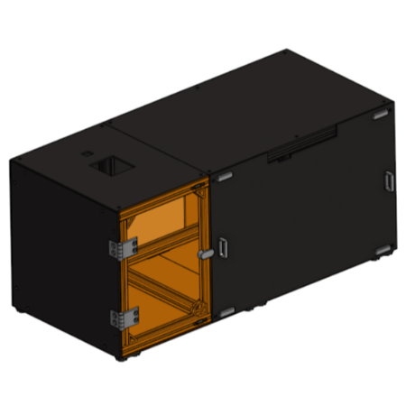

  Frame Assembly

.. figure:: ../static/Frame/frame.png
   :width: 180px

  Frame

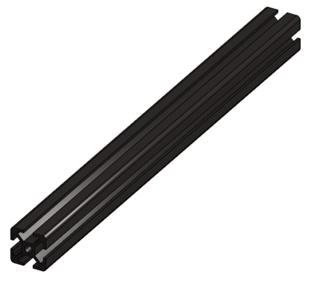

  25cm Aluminum Extrusion

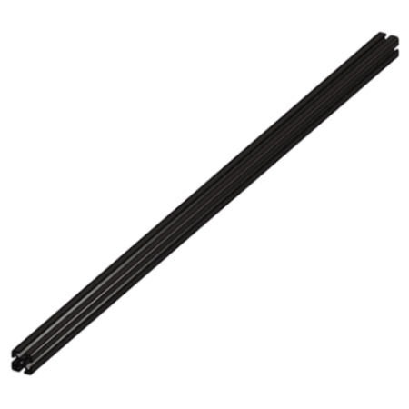

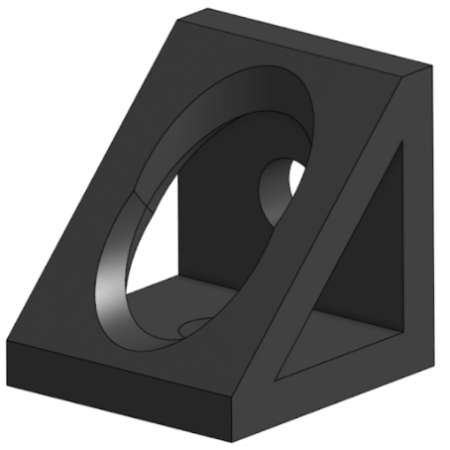

   90deg Corner Bracket

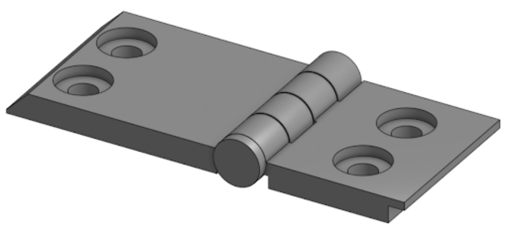

   Door Hinge Assembly

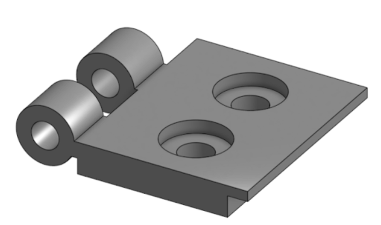

   Short Hinge Component

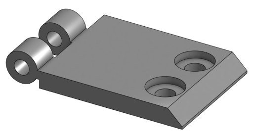

   Long Hinge Component

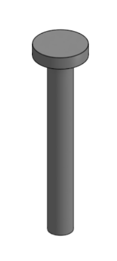

   Hinge Pin

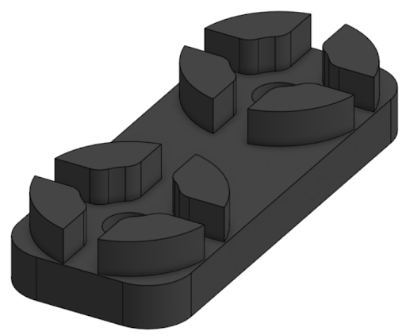

   TPU Feet

   Back Projector Panel

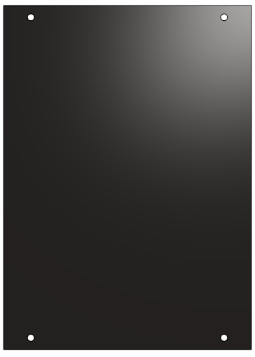

   Back Vial Panel

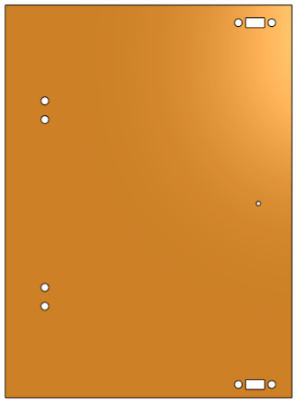

   Front Vial Panel

   Left Bottom Panel

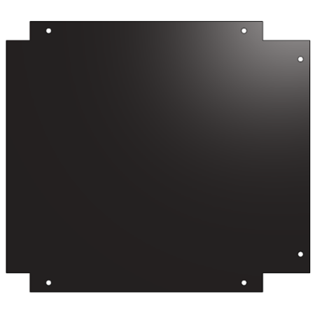

  Right Bottom Panel

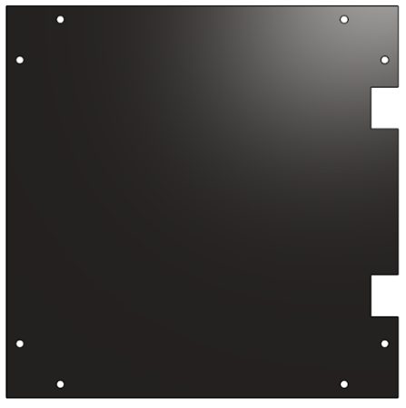

   Side Vial Panel

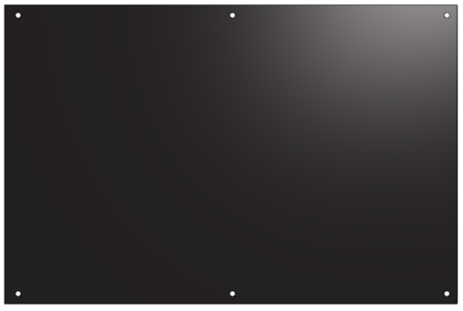

   Top Projector Panel

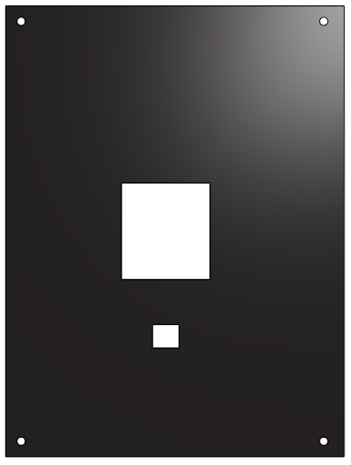

  Top Vial Panel

Optics
----------
Test

Vial
----------
T1

Vial Mechanism
--------------
Insert Images Here.

Electronics
-----------
Insert Images Here.
