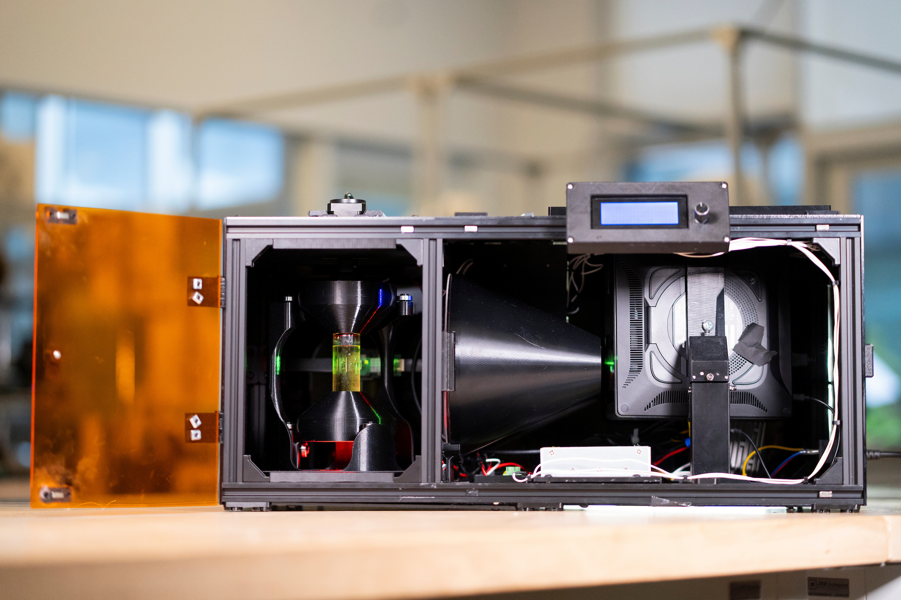

.. OpenCAL documentation master file, created by
   sphinx-quickstart on Wed Oct 15 21:26:09 2025.
   You can adapt this file completely to your liking, but it should at least
   contain the root `toctree` directive.
   Add your content using ``reStructuredText`` syntax. See the
   `reStructuredText <https://www.sphinx-doc.org/en/master/usage/restructuredtext/index.html>`_
   documentation for details.    

OpenCAL: A Comprehensive Guide
-------------------------------
**What is CAL?**

Computed axial lithography, or CAL, looks different from other forms of 3D printing. A vial of resin rotates
while a sequence of carefully computed images are projected through the volume. Where enough light accumulates,
a part forms, all at once, in just minutes. There are no layers and no support structures. Invented by Berkeley
in 2017, the process has developed a lot over the decade.

**How does it work?**

The core idea behind CAL is tomographic reconstruction. It's like a CT scan in reverse. In a CT scan, X-rays are
used to measure a person's internal structure and then computers reconstruct it volumetrically. In CAL, the process
starts with a 3D model. From that model, the software computes the projected images needed to reconstruct the part
in resin. The open-source software that drives this is called VAMToolbox/Tomo. It calculates light dosage so that
only the regions meant to form the part receive enough light to solidify, while the rest remains liquid. As the
light passes through the spinning vial, it is effectively delivering dose to the whole part at once.
Because of that, machines like OpenCAL can print much faster than traditional methods, with inch-scale objects
forming in minutes.

The CAL team have condensed much of our lab setup into a new, accessible open-source platform. OpenCAL is a project
designed to let the public build, test, and contribute to the volumetric additive manufacturing (VAM) community.
The project covers machine construction, the software needed to fabricate parts, and resources for obtaining the
resin. Once you've gathered the components and 3D printed the parts, the machine can be assembled in an afternoon.

   The OpenCAL V2 setup actively printing.

.. raw:: html

     

Join the community to ask questions, share builds, and get help:

.. raw:: html

    

        <a href="https://discord.com/invite/patduYdnSN" target="_blank"
           style="display: inline-flex; align-items: center; gap: 14px;
                  background-color: #5865F2; color: #ffffff; font-size: 1.4em; font-weight: 700;
                  text-decoration: none; padding: 18px 36px; border-radius: 10px;
                  box-shadow: 0 4px 14px rgba(88,101,242,0.4);">
            
            Join the OpenCAL Discord
        </a>
    

**NOTES:**

This site, and the attached Github, will be used as the **Source-of-Truth** for all things OpenCAL. It is the initial public rendering of the open-source
version for public research. Critique is highly appreciated and the site and information may be updated overtime as more research
is conducted.

* `OpenCAL on GitHub <https://github.com/computed-axial-lithography/OpenCAL>`__

.. raw:: html

     

.. toctree::
   :hidden:

   Home <self>
.. toctree::
   :maxdepth: 2
   :hidden:
   :caption: Engineering Documentation
   
   engineering_documentation/bom
   engineering_documentation/tools
   engineering_documentation/cad

.. toctree::
   :maxdepth: 2
   :hidden:
   :caption: Materials

   materials/overview
   materials/lab_directions

.. toctree::
   :maxdepth: 2
   :hidden:
   :caption: Step-by-Step Guides 

   step_by_step/frame_stepbystep
   step_by_step/optics_stepbystep
   step_by_step/rotational_element_stepbystep
   step_by_step/electronics_stepbystep
   step_by_step/main_assembly
   step_by_step/wiring_stepbystep

.. CentrifuCAL section temporarily removed — re-add the line below to the toctree above to restore it:
.. step_by_step/centrifucal_stepbystep

.. toctree::
   :maxdepth: 2
   :hidden:
   :caption: Software

   software/github
   software/controls

.. toctree::
   :maxdepth: 2
   :hidden:
   :caption: Tomo (Print Preparation)

   software/tomo
   software/tomo_workflow
   software/vamtoolbox

.. toctree::
   :maxdepth: 2
   :hidden:
   :caption: Workflow

   workflow/printing

.. toctree::
   :maxdepth: 2
   :hidden:
   :caption: Resources

   resources/research_papers
   resources/opencal_in_media
   resources/contributors
   resources/contact
   resources/help_wanted

.. toctree::
   :maxdepth: 2
   :hidden:
   :caption: License

   resources/license
