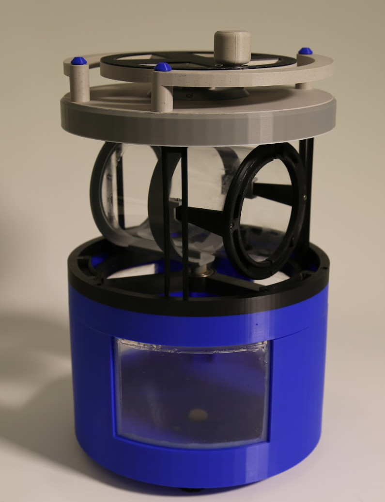

Help Wanted
===========

This page collects parts of OpenCAL that we **started but did not finish**: features and add-ons
that are not yet fully working. We would love the **community's help** to complete them.

Have experience, ideas, or want to take one of these on? Reach out on the
`OpenCAL Discord <https://discord.com/invite/patduYdnSN>`__; contributions are very welcome.

Cheaper Motor Controller (TMC5160T)
-----------------------------------

To lower the build cost, we wanted to drive the stepper motor with a **cheaper controller** than
the **Pololu Tic T249** used in the current build. We tried the **TMC5160T** as a candidate:

* `TMC5160T stepper motor driver (Amazon) <https://www.amazon.com/dp/B0B8HZXWPP>`__

We **could not get it working reliably**, so it never made it into the official build. If you can
get the TMC5160T (or another low-cost driver) running dependably with OpenCAL, we'd love your
help.

Large Vial (Screw-On)
---------------------

We designed a large, **screw-on glass vial** to print bigger parts, but we **could not get it
fully working and reliable**. For now, use the small vial — or the simpler **lid-style large vial**
documented in the
:doc:`Rotational Element guide <../step_by_step/rotational_element_stepbystep>` — for printing. If
you'd like to help finish the screw-on design, we'd welcome it.

.. image:: ../static/Step_by_Step/Rotational_Element_Subassemblies/Large_Vial/large_vial_1_CAD.png
   :align: center
   :width: 300px

.. image:: ../static/Step_by_Step/Rotational_Element_Subassemblies/Large_Vial/large_vial_2_CAD.png
   :align: center
   :width: 300px

**Parts:**

* (QTY 1) Large Glass Vial
* (QTY 1) Bottom Glass Vial Attachment
* (QTY 1) Bottom Vial Lock
* (QTY 1) Top Glass Vial Attachment
* (QTY 1) Top Vial Lock
* (QTY 1) Bottom Glass Disk
* (QTY 2) 1/8'' Soft Silicone O-Ring
* (QTY 1) Silicone Caulk

**Tools:** Tape

We never finalized the screw-on assembly, so step-by-step instructions are not documented — the
parts and CAD above are the design as far as we took it.

Vial Light-Protection Covers
----------------------------

Photopolymer resin cures on exposure to stray light (see the resin-handling warnings in the
:doc:`Materials overview <../materials/overview>`). We started designing **covers for the vials**
to shield them from ambient and stray light **when they are not being printed** (protecting the
resin between prints and during storage), but we **never settled on a reliable, easy-to-use
design**. Ideas and designs from the community are welcome.

Centrifugal Spinning (CentrifuCAL)
----------------------------------

We explored a centrifugal spinning add-on, **CentrifuCAL**, to counteract sinking or floating of
the part in low-viscosity resin. It is a **hand-cranked, planetary-gear spinner** that holds and
rotates the vial.

   An early CentrifuCAL prototype.

We built the **early prototype** shown above but **did not fully finish or validate** the design,
so it is not part of the official build. Its parts and assembly steps are recorded below to help
anyone who wants to pick it up.

.. tip::

   **Off-the-shelf alternative.** If you don't want to build the CentrifuCAL spinner, a manual
   **salad spinner** can provide a simple, low-cost way to spin the vial, such as
   `this salad spinner <https://www.amazon.com/dp/B09KG9Q57N>`__.

.. note::

   The steps below describe an early prototype. Step images are not yet included; they will be
   added as the design is finalized.

Tools
~~~~~

* Soldering iron (for heat-set inserts)
* 3D printer — PETG capable, minimum bed size 256 × 256 mm (prototype printed on a Prusa)
* 3 mm hex key
* Superglue
* Scissors / box cutter

Parts
~~~~~

**3D-printed parts** (each links to its Onshape model; print quantity in parentheses):

* `Lower Base <https://cad.onshape.com/documents/55c50c3c5dd39d2267b03f72/w/1eae40e5d02a2f983f9a104d/e/99b70eb97a5544712a7c3ca7>`__ (3 parts)
* `Upper Base <https://cad.onshape.com/documents/55c50c3c5dd39d2267b03f72/w/1eae40e5d02a2f983f9a104d/e/d4bedaaed3195f4c6f6922fe>`__ (3 parts)
* `Lid <https://cad.onshape.com/documents/55c50c3c5dd39d2267b03f72/w/1eae40e5d02a2f983f9a104d/e/eedde5031071aa85743f810c>`__ (3 parts)
* `Vial Holder <https://cad.onshape.com/documents/55c50c3c5dd39d2267b03f72/w/1eae40e5d02a2f983f9a104d/e/4a7d122a5a7c5017d8d8f72b>`__
* `Spinner <https://cad.onshape.com/documents/55c50c3c5dd39d2267b03f72/w/1eae40e5d02a2f983f9a104d/e/75df6e6c951f9dced061af3d>`__
* `Tab <https://cad.onshape.com/documents/55c50c3c5dd39d2267b03f72/w/1eae40e5d02a2f983f9a104d/e/a78b74a6848b637b5f20eb21>`__
* `Sun Gear <https://cad.onshape.com/documents/55c50c3c5dd39d2267b03f72/w/1eae40e5d02a2f983f9a104d/e/2e7adfbef37c3bc1cd1a745d>`__
* `Ring Gear <https://cad.onshape.com/documents/55c50c3c5dd39d2267b03f72/w/1eae40e5d02a2f983f9a104d/e/4386153d967c3923213d1b86>`__
* `Planet Gear <https://cad.onshape.com/documents/55c50c3c5dd39d2267b03f72/w/1eae40e5d02a2f983f9a104d/e/c68106d911cb075254185df3>`__ (×3)
* `Gearbox Crank Top <https://cad.onshape.com/documents/55c50c3c5dd39d2267b03f72/w/1eae40e5d02a2f983f9a104d/e/1df9c003d9d76a47b1959e8c>`__
* `Gearbox Crank Cover <https://cad.onshape.com/documents/55c50c3c5dd39d2267b03f72/w/1eae40e5d02a2f983f9a104d/e/33fb5d2ef9f419987838cd20>`__
* `Gearbox Bottom <https://cad.onshape.com/documents/55c50c3c5dd39d2267b03f72/w/1eae40e5d02a2f983f9a104d/e/556d618f755142e5338cd3b6>`__
* `Crank Handle <https://cad.onshape.com/documents/55c50c3c5dd39d2267b03f72/w/1eae40e5d02a2f983f9a104d/e/114094a06b77ceeabe9328d0>`__
* `Door <https://cad.onshape.com/documents/55c50c3c5dd39d2267b03f72/w/1eae40e5d02a2f983f9a104d/e/d09c9b24ba7735b192b72cb0>`__
* `Door Handle <https://cad.onshape.com/documents/55c50c3c5dd39d2267b03f72/w/1eae40e5d02a2f983f9a104d/e/d6509631ce745f268d2ed9c7>`__
* `Handle <https://cad.onshape.com/documents/55c50c3c5dd39d2267b03f72/w/1eae40e5d02a2f983f9a104d/e/0e1891a91b61da711447a230>`__ (×2)
* `Handle Cap <https://cad.onshape.com/documents/55c50c3c5dd39d2267b03f72/w/1eae40e5d02a2f983f9a104d/e/d8d1c83defecfa5731faa83d>`__ (×4)
* `Hinge Bottom <https://cad.onshape.com/documents/55c50c3c5dd39d2267b03f72/w/1eae40e5d02a2f983f9a104d/e/dad397c9aa45916872710663>`__
* `Hinge Top <https://cad.onshape.com/documents/55c50c3c5dd39d2267b03f72/w/1eae40e5d02a2f983f9a104d/e/ecacb81c6b679ee54f4c057e>`__
* `Hinge Pin <https://cad.onshape.com/documents/55c50c3c5dd39d2267b03f72/w/1eae40e5d02a2f983f9a104d/e/1efdd39acad2585c9b566c60>`__
* `Foot <https://cad.onshape.com/documents/55c50c3c5dd39d2267b03f72/w/1eae40e5d02a2f983f9a104d/e/c4b24503cbbca191f8b36d2f>`__ (×4)
* `Drain Plug <https://cad.onshape.com/documents/55c50c3c5dd39d2267b03f72/w/1eae40e5d02a2f983f9a104d/e/20c86d0b96b052c417bf62ab>`__

**Other materials:**

* 2 × polycarbonate sheets, cut to 145 × 135 mm
* 28 mm bearing
* M3 heat-set inserts
* M3 bolts: M3×6, M3×10, M3×25, M3×40, M3×50

(See the :doc:`BOM <../engineering_documentation/bom>` for quantities and sourcing.)

Assembly (prototype)
~~~~~~~~~~~~~~~~~~~~~~

#. 3D print all parts.
#. Cut 2 polycarbonate sheets to **145 × 135 mm**.
#. Place the polycarbonate sheets into their respective slots in the **Lower Base**.
#. Using the soldering iron, place **3× M3 heat-set inserts** into the holes on the top of the Lower Base.
#. Place the remaining M3 heat-set inserts: **7 on the Lid** and **4 on the Upper Base**.
#. Assemble the Lower and Upper Base in thirds, placing the Upper Base onto the polycarbonate sheets and fastening with an **M3×40 bolt**.
#. Fasten the three pieces of the Lower Base, Upper Base, and Lid together with superglue.
#. Place the final **3× M3 heat-set inserts** into the holes on the Door.
#. On the Lower Base, press-fit a **28 mm bearing** into the middle section.
#. Superglue the **Vial Holder** to the **Spinner**.
#. Secure the **Tab** to the Vial Holder with an **M3×6 bolt**.
#. Place the Vial Holder and Spinner onto the bearing in the Lower Base.
#. Affix the Lid and handles with **4× M3×50 bolts**.
#. Affix the **Ring Gear** with **4× M3×25 bolts**.
#. Assemble the remaining gears (3 planet gears + 1 sun gear), passing the Sun Gear through the hole and fastening it into the slot on the Vial Holder.
#. Assemble the gearbox: stack the Gearbox Bottom, Cover, and Top; flip it over and drive **3× M3×10 bolts** into the holes.
#. Place the assembled gearbox on top of the gears, fitting its pegs into each planet gear.
#. Secure the gearbox to the Lid with **4× M3×25 bolts**.
#. Superglue the **4 feet** to the bottom of the assembly.
#. Place the handles on top of the box and secure with **4× M3×50 bolts**.
#. Place the handle caps on the handles and secure with superglue.
