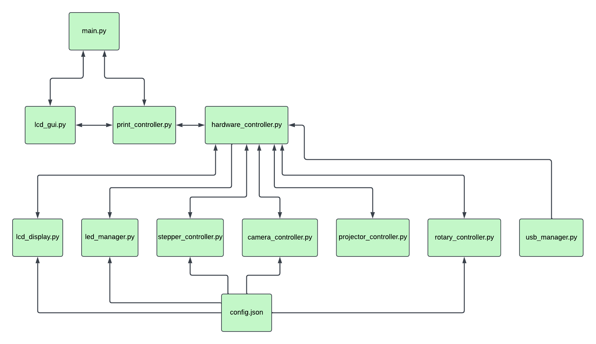

Software Installation
=====================

Once the printer is built, the next step is getting the OpenCAL software onto the
Raspberry Pi. The software runs **headless on a Raspberry Pi 5** and is operated entirely
through the hardware LCD screen and rotary encoder — no monitor, keyboard, or mouse is
needed during normal use.

The source code and the most up-to-date instructions live in the
`OpenCAL software repository <https://github.com/computed-axial-lithography/OpenCAL>`__.
Developer/API documentation is hosted separately at
`opencal-org.readthedocs.io <https://opencal-org.readthedocs.io>`__.

Hardware Requirements
---------------------

.. list-table::
   :header-rows: 1
   :widths: 28 72

   * - Component
     - Specification
   * - Computer
     - Raspberry Pi 5 (2 GB+ RAM)
   * - Storage
     - microSD card ≥ 12 GB
   * - Motor Controller
     - Pololu Tic T249 (USB connection)
   * - Stepper Motor
     - NEMA 17 (tested with 17HE19-2004S, 2.0 A rated)
   * - LED Array
     - 8×8 SK6812 RGBW NeoPixel matrix (64 LEDs)
   * - Display
     - 20×4 I2C LCD (PCF8574 backpack, address 0x27)
   * - Encoder
     - Rotary encoder with push button (GPIO 5, 6, 19)
   * - Camera
     - Raspberry Pi Camera Module 3 (IMX708)
   * - Projector
     - Any HDMI projector (tested with NexiGo Nova Mini)

Option 1: Flash the Pre-Built Image (Recommended)
-------------------------------------------------

The easiest way to get started is to flash the pre-built Raspberry Pi 5 image directly
to a microSD card. It comes with all dependencies installed, the hardware configured,
and the OpenCAL service enabled to start on boot.

#. Download ``opencal_pi5.img.gz`` from the
   `OpenCAL pre-built image <https://drive.google.com/file/d/1HBJ7cH8QSTCckkTwJ3i0WToUSsLiP4YX/view?usp=sharing>`__.
#. Download and install the
   `Raspberry Pi Imager <https://www.raspberrypi.com/software/>`__.
#. Open Raspberry Pi Imager.
#. Click **"Choose OS"** → **"Use custom"** → select ``opencal_pi5.img.gz``.
#. Click **"Choose Storage"** → select your microSD card (≥ 12 GB).
#. Click **"Write"** and wait for it to complete.
#. Insert the SD card into your Raspberry Pi 5 and power on. The system boots directly
   into OpenCAL.

**Default login:**

* **Username:** ``opencal``
* **Password:** set on first login (you will be prompted to change it).

.. note::

   The pre-built image already has the systemd service enabled and all hardware
   configured — you do **not** need to run any additional setup commands. The only
   things intentionally cleared from the image for security are WiFi credentials and
   SSH host keys (regenerated automatically on first boot).

**WiFi setup (optional):** place a ``wifi.txt`` file in the boot partition of the SD card
with the following contents:

.. code-block:: text

   SSID=YourNetworkName
   PASS=YourPassword

Option 2: Build from Source (Advanced)
--------------------------------------

If you would rather install onto an existing Raspberry Pi OS system, you can build from
source. This is only recommended for advanced users or developers.

.. dropdown:: Build-from-source instructions

   **Prerequisites:** Raspberry Pi 5 running Raspberry Pi OS Bookworm.

   .. code-block:: bash

      # Clone the repo
      git clone https://github.com/computed-axial-lithography/OpenCAL.git
      cd OpenCAL

      # Install Python dependencies
      pip install -r requirements.txt --break-system-packages

      # Install the Pololu Tic software (ticcmd):
      # download the ARM64 package from https://www.pololu.com/docs/0J71/3.2
      # and install it with:
      sudo dpkg -i pololu-tic-*.deb

      # Install udiskie for USB automounting
      sudo apt install udiskie

   Enable the user-level systemd service so OpenCAL starts automatically once the
   Wayland display is ready:

   .. code-block:: bash

      mkdir -p ~/.config/systemd/user

      cat > ~/.config/systemd/user/opencal.path << 'EOF'
      [Unit]
      Description=Start OpenCAL when Wayland compositor is ready
      [Path]
      PathExists=%t/wayland-0
      [Install]
      WantedBy=default.target
      EOF

      cat > ~/.config/systemd/user/opencal.service << 'EOF'
      [Unit]
      Description=OpenCAL Printer Controller
      [Service]
      Type=simple
      WorkingDirectory=/home/opencal/OpenCAL
      ExecStart=/usr/bin/python3 -m opencal
      Environment=SDL_VIDEODRIVER=wayland
      Environment=WAYLAND_DISPLAY=wayland-0
      Environment=XDG_RUNTIME_DIR=/run/user/1000
      Environment=DISPLAY=:0
      StandardOutput=journal
      StandardError=journal
      Restart=on-failure
      RestartSec=5
      TimeoutStopSec=10
      EOF

      systemctl --user enable opencal.path
      systemctl --user start opencal.path
      loginctl enable-linger opencal

   To check status or follow logs:

   .. code-block:: bash

      systemctl --user status opencal.service
      journalctl --user -u opencal.service -f

Configuration
-------------

All tunable parameters live in ``opencal/utils/config.json`` — a single source of truth
for GPIO pins, I2C addresses, LED counts, camera type, default RPM, and projector
calibration values. Edit it to match your hardware:

.. code-block:: json

   {
     "stepper_motor": {
       "driver_mode": "tic_usb",
       "A_pin": 12,
       "B_pin": 13,
       "default_rpm": 9,
       "default_direction": "CW",
       "steps_per_revolution": 3200
     },
     "rotary_encoder": {
       "clk_pin": 5,
       "dt_pin": 6,
       "btn_pin": 19
     }
   }

.. note::

   Motor controller settings are stored separately in ``opencal/utils/tic_settings.yaml``
   and are written to the Pololu Tic T249 automatically on every startup — no manual
   configuration of the Tic is needed.

How the Software Is Organized
-----------------------------

At a high level, ``main.py`` runs the LCD GUI and the print controller, which talk to a
central hardware controller. That controller initializes each hardware driver
independently — if one device fails to start, the system continues in a degraded mode
rather than crashing. Every driver reads its settings from ``config.json``.

   OpenCAL software architecture.
