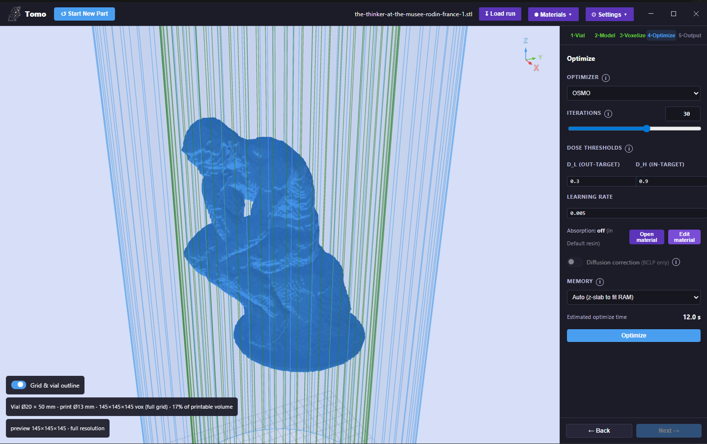

Tomo — Print Preparation Software
=================================

**Tomo is a standalone Windows desktop app for preparing CAL/VAM print files.** It is a
graphical front end for `VAMToolbox <https://github.com/computed-axial-lithography/VAMToolbox>`__
— the open-source library that solves the tomographic optimization at the heart of Computed
Axial Lithography. Tomo takes an STL model all the way to a **print-ready light-projection
sequence** (the sinogram video your projector plays) without writing a line of Python.

   Tomo — a guided desktop workflow for CAL print preparation.

.. note::

   Tomo is the tool that produces the ``.mp4`` print files that the OpenCAL printer plays
   from a USB drive (see :doc:`controls`). Use Tomo to turn a 3D model into a print; use the
   printer's on-device menu to run it.

What Tomo Does
--------------

In CAL/VAM printing, a part is cured *all at once* inside a rotating vial of photopolymer
resin. A projector shines a sequence of images into the vial as it spins; where enough light
accumulates over a full rotation, the resin solidifies. Computing *which images to project* —
the **sinogram** — is an inverse tomography problem: you reconstruct the light field that,
integrated over all angles, deposits the right dose everywhere inside the target geometry and
nowhere outside it.

VAMToolbox solves that problem from Python. **Tomo puts the entire pipeline behind a guided
five-stage graphical workflow** — set up the vial, place the model, voxelize it, optimize the
projections, and preview/export the result — with live 3D previews, hardware auto-tuning, and
one-click video export. It ships as a single Windows installer with a **self-contained
Python/CUDA runtime** bundled in, so end users never set up a Python environment.

.. important::

   **Tomo is a front end, not a fork.** All of the optimization, voxelization, and physics is
   performed by VAMToolbox. If you would rather script the same pipeline, use
   `VAMToolbox <https://vamtoolbox.readthedocs.io>`__ directly.

Installation
------------

#. Download the latest **Tomo installer** from
   `Google Drive <https://drive.google.com/file/d/1a32FkjpBAUhvLERIauvhrU667B8wuy6c/view?usp=drive_link>`__.
#. Run the installer. It installs per-user to ``%LOCALAPPDATA%\Programs\Tomo`` — **no
   administrator rights required**.
#. Launch **Tomo** from the Start Menu or desktop shortcut.

.. note::

   **The first launch is slow (~90 seconds)** while Windows Defender scans the freshly
   installed executables. Subsequent launches are fast.

Requirements
------------

.. list-table::
   :header-rows: 1
   :widths: 30 70

   * - Requirement
     - Notes
   * - **Operating system**
     - Windows 10 / 11 (64-bit).
   * - **GPU**
     - An NVIDIA CUDA-capable GPU is strongly recommended. Tomo falls back to CPU where
       possible, but large parts at full resolution expect a GPU. Hardware is auto-detected.
   * - **Python**
     - None required — a self-contained runtime is bundled in the installer.

How Tomo Is Built
-----------------

Tomo is a three-layer desktop application packaged with Electron:

* **Frontend** — a React (Vite) single-page app with the four-tab workflow and interactive
  Three.js 3D previews.
* **Backend** — a small Flask server that threads the long-running voxelize/optimize jobs and
  reports progress, ETA, and cancellation to the UI.
* **Engine** — the backend calls the high-level ``vamtoolbox.pipeline`` API, which performs
  voxelization, optimization, rebinning, and video export. Tomographic projection uses **ASTRA**
  with CUDA.

See the :doc:`tomo_workflow` page for the full workflow and a reference of every control.
