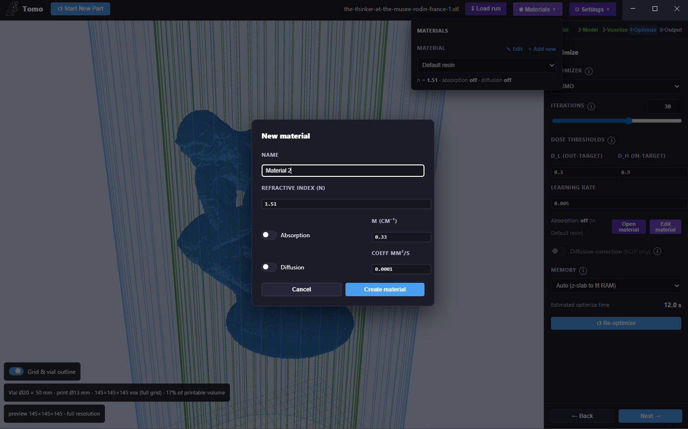
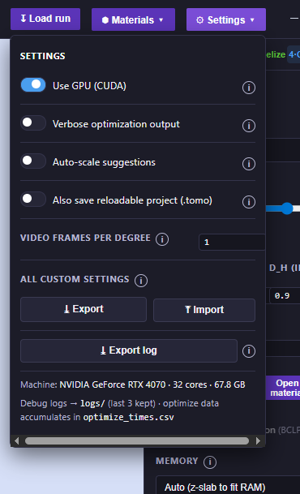
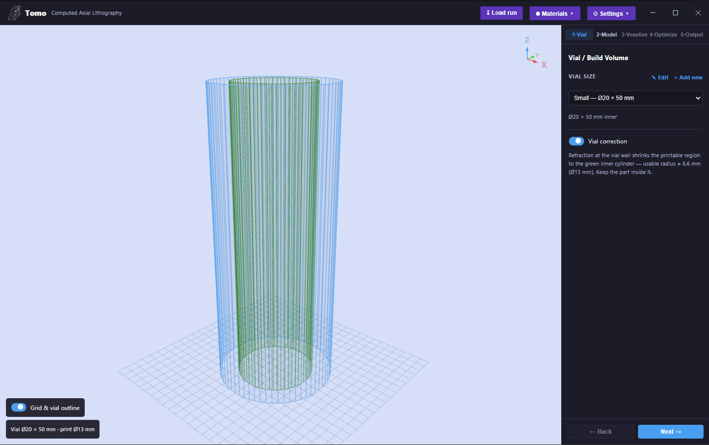
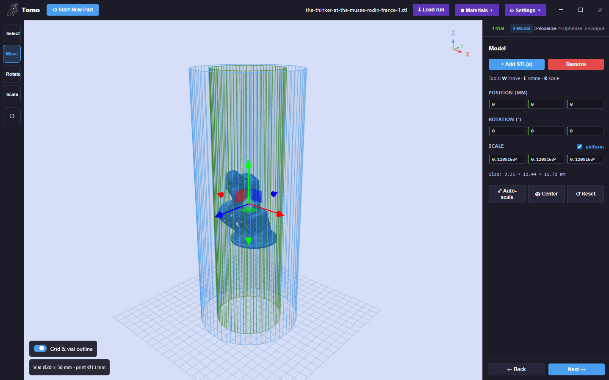
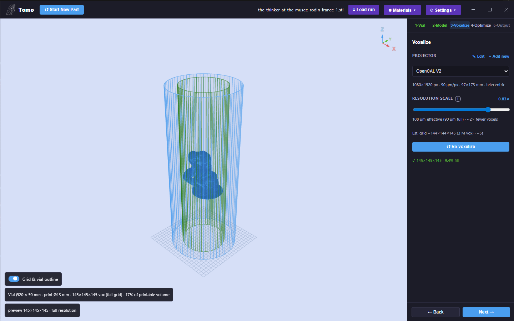
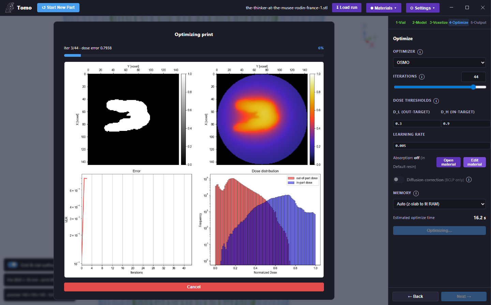
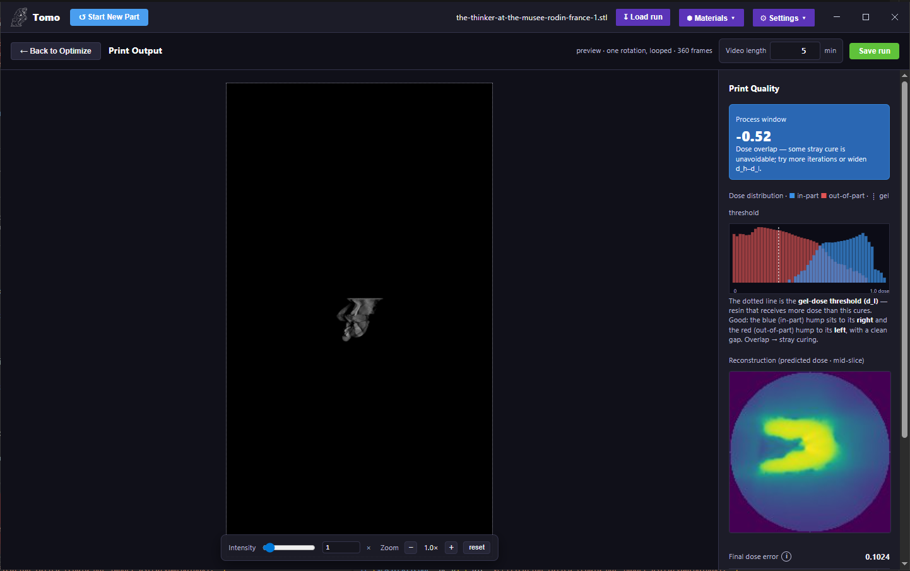

Tomo: Workflow & Controls
=========================

Tomo is organized as **five numbered tabs that mirror the CAL pipeline** — you move left to
right through them (with **Back** / **Next** buttons) to take a model from STL to a print-ready
projection video:

**1·Vial → 2·Model → 3·Voxelize → 4·Optimize → 5·Output**

A persistent **top bar** holds actions and presets that apply across the whole job.

Top Bar
-------

.. list-table::
   :header-rows: 1
   :widths: 22 78

   * - Control
     - What it does
   * - **Start New Part**
     - Clears the current part and parameters to begin a fresh job.
   * - **Load run**
     - Reloads a previously saved run, restoring all of its parameters.
   * - **Materials ▾**
     - Manage resin **material presets**. Each material stores a **refractive index (n)**, an
       **Absorption** setting (on/off + attenuation coefficient ``μ`` in cm⁻¹), and a
       **Diffusion** setting (on/off + coefficient in mm²/s). Use **Edit** / **+ Add new** to
       create materials; the active material feeds the physics corrections on the Optimize tab.
   * - **Settings ▾**
     - Application settings (see below).

   The Materials menu with the "New material" dialog — set the refractive index, absorption (μ), and diffusion coefficient.

**Settings menu**

* **Use GPU (CUDA)** — run voxelization/optimization on the GPU (recommended).
* **Verbose optimization output** — show the live four-panel diagnostic while optimizing.
* **Auto-scale suggestions** — offer to scale a part to fit the vial.
* **Also save reloadable project (.tomo)** — save a reloadable project file alongside outputs.
* **Video frames per degree** — projection-video sampling density.
* **Export / Import all custom settings**, **Export log**, plus a machine readout (GPU, cores,
  RAM). Debug logs are kept under ``logs/`` and optimize timing accumulates in
  ``optimize_times.csv``.

   The Settings menu.

Stage 1 — Vial
--------------

Choose the resin container and define the printable volume.

* **Vial size** — pick a preset (e.g. *Small — Ø20 × 50 mm*), or **Edit** / **+ Add new** to
  define your own (name, height, diameter).
* **Vial correction** — when enabled, Tomo models **refraction at the vial wall**, which shrinks
  the usable printable region to the **green inner cylinder** shown in the 3D view (for the Ø20 mm
  vial, a usable radius of ≈ 6.6 mm / Ø13 mm). **Keep your part inside the green cylinder.**
* The 3D view shows the blue vial outline, the green printable cylinder, and a reference grid
  (toggle with **Grid & vial outline**).

   Stage 1 · Vial — vial-size preset, the Vial correction toggle, and the blue vial outline with the green printable cylinder.

Stage 2 — Model
---------------

Load and place your part.

* **Add STL(s)** / **Remove** — load one or more STL files.
* **Transform tools** (left toolbar): **Select**, **Move**, **Rotate**, **Scale** — with keyboard
  shortcuts **W** (move), **E** (rotate), **R** (scale).
* **Position (mm)**, **Rotation (°)**, and **Scale** (per-axis, with an optional **uniform** lock).
  A live **Size** readout shows the current bounding box in millimetres.
* **Auto-scale** (fit the part to the vial), **Center**, and **Reset** buttons.
* Tomo warns if the part's footprint exceeds the printable radius.

   Stage 2 · Model — an STL loaded with the transform gizmo and the Position / Rotation / Scale panel.

Stage 3 — Voxelize
------------------

Convert the mesh into a high-resolution voxel target.

* **Projector** — pick a projector preset (e.g. *OpenCAL V2*), or **Edit** / **+ Add new**. The
  preset defines the resolution in pixels (**width × height**), the **pixel pitch** (µm), the
  resulting **build area** (mm), and whether the projector is **telecentric** or has a finite
  **throw ratio**. This sets the **print resolution**.
* **Resolution scale** — a slider that trades detail for speed/memory. Tomo shows the
  **effective pitch** vs the full pitch, the approximate voxel-count reduction, the **estimated
  grid size**, the **voxel count**, and the **voxelize time**.
* **Re-voxelize** runs the GPU layer-slicer; the result line reports the final grid (e.g.
  ``145×145×145``) and the **fill %** of the printable volume, with a live 3D voxel preview.

.. note::

   High resolution is never silently coarsened — if you ask for a fine pitch, Tomo voxelizes at
   that pitch. The resolution-scale reduction is opt-in.

   Stage 3 · Voxelize — the projector preset, the resolution-scale slider with its live estimate, and the voxel preview.

Stage 4 — Optimize
------------------

Compute the sinogram — the projection sequence — with the tomographic optimizer.

.. list-table::
   :header-rows: 1
   :widths: 26 74

   * - Control
     - What it does
   * - **Optimizer**
     - **OSMO** (Object-Space Model Optimization — fast threshold optimizer for solid/binary
       parts) or **BCLP** (Band-Constrained Linear Programming — handles grey/continuous targets
       and is **required for diffusion correction**; ~1.4× slower).
   * - **Iterations**
     - Number of optimization passes — slider plus a free-entry number field.
   * - **Dose thresholds (D_L / D_H)**
     - Normalized dose targets (0–1). **D_H (in-target)** is the minimum dose that must be reached
       *inside* the part (gel point); **D_L (out-target)** is the maximum dose allowed *outside*
       it. A wider D_H–D_L gap is more robust but harder to hit.
   * - **Learning rate**
     - Gradient step size for the **BCLP** optimizer.
   * - **Absorption**
     - Beer–Lambert attenuation compensation, driven by the active **Material** preset. Use **Open
       material** / **Edit material** to change it.
   * - **Diffusion correction**
     - Compensates for cure/diffusion blur (sharper edges). **BCLP only** — auto-disabled for OSMO.
   * - **Memory**
     - z-slab mode: **Auto (z-slab to fit RAM)**, **Off**, or a fixed slab count — lets very large
       optimizations fit in RAM.

Tomo shows an **estimated optimize time**, then **Optimize** runs the solve. With **Verbose
optimization output** enabled, a live **"Optimizing print"** window shows the current
**iteration / total**, the **dose error**, and a four-panel diagnostic — the **target slice**, the
**predicted-dose reconstruction**, an **error-vs-iterations** curve, and the **dose distribution**
histogram — with a **Cancel** button.

.. figure:: ../static/Tomo/tomo_optimize.png
   :align: center
   :width: 100%

   Stage 4 · Optimize — optimizer, iterations, dose thresholds (D_L / D_H), learning rate, diffusion, and memory.

   The live "Optimizing print" window (verbose output) — target slice, predicted-dose reconstruction, error curve, and dose histogram.

Stage 5 — Output
----------------

Preview the result and export the print.

* **Projection video** — play the optimized sinogram as a rotating, looped projection video (one
  rotation, N frames). This is the exact image sequence the projector plays. **Intensity** and
  **Zoom** controls adjust the preview.
* **Video length (min)** — sets the print duration encoded into the exported video.
* **Print Quality** panel:

  * **Process window** — a single score. **Positive** means a single dose threshold cures the part
    cleanly; **negative** means dose overlap (some stray cure is unavoidable) — try more iterations
    or widen the D_H–D_L gap.
  * **Dose distribution** — a histogram of **in-part** (blue) vs **out-of-part** (red) voxel doses,
    with the **gel-dose threshold** marked. A clean gap between the two humps is ideal.
  * **Reconstruction (predicted dose, mid-slice)** — the simulated cured cross-section.
  * **Final dose error** — overall dose-matching error metric.
* **Save run** — persist the job and all its parameters (reload later with **Load run**). Export
  the projection video as **MP4**.

.. tip::

   Name the exported print file using the OpenCAL convention so the printer reads the RPM
   automatically, e.g. ``part_9rpm.mp4`` — see :ref:`naming-convention`.

   Stage 5 · Output — the projection-video preview and the Print Quality panel (process window, dose histogram, reconstruction, final dose error).

Hardware
--------

Tomo **auto-detects** your CUDA GPU and tunes the run for it (the detected machine is shown in the
Settings menu); CUDA is used when available, with a CPU fallback. A GPU is strongly recommended
for full-resolution voxelization and optimization.
