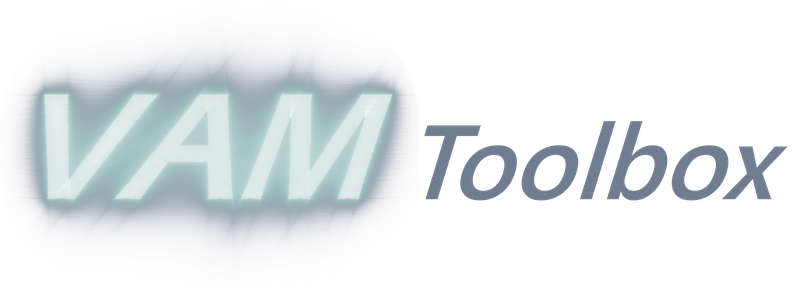

VAMToolbox — The Projection Engine
==================================

**VAMToolbox is the open-source Python library that powers projection generation for Computed
Axial Lithography.** It is the engine underneath :doc:`Tomo <tomo>` — everything Tomo does
(voxelize a model, optimize the projection sequence, apply the resin physics, and produce the
final light-projection video) is computed by VAMToolbox. Tomo is the graphical front end;
**VAMToolbox is the math.**

.. note::

   Use :doc:`Tomo <tomo>` for a no-code desktop workflow. Use VAMToolbox directly if you want to
   script the pipeline, batch many jobs, or build your own tools on top of it.

Links
-----

* **Source code:** `github.com/computed-axial-lithography/VAMToolbox <https://github.com/computed-axial-lithography/VAMToolbox>`__
* **Documentation:** `vamtoolbox.readthedocs.io <https://vamtoolbox.readthedocs.io>`__

What It Does
------------

VAMToolbox generates the light projections (the **sinogram**) and models the DLP projector for
tomographic VAM. Its core capabilities are:

* **Projection optimization** — the **OSMO** and **BCLP** optimizers compute the projection
  sequence that deposits enough light dose inside the target geometry and nowhere outside it.
  BCLP additionally handles grayscale / continuous targets.
* **Physics models** — light **absorption** (Beer–Lambert), cure/oxygen **diffusion**, and a GPU
  **ray tracer** for attenuation and refraction in graded-index media. Corrections are
  resolution-aware (they use the real physical voxel pitch).
* **High-resolution voxelization** — a GPU **OpenGL voxelizer** that handles large parts at fine
  resolution.
* **ASTRA CUDA backend** — fast projection/reconstruction operators via the
  `ASTRA Toolbox <https://astra-toolbox.com>`__.
* **High-level pipeline API** — ``PrintConfig`` + ``VAMPipeline`` (the same API Tomo drives), so a
  full job — hardware detection, voxelize, optimize, rebin, video export — runs from a single
  Python call.

The optimization methods are described in the CAL/VAM literature — see
:doc:`../resources/research_papers` for the OSMO, BCLP, and deconvolution papers.

Using It Directly
-----------------

VAMToolbox runs on **Windows** with **Python 3.13**. The recommended setup is the one-command
installer, run from a checkout of the repository:

.. code-block:: powershell

   powershell -ExecutionPolicy Bypass -File install.ps1

This creates a virtual environment, downloads and installs the CUDA-bundled **ASTRA** build,
installs the Python requirements and VAMToolbox, and verifies that CUDA works. (As of version
3.0.0, conda is no longer required.) See the
`VAMToolbox documentation <https://vamtoolbox.readthedocs.io>`__ for the full install guide, API
reference, and examples.

Relationship to OpenCAL
-----------------------

VAMToolbox — and :doc:`Tomo <tomo>`, its desktop GUI — produce the projection video your OpenCAL
printer plays. Together they close the loop: **design a part → generate its projections with
VAMToolbox / Tomo → print it on OpenCAL.**
