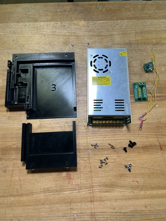
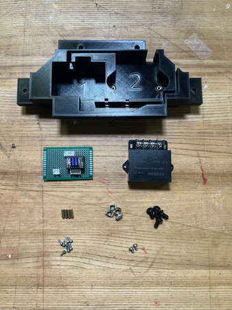
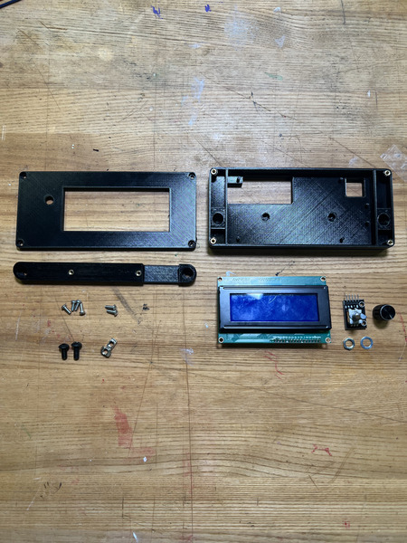
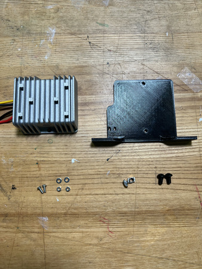
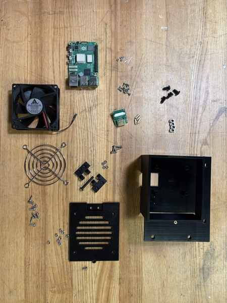
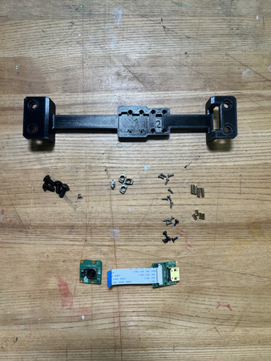
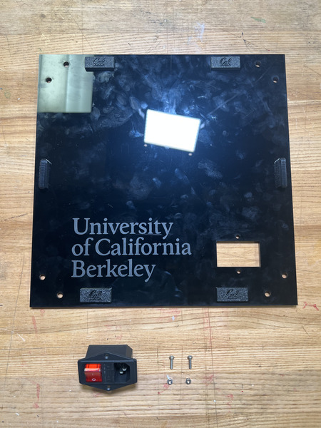

Electronics Subassemblies
++++++++++++++++++++++++++++++
The electronics consists of the following subassemblies:

* Bottom Plate

* Top Plate

* LCD Housing

* 19V Converter Assembly

* Raspberry Pi Housing

* Camera Mount

* Switch

**NOTE:** This is ONLY for electronic mounting. Wiring will occur in another page.

----

Bottom Plate
================

----

.. image:: ../static/WIP.png
    :align: center

Required Materials:
^^^^^^^^^^^^^^^^^^^
**NOTE: Heat Set Insert has already been installed into the Bottom Plates.**

* (QTY 1) Bottom Plate 1
* (QTY 1) Bottom Plate 2
* (QTY 1) 24V Power Supply
* (QTY 1) 5V Buck Converter
* (QTY 1) Terminal Block
* (QTY 3) M2x10 Standoffs
* (QTY 6) M2x6 Button Head Screw
* (QTY 8) M3x4x5 Heat Set Insert
* (QTY 8) M3x6 Button Head Screw
* (QTY 4) M5x10 Button Head Screw
* (QTY 4) M5 Hammer TNut

Required Tools:
^^^^^^^^^^^^^^^
* Soldering Iron
* M2 Hex/Allen Key
* Small Phillips Driver (+1.5)

.. image:: ../static/WIP.png
    :align: center

Step-by-Step Instructions
^^^^^^^^^^^^^^^^^^^^^^^^^
**NOTE: Unless otherwised mentioned, all fasteners will be "hand tight". Ensure that heat set inserts have ~2 minutes to cool post installation.**

#. Take the **QTY (1) Bottom Plate 2** and flip it so that it is laying on the top. Take **QTY (4) M3x4x5mm Heat Set Insert** and, using a soldering iron, place them into the following locations on the Bottom Plate 2. Ensure that the top of the heat set inserts are flush with the surfaces.

   .. image:: ../static/Step_by_Step/Electronics_Subassemblies/Bottom_Plate/bottomplate-1.jpg
       :align: center

#. Take **QTY (4) M3x4x5mm Heat Set Insert** and, using a soldering iron, place them into the following locations on the **QTY (1) Bottom Plate 1** (in the '2' area). Ensure that the top of the heat set inserts are flush with the surfaces.

   .. image:: ../static/Step_by_Step/Electronics_Subassemblies/Bottom_Plate/bottomplate-2.jpg
       :align: center

#. Flip the **QTY (1) Bottom Plate 1** and align it with **QTY (1) Bottom Plate 2**. Fasten down the plates using **QTY (4) M3x6 Button Head Screw** using a M2.5 Hex/Allen Key.

   .. image:: ../static/Step_by_Step/Electronics_Subassemblies/Bottom_Plate/bottomplate-3.jpg
       :align: center

#. Install **QTY (1) 5V Buck Converter** onto **QTY (3) M2x10 Standoff** using **QTY (3) M2x6 Button Head Screws** from the front (screws should be going from converter to standoffs).

   .. image:: ../static/Step_by_Step/Electronics_Subassemblies/Bottom_Plate/bottomplate-4a.jpg
       :align: center

   .. image:: ../static/Step_by_Step/Electronics_Subassemblies/Bottom_Plate/bottomplate-4b.jpg
       :align: center

#. In the '1' area, install the assembly from Step 4 by placing it in the designated locations and screwing them in with **QTY (3) M2x6 Button Head Screw** on the opposite end of the Bottom Plate 1. Ensure that it is orientated where the wires are coming out on the left of the '1'.

   .. image:: ../static/Step_by_Step/Electronics_Subassemblies/Bottom_Plate/bottomplate-5.jpg
       :align: center

#. Take the **QTY (1) Terminal Block** and install it in section '2' using **QTY (4) M3x6 Button Head Screw**. Ensure that it is orientated where the AB screw terminals are facing the 5V Buck converter (see image below).

   .. image:: ../static/Step_by_Step/Electronics_Subassemblies/Bottom_Plate/bottomplate-6.jpg
       :align: center

#. Take the **QTY (1) 24V Power Supply** and place it in section '3'. Ensure that it is orientated where the wires would be coming out from the top. This will not be fixed down due to its weight.

   .. image:: ../static/Step_by_Step/Electronics_Subassemblies/Bottom_Plate/bottomplate-7a.jpg
       :align: center

   .. image:: ../static/Step_by_Step/Electronics_Subassemblies/Bottom_Plate/bottomplate-7b.jpg
       :align: center

#. Place **QTY (4) M5x10 Button Head Screw** through each of the holes on the **QTY (1) Bottom Plate 1** and **QTY (1) Bottom Plate 2** from the top. Loosely install **QTY (4) M5 Hammer TNut** on the opposite ends.

#. The Bottom Plate is now complete.

   .. image:: ../static/Step_by_Step/Electronics_Subassemblies/Bottom_Plate/bottomplate-9.jpg
       :align: center

----

Top Plate
================

----

.. image:: ../static/WIP.png
    :align: center

Required Materials:
^^^^^^^^^^^^^^^^^^^
**NOTE: Heat set inserts were already installed into the Back Top Plate**

* (QTY 1) Back Top Plate 
* (QTY 4) M2x10 Standoffs
* (QTY 8) M2x6 Button Head Screws
* (QTY 1) Stepper Motor Circuit / Perfboard Assembly
* (QTY 1) 12V Buck Converter
* (QTY 2) M3x4x5 Heat Insert
* (QTY 2) M3x6 Button Head Screw

Required Tools:
^^^^^^^^^^^^^^^
* Soldering Iron
* M2 Allen/Hex Key
* Small Phillips Driver (+1.5)

.. image:: ../static/WIP.png
    :align: center

Step-by-Step Instructions
^^^^^^^^^^^^^^^^^^^^^^^^^
**NOTE: Unless otherwised mentioned, all fasteners will be "hand tight". Ensure that heat set inserts have ~2 minutes to cool post installation.**

#. Take **QTY (2) M3x4x5mm Heat Set Insert** and, using a soldering iron, place them into the following locations on the **QTY (1) Top Plate** (in the '2' area). Ensure that the top of the heat set inserts are flush with the surfaces.

   .. image:: ../static/Step_by_Step/Electronics_Subassemblies/Top_Plate/topplate-1.jpg
       :align: center

#. Attach the Perfboard Assembly from the Wiring Page with the **QTY (1) Stepper Motor Circuit** onto **QTY (4) M2x10 Standoffs** using **QTY (4) M2x6 Button Head Screws** from the top (screws should be going from Perfboard Assembly to standoffs).

   .. image:: ../static/Step_by_Step/Electronics_Subassemblies/Top_Plate/topplate-2.jpg
       :align: center

#. Take the assembly from Step 2 and install it in section '1', using **QTY (4) M2x6 Button Head Screw** from the opposite end of the Top Plate. Ensure that it is orientated where the motor circuit is closer to the right side of the '1' on the 3D print.

   .. image:: ../static/Step_by_Step/Electronics_Subassemblies/Top_Plate/topplate-3.jpg
       :align: center

#. Take **QTY (1) 12V Buck Converter** and install it in section '2', using **QTY (2) M3x6 Button Head Screw**. Ensure that it is orientated where the screw terminals are on the top (see image).

   .. image:: ../static/Step_by_Step/Electronics_Subassemblies/Top_Plate/topplate-4.jpg
       :align: center

#. Place **QTY (4) M5x10 Button Head Screw** through each of the holes on the **QTY (1) Top Plate** from the BOTTOM. Loosely install **QTY (4) M5 Hammer TNut** on the opposite ends.

#. The Top Plate is now complete.

   .. image:: ../static/Step_by_Step/Electronics_Subassemblies/Top_Plate/topplate-6.jpg
       :align: center

----

LCD Housing
===========

----

.. image:: ../static/WIP.png
    :align: center

Required Materials:
^^^^^^^^^^^^^^^^^^^
**NOTE: Heat set inserts had already been installed into the LCD Base. The Knob Encoder mounting Washer & Nut should come with the Knob Encoder kit.**

* (QTY 1) LCD Base
* (QTY 1) LCD Connector
* (QTY 1) LCD Top
* (QTY 1) LCD Screen
* (QTY 1) Knob Encoder
* (QTY 1) Knob Encoder Washer
* (QTY 1) Knob Encoder Nut
* (QTY 6) M3x6x5 Heat Set Insert
* (QTY 6) M3x8 Button Head Screw
* (QTY 2) M5x10 Button Head Screw
* (QTY 2) M5 Hammer TNut

Required Tools:
^^^^^^^^^^^^^^^
* M3 Hex/Allen Key
* M2 Hex/Allen Key

.. image:: ../static/WIP.png
    :align: center

Step-by-Step Instructions
^^^^^^^^^^^^^^^^^^^^^^^^^
**NOTE: Unless otherwised mentioned, all fasteners will be "hand tight".**

#. Take **QTY (4) M3x6x5mm Heat Set Insert** and, using a soldering iron, place them into the following locations on the **QTY (1) LCD Base** from the front. Ensure that the top of the heat set inserts are flush with the surfaces.

   .. image:: ../static/Step_by_Step/Electronics_Subassemblies/LCD_Housing/LCD-1.jpg
       :align: center

#. Take **QTY (2) M3x6x5mm Heat Set Insert** and, using a soldering iron, place them into the following locations on the **QTY (1) LCD Connector** from the front. Ensure that the top of the heat set inserts are flush with the surfaces.

   .. image:: ../static/Step_by_Step/Electronics_Subassemblies/LCD_Housing/LCD-2.jpg
       :align: center

#. Install the **QTY (1) LCD Connector** using **QTY (2) M3x8 Button Head Screw**. The connector should be oriented so that the cutout is under the big cutout on the LCD Base (see image). The screws should be going through the LCD Base from the center counterbores and into the connector.

   .. image:: ../static/Step_by_Step/Electronics_Subassemblies/LCD_Housing/LCD-3a.jpg
       :align: center

   .. image:: ../static/Step_by_Step/Electronics_Subassemblies/LCD_Housing/LCD-3b.jpg
       :align: center

#. Pull out the knob of the **QTY (1) Knob Encoder** and keep it to the side. Also unscrew the **QTY (1) Knob Encoder Nut** and **QTY (1) Knob Encoder Washer** if it is attached. Install the **QTY (1) LCD Screen** and Knob Encoder by aligning their holes with the small extruded pillars on the **QTY (1) LCD Base** and pressing down. Ensure the LCD screen is on the left and encoder is on the right. Ensure the PCB of the LCD comes out the back and the wire prongs of the encoder come out the back at the top.

   .. image:: ../static/Step_by_Step/Electronics_Subassemblies/LCD_Housing/LCD-4a.jpg
       :align: center

   .. image:: ../static/Step_by_Step/Electronics_Subassemblies/LCD_Housing/LCD-4b.jpg
       :align: center

#. Slide **QTY (2) M5x10 Button Head Screw** through the holes on the side of the LCD Base. Loosely install **QTY (2) M5 Hammer TNut** to the other side.

   .. image:: ../static/Step_by_Step/Electronics_Subassemblies/LCD_Housing/LCD-5.jpg
       :align: center

#. Install the **QTY (1) LCD Top** by aligning it with the base (matching the LCD Screen hole) and ensuring the counterbores are external. Fasten down using **QTY (4) M3x8 Button Head Screw**.

   .. image:: ../static/Step_by_Step/Electronics_Subassemblies/LCD_Housing/LCD-6.jpg
       :align: center

#. Place **QTY (1) Knob Encoder Washer** over the Knob Encoder and screw on **QTY (1) Knob Encoder Nut**. Press on the Knob onto the Knob Encoder.
NOTE: This will fix the encoder to the top lid. When moving the LCD Enclosure on the rail, the LCD Top will need to be removed. However, due to the encoder, it cannot be completely removed (assuming it is plugged in) and must be held while the entire enclosure is being moved. This will be repeated in the main assembly page.

   .. image:: ../static/Step_by_Step/Electronics_Subassemblies/LCD_Housing/LCD-7.jpg
       :align: center

#. The LCD Enclosure is now complete.

   .. image:: ../static/Step_by_Step/Electronics_Subassemblies/LCD_Housing/LCD-8.jpg
       :align: center

----

19V Converter Assembly
======================

----

.. image:: ../static/WIP.png
    :align: center

Required Materials:
^^^^^^^^^^^^^^^^^^^
* (QTY 1) 19V Converter Mount
* (QTY 1) 19V Buck Converter
* (QTY 2) M3x6 Button Head Screw
* (QTY 2) M3 Washer
* (QTY 2) M3 Hex Nut
* (QTY 2) M5x8 Button Head Screw
* (QTY 2) M5 Hammer TNut

Required Tools:
^^^^^^^^^^^^^^^
* M2 Hex/Allen Key

.. image:: ../static/WIP.png
    :align: center

Step-by-Step Instructions
^^^^^^^^^^^^^^^^^^^^^^^^^
**NOTE: Unless otherwised mentioned, all fasteners will be "hand tight".**

#. Place the flat end of the **QTY (1) 19V Buck Converter** against the non-counterbored side of the **QTY (1) 19V Converter Mount** with the wires going to the left. Fasten these together using **QTY (2) M3x8 Button Head Screw**, **QTY (2) M3 Washer**, and **QTY (2) M3 Hex Nut** from the opposite end. Ensure the fastener comes from the 3D printed side and the washer is under the head of the fastener (the fastener and washer should be in the counterbore).

   .. image:: ../static/Step_by_Step/Electronics_Subassemblies/19V_Converter_Assembly/19v-1a.jpg
       :align: center

   .. image:: ../static/Step_by_Step/Electronics_Subassemblies/19V_Converter_Assembly/19v-1b.jpg
       :align: center

#. Insert **QTY (2) M5x8 Button Head Screw** from the top on each of the side mounting points as shown below. Loosely install **QTY (2) M5 Hammer TNut** on the opposite end of each fastener.

#. The 19V Converter Assembly is now complete.

   .. image:: ../static/Step_by_Step/Electronics_Subassemblies/19V_Converter_Assembly/19v-3.jpg
       :align: center

----

Raspberry Pi Housing
====================

----

.. image:: ../static/WIP.png
    :align: center

Required Materials:
^^^^^^^^^^^^^^^^^^^
**NOTE: Heat set is already installed into RP5 Housing. M2 Hex Nuts are missing from image.**

* (QTY 1)  RP5 Housing
* (QTY 1)  Raspberry Pi 5
* (QTY 1)  RP5 Housing Door
* (QTY 2)  RP5 Door Hinge
* (QTY 1)  Hinge Pin
* (QTY 1)  Brushless Cooling Fan
* (QTY 1)  CSI to HDMI Adapter
* (QTY 4)  M2x10 Standoff
* (QTY 12) M2x6 Button Head Screw
* (QTY 1)  M3x8 Button Head Screw
* (QTY 12) M3x10 Button Head Screw
* (QTY 4)  M2 Hex Nut
* (QTY 12) M3 Hex Nut
* (QTY 4)  M5x10 Button Head Screw
* (QTY 4)  M5 Hammer TNut
* (QTY 1)  M3x4x5 Heat Set Insert

Required Tools:
^^^^^^^^^^^^^^^
* M2 Hex/Allen Key
* M3 Hex/Allen Key
* Soldering Iron
* Small Phillips Driver (+1.5)

.. image:: ../static/WIP.png
    :align: center

Step-by-Step Instructions
^^^^^^^^^^^^^^^^^^^^^^^^^
**NOTE: Unless otherwised mentioned, all fasteners will be "hand tight". Ensure that heat set inserts have ~2 minutes to cool post installation.**

#. Align **QTY (2) RP5 Door Hinge** with each other by placing the circular ends in between each other. Each hinge should be flipped relative to the other hinge. Ensure it is in the following orientation:

   .. image:: ../static/Step_by_Step/Electronics_Subassemblies/Raspberry_Pi_Housing/rp5-1.jpg
       :align: center

#. Insert **QTY (1) Hinge Pin** from the top, ensuring that it goes all the way through. Both Hinges are the same, so either orientation will work.

   .. image:: ../static/Step_by_Step/Electronics_Subassemblies/Raspberry_Pi_Housing/rp5-2.jpg
       :align: center

#. Insert **QTY (1) M3x4x5 Heat Insert** into **QTY (1) RP5 Housing** in the designated location using a soldering iron. Ensure that the top of the heat set inserts are flush with the surfaces.

   .. image:: ../static/Step_by_Step/Electronics_Subassemblies/Raspberry_Pi_Housing/rp5-3.jpg
       :align: center

#. Attach the cool fan grill to the **QTY (1) Brushless Cooling Fan** using **QTY (4) M3x10 Button Head Screw** and **QTY (4) M3 Hex Nut** from the side WITHOUT the logo and wires. The screws should be going from the grill into the fan.

   .. image:: ../static/Step_by_Step/Electronics_Subassemblies/Raspberry_Pi_Housing/rp5-4.jpg
       :align: center

#. Attach the **QTY (1) Brushless Cooling Fan** to the back of the **QTY (1) RP5 Housing Door** (the side without the hinge indent) using **QTY (4) M3x10 Button Head Screws** and **QTY (4) M3 Hex Nut**. The fan should be orientated so that the wire is coming from the top left (while looking from the 3D printed door with the hinge indent on the left). The non-grill side of the fan should be interfacing with the door. The screws should be coming from the door to the fan (see image below).

   .. image:: ../static/Step_by_Step/Electronics_Subassemblies/Raspberry_Pi_Housing/rp5-5a.jpg
       :align: center

   .. image:: ../static/Step_by_Step/Electronics_Subassemblies/Raspberry_Pi_Housing/rp5-5b.jpg
       :align: center

#. Attach one of the Hinges from the assembly in Step 2 to the hinge indent area on the RP5 Housing Door (opposite side of fan) using **QTY (2) M3x10 Button Head Screw** and **QTY (2) M3 Hex Nut**. The bottom of the hinge that touches the door should be the extruded side -- not the flat side (see image below).

   .. image:: ../static/Step_by_Step/Electronics_Subassemblies/Raspberry_Pi_Housing/rp5-6a.jpg
       :align: center

   .. image:: ../static/Step_by_Step/Electronics_Subassemblies/Raspberry_Pi_Housing/rp5-6b.jpg
       :align: center

#. Attach **QTY (4) M2x10 Standoff** to **QTY (1) CSI to HDMI Adapter** in the corners and screw them in with **QTY (4) M2x6 Button Head Screw**.

   .. image:: ../static/Step_by_Step/Electronics_Subassemblies/Raspberry_Pi_Housing/rp5-7.jpg
       :align: center

#. Attach the assembly from Step 7 in the section '2' using **QTY (4) M2x6 Button Head Screw** from the opposite end of the 3D print, ensuring the port comes out on the right whiling looking from the door (see image below).

   .. image:: ../static/Step_by_Step/Electronics_Subassemblies/Raspberry_Pi_Housing/rp5-8.jpg
       :align: center

#. Attach **QTY (1) Raspberry Pi 5** onto the RP5  in section '1' using **QTY (4) M2x6 Button Head Screw** and **QTY (4) M2 Hex Nut** on the opposite end. The ports on the Raspberry Pi should be on the top. The screws should be going from the Raspberry Pi 5 to the Housing, with the nuts on the external side.

   .. image:: ../static/Step_by_Step/Electronics_Subassemblies/Raspberry_Pi_Housing/rp5-9a.jpg
       :align: center

   .. image:: ../static/Step_by_Step/Electronics_Subassemblies/Raspberry_Pi_Housing/rp5-9b.jpg
       :align: center

   .. image:: ../static/Step_by_Step/Electronics_Subassemblies/Raspberry_Pi_Housing/rp5-9c.jpg
       :align: center

#. Take the assembly from Step 6 and attach the other Hinge to the RP5 Housing at the RP5 Housing hinge indent using **QTY (2) M3x10 Button Head Screw** and **QTY (2) M3 Hex Nut** with the screws going from the Hinge to the Housing.

   .. image:: ../static/Step_by_Step/Electronics_Subassemblies/Raspberry_Pi_Housing/rp5-10a.jpg
       :align: center

   .. image:: ../static/Step_by_Step/Electronics_Subassemblies/Raspberry_Pi_Housing/rp5-10b.jpg
       :align: center

#. Close the door and lock it by screwing in **QTY (1) M3x8 Button Head Screw** in the designated location (see image below).

   .. image:: ../static/Step_by_Step/Electronics_Subassemblies/Raspberry_Pi_Housing/rp5-11.jpg
       :align: center

#.  Insert **QTY (4) M5x10 Button Head Screw** from the top on each of the side mounting points as shown below. Loosely install **QTY (4) M5 Hammer TNut** on the opposite end of each fastener.

#. The Raspberry Pi Housing is now complete.

   .. image:: ../static/Step_by_Step/Electronics_Subassemblies/Raspberry_Pi_Housing/rp5-13a.jpg
       :align: center

   .. image:: ../static/Step_by_Step/Electronics_Subassemblies/Raspberry_Pi_Housing/rp5-13b.jpg
       :align: center

----

Camera Mount
================

----

.. image:: ../static/WIP.png
    :align: center

Required Materials:
^^^^^^^^^^^^^^^^^^^
* (QTY 1) Camera Mount
* (QTY 1) Raspberry Pi Camera
* (QTY 1) CSI to HDMI Adapter
* (QTY 4) M5x10 Button Head Screw
* (QTY 4) M5 Hammer TNut
* (QTY 16) M2x6 Button Head Screw
* (QTY 4) M2x6 Standoff
* (QTY 4) M2x10 Standoff

Required Tools:
^^^^^^^^^^^^^^^
* Small Phillips Driver (+1.5)

.. image:: ../static/WIP.png
    :align: center

Step-by-Step Instructions
^^^^^^^^^^^^^^^^^^^^^^^^^
**NOTE 1: Unless otherwised mentioned, all fasteners will be "hand tight".**

**NOTE 2: The flat side of the camera mount is the "back" (without the counterbores).**

**NOTE 3: The Wiring Section will install the ribbon cable that connects the camera to the adapter.**

#. Install **QTY (4) M2x6 Standoff** to the bottom of the **QTY (1) Raspberry Pi Camera** using **QTY (4) M2x6 Button Head Screw**. The screw should go from the camera to the standoff.

    .. image:: ../static/Step_by_Step/Electronics_Subassemblies/Camera_Mount/camera-1.jpg
        :align: center

#. Install the assembly from Step 1 into the '1' section using **QTY (4) M2x6 Button Head Screw** from the opposite end (with respect to the front--see image below). Ensure the camera ribbon cable goes to the left of the '1'.

    .. image:: ../static/Step_by_Step/Electronics_Subassemblies/Camera_Mount/camera-2.jpg
        :align: center

#. Install **QTY (4) M2x10 Standoff** to the bottom of **QTY (1) CSI to HDMI Adapter** using **QTY (4) M2x6 Button Head Screw**. The screw should go from the adapter to the standoff.

    .. image:: ../static/Step_by_Step/Electronics_Subassemblies/Camera_Mount/camera-3.jpg
        :align: center

#. Install the assembly from Step 3 into the '2' section using **QTY (4) M2x6 Button Head Screw** from the opposite end (with respect to the front--see image below). Ensure the hdmi port faces the right of the '2'.

    .. image:: ../static/Step_by_Step/Electronics_Subassemblies/Camera_Mount/camera-4.jpg
        :align: center

#. Insert **QTY (4) M5x10 Button Head Screw** from the top on each of the side mounting points as shown below. Loosely install **QTY (4) M5 Hammer TNut** on the opposite end of each fastener.

#. The Camera Mount subassembly is now complete.

    .. image:: ../static/Step_by_Step/Electronics_Subassemblies/Camera_Mount/camera-6.jpg
        :align: center

----

Switch
====================

----

.. image:: ../static/WIP.png
    :align: center

Required Materials:
^^^^^^^^^^^^^^^^^^^
* (QTY 1) Side Projector Panel subassembly
* (QTY 1) Switch
* (QTY 2) M3x10 Button Head Screw
* (QTY 2) M3 Hex Nut

Required Tools:
^^^^^^^^^^^^^^^
* M2 Hex/Allen Key

.. image:: ../static/WIP.png
    :align: center

Step-by-Step Instructions
^^^^^^^^^^^^^^^^^^^^^^^^^
**NOTE: Unless otherwised mentioned, all fasteners will be "hand tight". The Side Projector Panel subassembly needs to be completed prior to this.**

#. Place the **QTY (1) Switch** from the front of the **QTY (1) Side Projector Panel subassembly** in the position below. Ensure the switch is on the left and plug is on the right. Install using **QTY (2) M3x10 Button Head Screw** and **QTY (2) M3 Hex Nut** from the opposite side.

    .. image:: ../static/Step_by_Step/Electronics_Subassemblies/Switch/switch-1a.jpg
        :align: center

    .. image:: ../static/Step_by_Step/Electronics_Subassemblies/Switch/switch-1b.jpg
        :align: center

#. The Switch subassembly is complete

