Frame Subassemblies
++++++++++++++++++++++++

The frame consists of the following subassemblies:

* Aluminum Extrusion Frame

* LCD Panel

* Back Projector Panel

* Side Projector Panel

* Top Projector Panel

* Door

* Top Vial Panel

* Back Vial Panel

* Side Vial Panel

* Bottom Panels

* Magnet Frame Inserts

**NOTE:** The Aluminum Extrusion Frame is the most critical subassembly. This is the very first thing that should be built for OpenCAL. The other subassemblies can be created and installed at any point.

----

Aluminum Extrusion Frame
========================

----

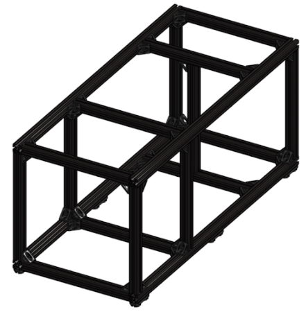

|

Required Materials:
^^^^^^^^^^^^^^^^^^^
* (QTY 4)   65 cm Aluminum Extrusions
* (QTY 13)  25 cm Aluminum Extrusions
* (QTY 44)  90 deg Corner Gussets
* (QTY 88)  M5x8 Button Head Screws
* (QTY 12)  M5x10 Button Head Screws
* (QTY 6)   TPU Feet
* (QTY 4)   Magnet Frame Insert Assembly
* (QTY 100) M5 TNut

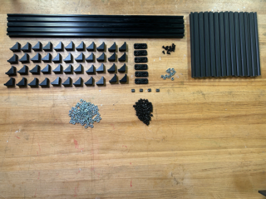

|

Required Tools:
^^^^^^^^^^^^^^^
* M3 Hex/Allen Key
* Metric Measuring Tape

Step-by-Step Instructions:
^^^^^^^^^^^^^^^^^^^^^^^^^^
**NOTE: All fasteners will be "hand tight". ENSURE all TNuts are in the correct orientation (screw goes into flanged end). ENSURE all the sides of the 90 deg gussets are flush with their respective aluminum extrusions -- this may need to be done after the rail positions are locked.**

#. Layout all of the required materials and tools.

#. Attach **QTY (4) 90 deg Corner Gussets** to **QTY (1) 25 cm Aluminum Extrusion** using **QTY (4) M5x8 Button Head Screws** and **QTY (4) M5 TNut** in the following configuration:

   .. image:: ../static/Step_by_Step/Frame_Subassemblies/Aluminum_Extrusion_Frame/Frame-2.jpg
      :align: center

#. Install **QTY (4) M5x8 Button Head Screws** and **QTY (4) M5 TNut** into the other side of each of the **QTY (4) 90 deg Corner Gussets**.

   .. image:: ../static/Step_by_Step/Frame_Subassemblies/Aluminum_Extrusion_Frame/Frame-3.jpg
      :align: center

#. Repeat Steps 2-3 three more times (should have a total of **4** of this assembly).

   .. image:: ../static/Step_by_Step/Frame_Subassemblies/Aluminum_Extrusion_Frame/Frame-4.jpg
       :align: center

#. Attach **QTY (2) 90 deg Corner Gussets** to **QTY (1) 25 cm Aluminum Extrusion** using **QTY (4) M5x8 Button Head Screws** and **QTY (4) M5 TNut** in the following configuration. It is recommended to loosely install the screws and nuts on the gussets prior to rail installation (see image).

   .. image:: ../static/Step_by_Step/Frame_Subassemblies/Aluminum_Extrusion_Frame/Frame-5.jpg
      :align: center

#. Repeat Step 5 five more times (should have a total of **6** of this assembly).

   .. image:: ../static/Step_by_Step/Frame_Subassemblies/Aluminum_Extrusion_Frame/Frame-6.jpg
       :align: center

#. Attach **QTY (6) 90 deg Corner Gussets** to **QTY (1) 25 cm Aluminum Extrusion** using **QTY (6) M5x8 Button Head Screws** and **QTY (6) M5 TNut** in the following configuration:

   .. image:: ../static/Step_by_Step/Frame_Subassemblies/Aluminum_Extrusion_Frame/Frame-7.jpg
       :align: center

#. Install **QTY (6) M5x8 Button Head Screws** and **QTY (6) M5 TNut** into the other side of each of the **QTY (6) 90 deg Corner Gussets**.

   .. image:: ../static/Step_by_Step/Frame_Subassemblies/Aluminum_Extrusion_Frame/Frame-8.jpg
       :align: center

#. Repeat Steps 7-8 five more times (should have a total of **2** of this assembly).

   .. image:: ../static/Step_by_Step/Frame_Subassemblies/Aluminum_Extrusion_Frame/Frame-9.jpg
       :align: center

#. Attach **QTY (4) 90 deg Corner Gussets** to **QTY (1) 25 cm Aluminum Extrusion** using **QTY (4) M5x8 Button Head Screws** and **QTY (4) M5 TNut** in the following configuration:

   .. image:: ../static/Step_by_Step/Frame_Subassemblies/Aluminum_Extrusion_Frame/Frame-10.jpg
       :align: center

#. Install **QTY (4) M5x8 Button Head Screws** and **QTY (4) M5 TNut** into the other side of each of the **QTY (4) 90 deg Corner Gussets**.

   .. image:: ../static/Step_by_Step/Frame_Subassemblies/Aluminum_Extrusion_Frame/Frame-11.jpg
       :align: center

#. Take QTY (1) of the assemblies from **Step 4** and slide it inbetween **QTY (2) 65 cm Aluminum Extrusion** to the very end in the following configuration. Tighten the **QTY (2) M5x8 Button Head Screw** that connects to the 65 cm rail.

   .. image:: ../static/Step_by_Step/Frame_Subassemblies/Aluminum_Extrusion_Frame/Frame-12.jpg
       :align: center

#. Take QTY (1) of the assemblies from **Step 9** and slide it from the same point in between the **QTY (2) 65 cm Aluminum Extrusion** as **Step 12** 205mm from the end (front rail to front rail) in the following configuration:

   .. image:: ../static/Step_by_Step/Frame_Subassemblies/Aluminum_Extrusion_Frame/Frame-13.jpg
       :align: center

#. Take QTY (1) of the assemblies from **Step 10** and slide it from the same point in between the **QTY (2) 65 cm Aluminum Extrusion** ~260mm from the rail in **Step 13** (front rail to front rail) in the following configuration. You may need to loosen the brackets from the previous two steps to slide it in. This rail location is temporary and will be changed in main assembly.

   .. image:: ../static/Step_by_Step/Frame_Subassemblies/Aluminum_Extrusion_Frame/Frame-14.jpg
       :align: center

#. Take QTY (1) of the assemblies from **Step 4**, FLIP IT, and slide it inbetween **QTY (2) 65 cm Aluminum Extrusion** to the opposite end in the following configuration. Keep this loose for the next step.

   .. image:: ../static/Step_by_Step/Frame_Subassemblies/Aluminum_Extrusion_Frame/frame-15.jpg
       :align: center

#. Refer to the "Magnet Frame Insert" Subassembly to make **QTY (2) Magnet Frame Insert**.

   .. image:: ../static/Step_by_Step/Frame_Subassemblies/Aluminum_Extrusion_Frame/Frame-16.jpg
       :align: center

#. Pull out the rail from **Step 15** so that the back railing is exposed, slide in **QTY (2) Magnet Frame Insert**. Slide the rail back to be flush with the end and tighten it.

   .. image:: ../static/Step_by_Step/Frame_Subassemblies/Aluminum_Extrusion_Frame/frame-17.jpg
       :align: center

   .. image:: ../static/Step_by_Step/Frame_Subassemblies/Aluminum_Extrusion_Frame/frame-17-2.jpg
       :align: center

#. You should now have the bottom of the frame.

   .. image:: ../static/Step_by_Step/Frame_Subassemblies/Aluminum_Extrusion_Frame/Frame-18.jpg
       :align: center

#. Repeat Steps 12, 13, 15, 16, & 17 with the remaining **QTY (2) 65 cm Aluminum Extrusion**.

   .. image:: ../static/Step_by_Step/Frame_Subassemblies/Aluminum_Extrusion_Frame/Frame-18b.jpg
       :align: center

#. Take **QTY (6) TPU Feet** and install **QTY (2) M5 TNut** and **QTY (2) M5x8 Button Head Screw** into EACH foot (total 12 TNuts and screws should be used).

   .. image:: ../static/Step_by_Step/Frame_Subassemblies/Aluminum_Extrusion_Frame/Frame-19.jpg
       :align: center

   .. image:: ../static/Step_by_Step/Frame_Subassemblies/Aluminum_Extrusion_Frame/Frame-19-2.jpg
       :align: center

#. Take these assemblies and slide 3 of them on the bottom of each of the **QTY (2) 65 cm Aluminum Extrusion** from the bottom frame assembly. Two of the feet should go on each end and one should be near the center. Fasten these feet down.

   .. image:: ../static/Step_by_Step/Frame_Subassemblies/Aluminum_Extrusion_Frame/Frame-20.jpg
       :align: center

   .. image:: ../static/Step_by_Step/Frame_Subassemblies/Aluminum_Extrusion_Frame/Frame-20-2.jpg
       :align: center

#. You should now have the top and bottom of the frame.

   .. image:: ../static/Step_by_Step/Frame_Subassemblies/Aluminum_Extrusion_Frame/Frame-21.jpg
       :align: center

#. Slide in **QTY (3) M5 TNut** into the top of each of the **QTY (4) 65 cm Aluminum Extrusion** (a total of 12 M5 TNuts should be used). Position these near, but away from the vertical bracket locations (shown below).

   .. image:: ../static/Step_by_Step/Frame_Subassemblies/Aluminum_Extrusion_Frame/Frame-22.jpg
       :align: center

#. Take QTY (6) of the assembly from Step 5 and, from the top down, vertically slide them into the **Bottom Frame** (top down) in the following configuration.

   .. image:: ../static/Step_by_Step/Frame_Subassemblies/Aluminum_Extrusion_Frame/Frame-23.jpg
       :align: center

#. Slide the M5 TNuts from Step 23 under each of the **QTY (6) 90 deg Corner Gussets** and fasten down with **QTY (6) M5x8 Button Head Screw**. Also fasten the side fasteners that the vertical rail slides into. Loosen and tighten the brackets so that the vertical rails are flush (by touch) with the railings on each side.

   .. image:: ../static/Step_by_Step/Frame_Subassemblies/Aluminum_Extrusion_Frame/Frame-24.jpg
       :align: center

#. Carefully take the top assembly of the frame from Step 19 and, from the side (so that the M5 TNuts do not fall out), flip the assembly and align it with the vertical rails. Slowly slide in the top assembly, ensuring that the TNuts are going into all 6 of the vertical rails.

   .. image:: ../static/Step_by_Step/Frame_Subassemblies/Aluminum_Extrusion_Frame/Frame-25.jpg
       :align: center

#. Slide the M5 TNuts from Step 23 under each of the **QTY (6) 90 deg Corner Gussets** and fasten down with **QTY (6) M5x8 Button Head Screw**. You will not be able to slide the M5 TNuts through the corner brackets due to the little locater knobs on them. You may need to loosen the corner brackets, bring it down, align the TNut, and bring it back up and tighten.

   .. image:: ../static/Step_by_Step/Frame_Subassemblies/Aluminum_Extrusion_Frame/Frame-26-2.jpg
       :align: center

#. Ensure all railing and 90 deg corner brackets are flush with each other. Ensure all fasteners are completely hand tight. The Aluminum Extrusion Frame is now complete.

   .. image:: ../static/Step_by_Step/Frame_Subassemblies/Aluminum_Extrusion_Frame/Frame-26.jpg
       :align: center

----

LCD Panel
=========

----

|

Required Materials:
^^^^^^^^^^^^^^^^^^^
**NOTE: The Magnet Holders have been already glued in & the Heat Inserts have already been installed.**

* (QTY 1) LCD Panel
* (QTY 8) 12x5x2mm Rare Earth Magnet Bars
* (QTY 4) Magnet Holder
* (QTY 2) Panel Handle
* (QTY 4) M3x4x5 Heat Set Insert
* (QTY 4) M3x6 Button Head Screw

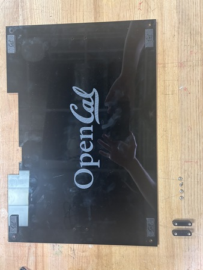

|

Required Tools:
^^^^^^^^^^^^^^^
* Soldering Iron
* M2 Hex/Allen Key
* Super Glue

Step-by-Step Instructions:
^^^^^^^^^^^^^^^^^^^^^^^^^^
**NOTE 1: Ensure all magnets are the correct polarity. Do this by keeping the magnets together and only taking a magnet out one by one and placing them in the same orientation (same side down). If the polarities get flipped, you may need to repeat some steps.**

**NOTE 2: The Magnet Holders had already been glued on to the panel prior to instruction writing. Images will reflect this.**

#. Lay a **QTY (1) Magnet Holders** on the flat end. Add a drop of super glue into the center box. Carefully place **QTY (1) 12x5x2mm Rare Earth Magnet Bar** in the center box. Wait ~ 2 mintues for cure.

   .. image:: ../static/Step_by_Step/Frame_Subassemblies/LCD_Panel/LCD-1.JPG
       :align: center

   .. image:: ../static/Step_by_Step/Frame_Subassemblies/LCD_Panel/LCD-1-2.JPG
       :align: center

#. After cure, place another drop of super glue on top of the magnet from Step 1. Carefully place another **QTY (1) 12x5x2mm Rare Earth Magnet Bar** in the same orientation on top of the previous magnet (ensure that the magnets are in the same polar orientation and are aligned with each other).

   .. image:: ../static/Step_by_Step/Frame_Subassemblies/LCD_Panel/LCD-2.JPG
       :align: center

   .. image:: ../static/Step_by_Step/Frame_Subassemblies/LCD_Panel/LCD-2-2.JPG
       :align: center

#. Repeat Steps 1 & 2 three more times. You should have 4 of these assemblies total.

#. Insert **QTY (2) M3x4x5 Heat Set Insert** into each of the holes on the back of **QTY (1) Panel Handle** using a soldering iron. To the best of your ability, ensure the heat inserts are straight.

   .. image:: ../static/Step_by_Step/Frame_Subassemblies/LCD_Panel/LCD-4.JPG
       :align: center

#. Repeat Step 4 one more time. You should have 2 handles with installed inserts.

   .. image:: ../static/Step_by_Step/Frame_Subassemblies/LCD_Panel/LCD-5.JPG
       :align: center

#. Add a couple dabs of super glue around the panel interface of the magnet holders (seen below). Press it into the top left of the **QTY (1) LCD panel** (from the front of the panel -- the part with the logo) at the designated location. Add more pressure to ensure a flush fit.

   .. image:: ../static/Step_by_Step/Frame_Subassemblies/LCD_Panel/LCD-6.JPG
       :align: center

   .. image:: ../static/Step_by_Step/Frame_Subassemblies/LCD_Panel/LCD-6-2.JPG
       :align: center

#. Repeat Step 6 three more times with the remaining assemblies from Step 3 at each of the corners of the panel. Ensure all magnets are facing the correct way (right-side up CAL logo).

   .. image:: ../static/Step_by_Step/Frame_Subassemblies/LCD_Panel/LCD-7.JPG
       :align: center

#. Install the **QTY (2) Panel Handle Assemblies** from Step 5 by screwing them in with **QTY (4) M3x6 Button Head Screws** in the following locations.

   .. image:: ../static/Step_by_Step/Frame_Subassemblies/LCD_Panel/LCD-8.JPG
       :align: center

#. The LCD Panel subassembly is now complete.

   .. image:: ../static/Step_by_Step/Frame_Subassemblies/LCD_Panel/LCD-9.JPG
       :align: center

----

Back Projector Panel
====================

----

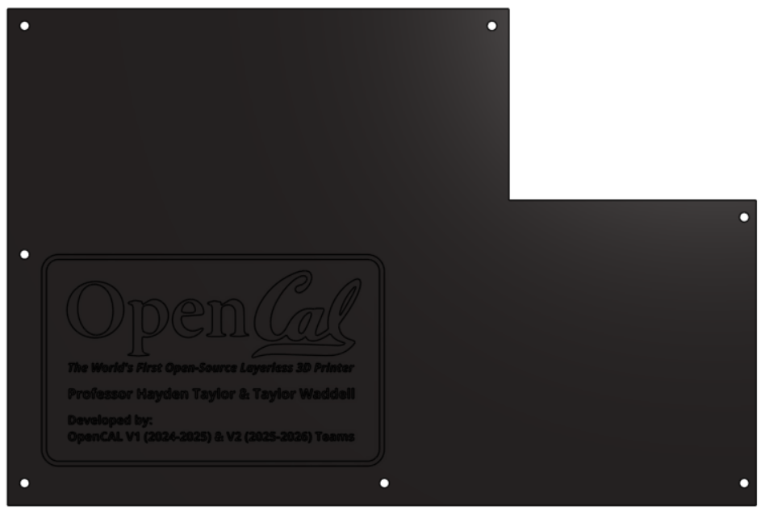

|

Required Materials:
^^^^^^^^^^^^^^^^^^^
* (QTY 1) Back Projector Panel
* (QTY 7) M5x8 Button Head Screws
* (QTY 7) M5 Hammer TNut

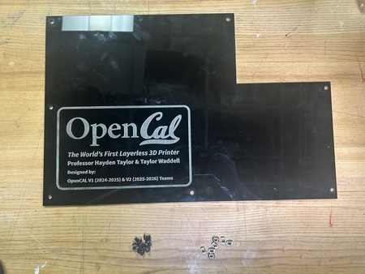

|

Required Tools:
^^^^^^^^^^^^^^^
No Tools Required.

Step-by-Step Instructions:
^^^^^^^^^^^^^^^^^^^^^^^^^^
**NOTE 1: Ensure all Hammer TNuts are in the correct orientation (wide end on bottom).**

#. Place **QTY (7) M5x8 Button Head Screw** through each of the holes on the **QTY (1) Back Projector Panel** from the front (face with logo). Loosely install **QTY (7) M5 Hammer TNut** on the opposite ends.

   .. image:: ../static/Step_by_Step/Frame_Subassemblies/Back_Projector_Panel/Back-2.JPG
       :align: center

#. The Back Projector Panel subassembly is now complete.

   .. image:: ../static/Step_by_Step/Frame_Subassemblies/Back_Projector_Panel/Back-2-2.JPG
       :align: center

----

Side Projector Panel
====================

----

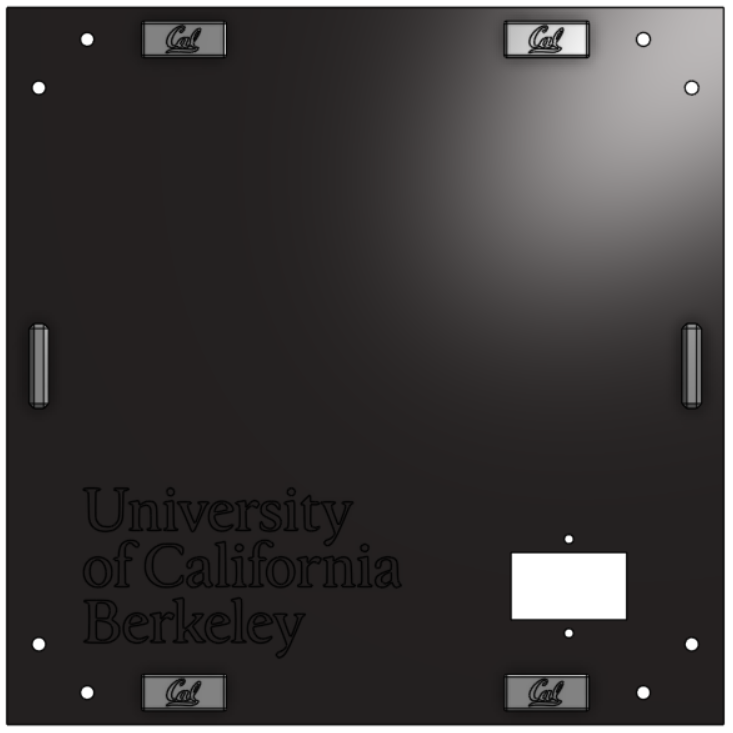

|

Required Materials:
^^^^^^^^^^^^^^^^^^^
* (QTY 1) Side Projector Panel
* (QTY 8) 12x5x2mm Rare Earth Magnet Bars
* (QTY 4) Magnet Holder
* (QTY 2) Panel Handle
* (QTY 4) M3x4x5 Heat Set Insert
* (QTY 4) M3x6 Button Head Screw

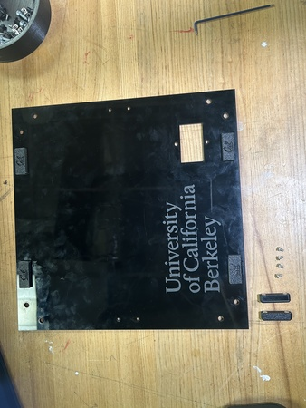

|

Required Tools:
^^^^^^^^^^^^^^^
* Soldering Iron
* M2 Hex Key
* Super Glue

Step-by-Step Instructions:
^^^^^^^^^^^^^^^^^^^^^^^^^^
**NOTE 1: Ensure all magnets are the correct polarity. Do this by keeping the magnets together and only taking a magnet out one by one and placing them in the same orientation (same side down). If the polarities get flipped, you may need to repeat some steps.**

**NOTE 2: The Magnet Holders had already been glued on to the panel prior to instruction writing. Images will reflect this.**

#. Lay a **QTY (1) Magnet Holder** on the flat end. Add a drop of super glue into the center box. Carefully place **QTY (1) 12x5x2mm Rare Earth Magnet Bar** in the center box. Wait ~ 2 mintues for cure.

   .. image:: ../static/Step_by_Step/Frame_Subassemblies/LCD_Panel/LCD-1.JPG
       :align: center

   .. image:: ../static/Step_by_Step/Frame_Subassemblies/LCD_Panel/LCD-1-2.JPG
       :align: center

#. After cure, place another drop of super glue on top of the magnet from Step 1. Carefully place another **QTY (1) 12x5x2mm Rare Earth Magnet Bar** in the same orientation on top of the previous magnet (ensure that the magnets are in the same polar orientation and are aligned with each other).

   .. image:: ../static/Step_by_Step/Frame_Subassemblies/LCD_Panel/LCD-2.JPG
       :align: center

   .. image:: ../static/Step_by_Step/Frame_Subassemblies/LCD_Panel/LCD-2-2.JPG
       :align: center

#. Repeat Steps 1 & 2 three more times. You should have 4 of these assemblies total.

#. Insert **QTY (2) M3x4x5 Heat Set Insert** into each of the holes on the back of **QTY (1) Panel Handle** using a soldering iron. To the best of your ability, ensure the heat inserts are straight.

   .. image:: ../static/Step_by_Step/Frame_Subassemblies/LCD_Panel/LCD-4.JPG
       :align: center

#. Repeat Step 4 one more time. You should have 2 handles with installed inserts.

   .. image:: ../static/Step_by_Step/Frame_Subassemblies/LCD_Panel/LCD-5.JPG
       :align: center

#. Add a couple dabs of super glue around the panel interface of the magnet holders (seen below). Press it into the top left of the **QTY (1) Side Projector Panel** (from the front of the panel) at the designated location. Add more pressure to ensure a flush fit.

   .. image:: ../static/Step_by_Step/Frame_Subassemblies/Side_Projector_Panel/Side-6.JPG
       :align: center

#. Repeat Step 6 three more times with the remaining assemblies from Step 3 at each of the corners of the panel. Ensure all magnets are facing the correct way (right-side up CAL logo).

   .. image:: ../static/Step_by_Step/Frame_Subassemblies/Side_Projector_Panel/Side-7.JPG
       :align: center

#. Install the **QTY (2) Panel Handle Assemblies** from Step 5 by screwing them in with **QTY (4) M3x6 Button Head Screws** in the following locations.

   .. image:: ../static/Step_by_Step/Frame_Subassemblies/Side_Projector_Panel/Side-8.JPG
       :align: center

#. (Not shown in images). Loosely install **QTY (4) M5x8 Button Head Screw** and **QTY (4) M5 Hammer TNut** on each corner of the panel. Do not tighten these down as this will occur during Main Assembly Part 2.

#. The Side Projector Panel subassembly is now complete.

   .. image:: ../static/Step_by_Step/Frame_Subassemblies/Side_Projector_Panel/Side-9.JPG
       :align: center

----

Top Projector Panel
===================

----

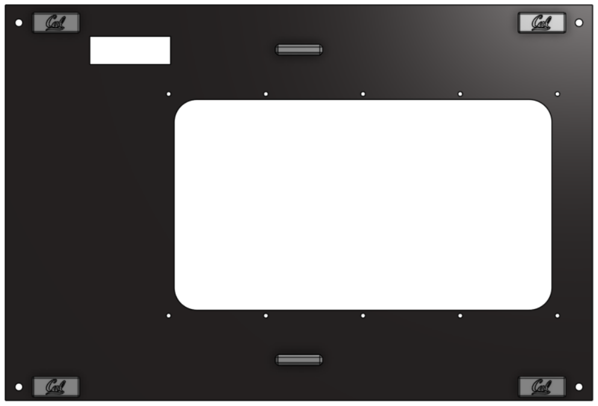

|

Required Materials:
^^^^^^^^^^^^^^^^^^^
**NOTE: Heat set inserts have already been installed into Top Caps. Rare Earth Magnet Bars have already been installed into magnet holders and panel. RP5 Guard is not depicted.**

* (QTY 1) Top Projector Panel
* (QTY 1) Top Cap 1
* (QTY 1) Top Cap 2
* (QTY 8) 12x5x2mm Rare Earth Magnet Bars
* (QTY 4) Magnet Holder
* (QTY 2) Panel Handle
* (QTY 4) M3x4x5 Heat Set Insert
* (QTY 10) M3x6x5 Heat Set Insert
* (QTY 4) M3x6 Button Head Screw
* (QTY 8) M3x8 Button Head Screw
* (QTY 1) RP5 Guard

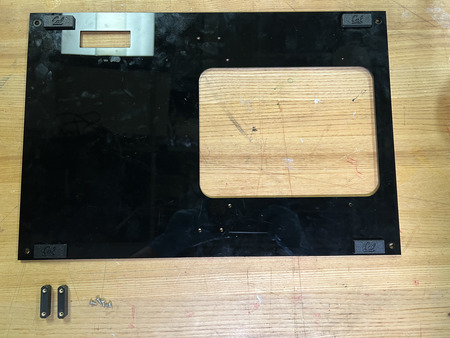

|

Required Tools:
^^^^^^^^^^^^^^^
* Soldering Iron
* M2 Hex Key
* Super Glue

Step-by-Step Instructions:
^^^^^^^^^^^^^^^^^^^^^^^^^^
**NOTE: Ensure all magnets are the correct polarity. Do this by keeping the magnets together and only taking a magnet out one by one and placing them in the same orientation (same side down). If the polarities get flipped, you may need to repeat some steps.**

#. Lay a **QTY (1) Magnet Holders** on the flat end. Add a drop of super glue into the center box. Carefully place **QTY (1) 12x5x2mm Rare Earth Magnet Bar** in the center box. Wait ~ 2 mintues for cure.

   .. image:: ../static/Step_by_Step/Frame_Subassemblies/LCD_Panel/LCD-1.JPG
       :align: center

   .. image:: ../static/Step_by_Step/Frame_Subassemblies/LCD_Panel/LCD-1-2.JPG
       :align: center

#. After cure, place another drop of super glue on top of the magnet from Step 1. Carefully place another **QTY (1) 12x5x2mm Rare Earth Magnet Bar** in the same orientation on top of the previous magnet (ensure that the magnets are in the same polar orientation and are aligned with each other).

   .. image:: ../static/Step_by_Step/Frame_Subassemblies/LCD_Panel/LCD-2.JPG
       :align: center

   .. image:: ../static/Step_by_Step/Frame_Subassemblies/LCD_Panel/LCD-2-2.JPG
       :align: center

#. Repeat Steps 1 & 2 three more times. You should have 4 of these assemblies total.

#. Insert **QTY (2) M3x4x5 Heat Set Insert** into each of the holes on the back of **QTY (1) Panel Handle** using a soldering iron. To the best of your ability, ensure the heat inserts are straight.

   .. image:: ../static/Step_by_Step/Frame_Subassemblies/LCD_Panel/LCD-4.JPG
       :align: center

#. Repeat Step 4 one more time. You should have 2 handles with installed inserts.

   .. image:: ../static/Step_by_Step/Frame_Subassemblies/LCD_Panel/LCD-5.JPG
       :align: center

#. Add a couple dabs of super glue around the panel interface of the magnet holders (seen below). Press it into the top left of the **QTY (1) Top Projector Panel** (from the front of the panel-- small hole is on the left, big hole is on the right) at the designated location. Add more pressure to ensure a flush fit.

   .. image:: ../static/Step_by_Step/Frame_Subassemblies/Top_Projector_Panel/top-projector-6.jpg
       :align: center

#. Repeat Step 6 three more times with the remaining assemblies from Step 3 at each of the corners of the panel. Ensure all magnets are facing the correct way (right-side up CAL logo).

   .. image:: ../static/Step_by_Step/Frame_Subassemblies/Top_Projector_Panel/top-projector-7.jpg
       :align: center

#. Install the **QTY (2) Panel Handle Assemblies** from Step 5 by screwing them in with **QTY (4) M3x6 Button Head Screws** in the following locations.

   .. image:: ../static/Step_by_Step/Frame_Subassemblies/Top_Projector_Panel/top-projector-8.jpg
       :align: center

#. Install the **QTY (1) Top Cap 1** and **QTY (1) Top Cap 2** to the same side as the handles (top side) using **QTY (10) M3x8 Button Head Screw** from the opposite end of the panel. The Top Caps, when placed together, are symmetrical so it does not matter what orientation, see image below.

#. Glue on **QTY (1) RP5 Guard** in the small hole on the **Top Projector Panel**.

#. The Top Projector Panel subassembly is now complete.

   .. image:: ../static/Step_by_Step/Frame_Subassemblies/Top_Projector_Panel/top-projector-10.jpg
       :align: center

----

Door
=========

----

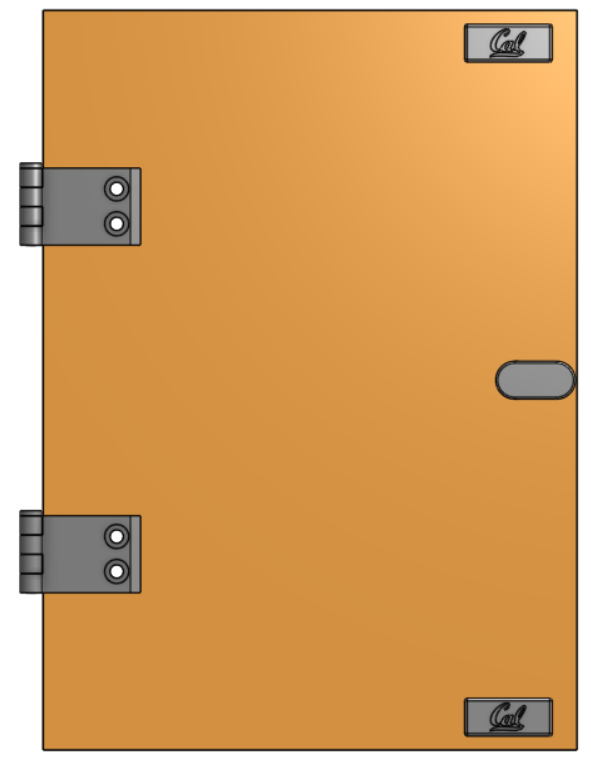

|

Required Materials:
^^^^^^^^^^^^^^^^^^^
**NOTE: Heat Set Insert has already been installed into the Door Handle.**

* (QTY 1) Door Panel
* (QTY 2) Magnet Holder
* (QTY 4) 12x5x2mm Rare Earth Magnet Bars
* (QTY 1) M3x6x5 Heat Set Insert
* (QTY 1) M3x8 Button Head Screw
* (QTY 2) Short Hinge
* (QTY 2) Long Hinge
* (QTY 2) Hinge Pin
* (QTY 4) M5x8 Button Head Screw
* (QTY 4) M5x10 Button Head Screw
* (QTY 4) M5 Hex Nut/M5 TNut
* (QTY 4) M5 Hammer TNut
* (QTY 1) Door Handle
* (QTY 1) M3 Washer

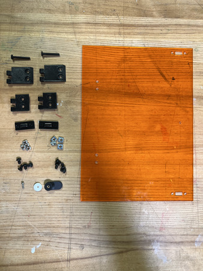

|

Required Tools:
^^^^^^^^^^^^^^^
* Soldering Iron
* M3 Allen Wrench
* M2 Allen Wrench
* Super Glue

Step-by-Step Instructions:
^^^^^^^^^^^^^^^^^^^^^^^^^^
**NOTE: The Heat Set Insert and Magnets have already been installed to the Door Handle and Magnet Holders Respectively. Images will reflect this.**

#. Align **QTY (1) Short Hinge** with **QTY (1) Long Hinge** with the short hinge on the left and long hinge on the right. Ensure it is in the following orientation:

   .. image:: ../static/Step_by_Step/Frame_Subassemblies/Door/door-1.jpg
       :align: center

#. Insert **QTY (1) Hinge Pin** from the top, ensuring that it goes all the way through.

   .. image:: ../static/Step_by_Step/Frame_Subassemblies/Door/door-2.jpg
       :align: center

#. Repeat Steps 1 & 2 one more time. You should have 2 of these assemblies.

   .. image:: ../static/Step_by_Step/Frame_Subassemblies/Door/door-3.jpg
       :align: center

#. On the **QTY (2) Short Hinge**, loose install **QTY (4) M5x8 Button Head Screw** with **QTY (4) M5 Hammer TNut**.

   .. image:: ../static/Step_by_Step/Frame_Subassemblies/Door/door-4.jpg
       :align: center

#. Align the holes of the **QTY (2) Long Hinge** part of the assembly with the corresponding holes in the FRONT of the **QTY (1) Door panel**. Install using **QTY (4) M3x10 Button Head Screw** and **QTY (4) M5 Hex Nut/TNut**. The front of the panel is designated as the side with the hinge holes on the left and handle hole on the right.

   .. image:: ../static/Step_by_Step/Frame_Subassemblies/Door/door-5a.jpg
       :align: center

   .. image:: ../static/Step_by_Step/Frame_Subassemblies/Door/door-5b.jpg
       :align: center

#. Install **QTY (1) M3x4x5 Heat Set Insert** into the **QTY (1) Door Handle** from the back.

   .. image:: ../static/Step_by_Step/Frame_Subassemblies/Door/door-6.jpg
       :align: center

#. Install the assembly from Step 6 with **QTY (1) M3x8 Button Head Screw** and **QTY (1) M3 Washer** from the back. The handle should be on the right side.

   .. image:: ../static/Step_by_Step/Frame_Subassemblies/Door/door-7a.jpg
       :align: center

   .. image:: ../static/Step_by_Step/Frame_Subassemblies/Door/door-7b.jpg
       :align: center

#. Lay a **QTY (1) Magnet Holders** on the flat end. Add a drop of super glue into the center box. Carefully place **QTY (1) 12x5x2mm Rare Earth Magnet Bar** in the center box. Wait ~ 2 mintues for cure.

   .. image:: ../static/Step_by_Step/Frame_Subassemblies/LCD_Panel/LCD-1.JPG
       :align: center

   .. image:: ../static/Step_by_Step/Frame_Subassemblies/LCD_Panel/LCD-1-2.JPG
       :align: center

#. After cure, place another drop of super glue on top of the magnet from Step 1. Carefully place another **QTY (1) 12x5x2mm Rare Earth Magnet Bar** in the same orientation on top of the previous magnet (ensure that the magnets are in the same polar orientation and are aligned with each other).

   .. image:: ../static/Step_by_Step/Frame_Subassemblies/LCD_Panel/LCD-2.JPG
       :align: center

   .. image:: ../static/Step_by_Step/Frame_Subassemblies/LCD_Panel/LCD-2-2.JPG
       :align: center

#. Repeat Steps 8 & 9 one more time. You should have 2 of these assemblies total.

   .. image:: ../static/Step_by_Step/Frame_Subassemblies/Door/door-10.jpg
       :align: center

#. Add a couple dabs of super glue around the panel interface of the magnet holders (seen below). Press it into the top right of the **QTY (1) Door Panel** (from the front of the panel) at the designated location. Add more pressure to ensure a flush fit.

   .. image:: ../static/Step_by_Step/Frame_Subassemblies/Door/door-11a.jpg
       :align: center

   .. image:: ../static/Step_by_Step/Frame_Subassemblies/Door/door-11b.jpg
       :align: center

#. Repeat Step 11 one more time with the remaining assembly from Step 10 at the bottom right corner of the panel. Ensure all magnets are facing the correct way (right-side up CAL logo).

#. The Door Subassembly is now complete.

   .. image:: ../static/Step_by_Step/Frame_Subassemblies/Door/door-13.jpg
       :align: center

----

Top Vial Panel
==============

----

|

Required Materials:
^^^^^^^^^^^^^^^^^^^
* (QTY 1) Top Vial Panel
* (QTY 4) M5x8 Button Head Screws
* (QTY 4) M5 Hammer TNut
* (QTY 1) Motor Wire Guard

   .. image:: ../static/Step_by_Step/Frame_Subassemblies/Top_Vial_Panel/top-vial-materials.jpg
       :align: center

|

Required Tools:
^^^^^^^^^^^^^^^
* (QTY 1) Super Glue

Step-by-Step Instructions:
^^^^^^^^^^^^^^^^^^^^^^^^^^
**NOTE 1: Ensure all Hammer TNuts are in the correct orientation (wide end on bottom).**

#. Place **QTY (4) M5x8 Button Head Screw** through each of the holes on the **QTY (1) Top Vial Panel** from the front (this is NOT symmetrical--the front is when the small hole is on top of the big hole and the wider side (relative to center hole) is on the left and narrower side is on the right). Loosely install **QTY (4) M5 Hammer TNut** on the opposite ends.

   .. image:: ../static/Step_by_Step/Frame_Subassemblies/Top_Vial_Panel/top-vial-1.jpg
       :align: center
    
#. Glue on **QTY (1) Motor Wire Guard** in the small hole on the **Top Projector Panel**.

    .. image:: ../static/WIP.png
        :align: center 

#. The Top Vial Panel subassembly is now complete.

   .. image:: ../static/Step_by_Step/Frame_Subassemblies/Top_Vial_Panel/top-vial-2.jpg
       :align: center

----

Back Vial Panel
===============

----

|

Required Materials:
^^^^^^^^^^^^^^^^^^^
* (QTY 1) Back Vial Panel
* (QTY 4) M5x8 Button Head Screws
* (QTY 4) M5 Hammer TNut

   .. image:: ../static/Step_by_Step/Frame_Subassemblies/Back_Vial_Panel/back-vial-materials.jpg
       :align: center

|

Required Tools:
^^^^^^^^^^^^^^^
No Tools Required.

Step-by-Step Instructions:
^^^^^^^^^^^^^^^^^^^^^^^^^^
**NOTE 1: Ensure all Hammer TNuts are in the correct orientation (wide end on bottom).**

#. Place **QTY (7) M5x8 Button Head Screw** through each of the holes on the **QTY (1) Back Vial Panel** from the front (face with logo). Loosely install **QTY (7) M5 Hammer TNut** on the opposite ends.

   .. image:: ../static/Step_by_Step/Frame_Subassemblies/Back_Vial_Panel/back-vial-2.jpg
      :align: center

#. The Back Vial Panel subassembly is now complete.

   .. image:: ../static/Step_by_Step/Frame_Subassemblies/Back_Vial_Panel/back-vial-2.jpg
      :align: center

----

Side Vial Panel
===============

----

|

Required Materials:
^^^^^^^^^^^^^^^^^^^
* (QTY 1) Back Vial Panel
* (QTY 4) M5x8 Button Head Screws
* (QTY 4) M5 Hammer TNut

   .. image:: ../static/Step_by_Step/Frame_Subassemblies/Side_Vial_Panel/side-vial-materials.jpg
       :align: center

|

Required Tools:
^^^^^^^^^^^^^^^
No Tools Required.

Step-by-Step Instructions:
^^^^^^^^^^^^^^^^^^^^^^^^^^
**NOTE 1: Ensure all Hammer TNuts are in the correct orientation (wide end on bottom).**

#. Place **QTY (4) M5x8 Button Head Screw** through each of the top and bottom corner holes on the **QTY (1) Side Vial Panel** from the front (face with logo). Loosely install **QTY (4) M5 Hammer TNut** on the opposite ends.

   .. image:: ../static/Step_by_Step/Frame_Subassemblies/Side_Vial_Panel/side-vial-1.jpg
       :align: center

#. The Side Vial Panel subassembly is now complete.

   .. image:: ../static/Step_by_Step/Frame_Subassemblies/Side_Vial_Panel/side-vial-2.jpg
       :align: center

----

Bottom Panels
==============

----

|

Required Materials:
^^^^^^^^^^^^^^^^^^^
* (QTY 2) Bottom Panel
* (QTY 12) M5x8 Button Head Screws
* (QTY 12) M5 Hammer TNut

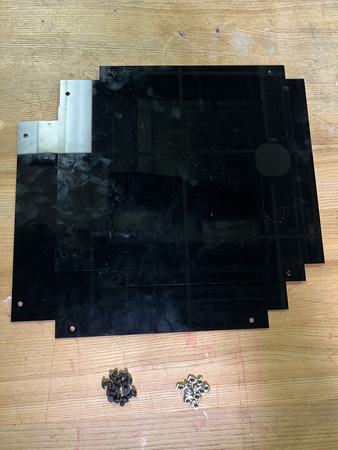

|

Required Tools:
^^^^^^^^^^^^^^^
No Tools Required.

Step-by-Step Instructions:
^^^^^^^^^^^^^^^^^^^^^^^^^^
**NOTE 1: Ensure all Hammer TNuts are in the correct orientation (wide end on bottom).**

#. Place **QTY (6) M5x8 Button Head Screw** through each of the holes on the **QTY (1) Bottom Panel** from the front (choose one side, panel is symmetrical). Loosely install **QTY (6) M5 Hammer TNut** on the opposite ends.

   .. image:: ../static/Step_by_Step/Frame_Subassemblies/Bottom_Panels/bottom-panels-1.jpg
       :align: center

#. Repeat Step 1 one more time. The Bottom Panels subassembly is now complete.

   .. image:: ../static/Step_by_Step/Frame_Subassemblies/Bottom_Panels/bottom-panels-2.jpg
       :align: center

----

Magnet Frame Inserts
====================

----

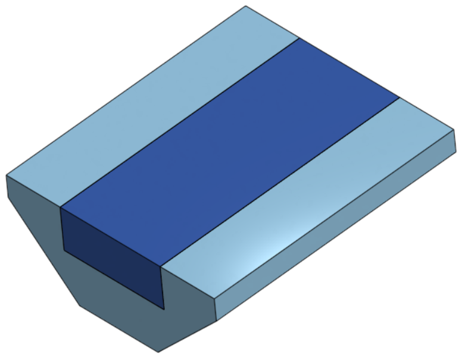

|

Required Materials:
^^^^^^^^^^^^^^^^^^^
* (QTY 10) Magnet Frame Insert
* (QTY 10) 12x5x2mm Rare Earth Magnet Bar

   .. image:: ../static/WIP.png
       :align: center

|

Required Tools:
^^^^^^^^^^^^^^^
* Super Glue

Step-by-Step Instructions:
^^^^^^^^^^^^^^^^^^^^^^^^^^
**NOTE: Wear gloves while doing this so super glue does not contact your skin. Also, ENSURE the magnets are all in the same polarity as the panels**

**NOTE: These Magnet Frame Inserts will be installed after the printer is completed so that they do not fall out and get lost.**

#. Place a dab of super glue into the crevice of **QTY (1) Magnet Frame Insert**. Place **QTY (1) 12x5x2mm Rare Earth Magnet Bar** on top of the crevice to bond the magnet.

   .. image:: ../static/Step_by_Step/Frame_Subassemblies/Magnet_Frame_Inserts/magnetframe-1a.jpg
       :align: center

   .. image:: ../static/Step_by_Step/Frame_Subassemblies/Magnet_Frame_Inserts/magnetframe-1b.jpg
       :align: center

#. Repeat Step 1 nine more times. You should have 10 of these assemblies total.

#. The Magnet Frame Insert Subassembly is now complete.
