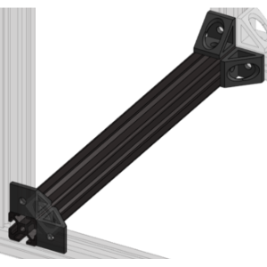
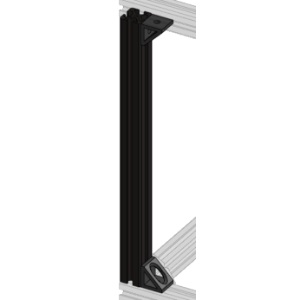
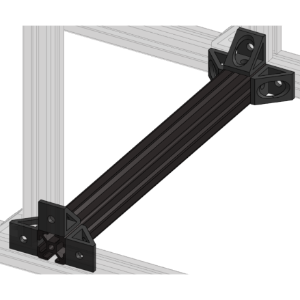
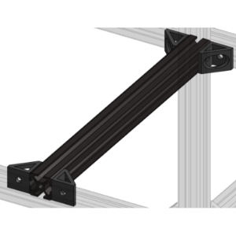

Frame
++++++++++++++++++++++++

The frame consists of the following subassemblies:

* Aluminum Extrusion Frame

* LCD Panel

* Back Projector Panel

* Top Projector Panel

* Door

Aluminum Extrusion Frame
========================

----

.. image:: ../static/Frame/frame.png
    :align: center 

Required Materials:
^^^^^^^^^^^^^^^^^^^
* 25 cm Aluminum Extrusions (QTY 13)
* 65 cm Aluminum Extrusions (QTY 4)
* 90 deg Corner Gussets (QTY 41)
* M5x8 Button Head Screws (QTY 94)
* M5 TNut (QTy 94)
* TPU Feet (QTY 6)

.. image:: ../static/WIP.png
    :align: center 

Required Tools:
^^^^^^^^^^^^^^^
* M3 Hex Key (recommended)
* M3 Allen Wrench

.. image:: ../static/WIP.png
    :align: center 

Step-by-Step Instructions:
^^^^^^^^^^^^^^^^^^^^^^^^^^
**NOTE: All fasteners will be "hand tight".**

1. Layout all of the required materials and tools.

.. image:: ../static/WIP.png
    :align: center 

2. Attach **QTY (4) 90 deg Corner Gussets** to **QTY (1) 25 cm Aluminum Extrusion** using **QTY (4) M5x8 Button Head Screws** and **QTY (4) M5 TNut** in the following configuration:

3. Install **QTY (4) M5x8 Button Head Screws** and **QTY (4) M5 TNut** into the other side of each of the **QTY (4) 90 deg Corner Gussets**.    

.. image:: ../static/WIP.png
    :align: center 
    
4. Repeat Steps (2 & 3) three more times (should have a total of **4** of this assembly).

.. image:: ../static/WIP.png
    :align: center 

5. Attach **QTY (2) 90 deg Corner Gussets** to **QTY (1) 25 cm Aluminum Extrusion** using **QTY (2) M5x8 Button Head Screws** and **QTY (4) M5 TNut** in the following configuration:

6. Repeat Step 5 five more times (should have a total of **6** of this assembly).

.. image:: ../static/WIP.png
    :align: center 

7. Attach **QTY (6) 90 deg Corner Gussets** to **QTY (1) 25 cm Aluminum Extrusion** using **QTY (6) M5x8 Button Head Screws** and **QTY (6) M5 TNut** in the following configuration:

8. Install **QTY (6) M5x8 Button Head Screws** and **QTY (6) M5 TNut** into the other side of each of the **QTY (6) 90 deg Corner Gussets**. 

.. image:: ../static/WIP.png
    :align: center 

9. Repeat Steps (7 & 8) five more times (should have a total of **2** of this assembly).

.. image:: ../static/WIP.png
    :align: center 

10. Attach **QTY (4) 90 deg Corner Gussets** to **QTY (1) 25 cm Aluminum Extrusion** using **QTY (4) M5x8 Button Head Screws** and **QTY (4) M5 TNut** in the following configuration:

11. Install **QTY (4) M5x8 Button Head Screws** and **QTY (4) M5 TNut** into the other side of each of the **QTY (4) 90 deg Corner Gussets**. 

.. image:: ../static/WIP.png
    :align: center 

12. Take QTY (1) of the assemblies from **Step 4** and slide it inbetween **QTY (2) 65 cm Aluminum Extrusion** to the very end in the following configuration:

.. image:: ../static/WIP.png
    :align: center 

13. Take QTY (1) of the assemblies from **Step 9** and slide it from the same point in between the **QTY (2) 65 cm Aluminum Extrusion** as **Step 12** 205mm from the end (front rail to front rail) in the following configuration:

.. image:: ../static/WIP.png
    :align: center 

14. Take QTY (1) of the assemblies from **Step 10** and slide it from the same point in between the **QTY (2) 65 cm Aluminum Extrusion** ~300mm from the rail in **Step 13** (front rail to front rail) in the following configuration:

.. image:: ../static/WIP.png
    :align: center 

15. Take QTY (1) of the assemblies from **Step 4**, FLIP IT, and slide it inbetween **QTY (2) 65 cm Aluminum Extrusion** to the opposite end in the following configuration: 

.. image:: ../static/WIP.png
    :align: center 

16. You should now have the bottom of the frame. Repeat Steps (12 & 13) with the remaining **QTY (2) 65 cm Aluminum Extrusion**.

.. image:: ../static/WIP.png
    :align: center 

17. Take **QTY (6) TPU Feet** and install **QTY (2) M5 TNut** and **QTY (2) M5x8 Button Head Screw** into EACH foot (total 12 TNuts and screws should be used).

.. image:: ../static/WIP.png
    :align: center 

18. Take these assemblies and slide 3 of them on the bottom of each of the **QTY (2) 65 cm Aluminum Extrusion** from the bottom frame assembly. Two of the feet should go on each end and one should be near the center. Fasten these feet down.

.. image:: ../static/WIP.png
    :align: center 

19. Repeat Step 15. You should now have the top of the frame.

.. image:: ../static/WIP.png
    :align: center 

20. Slide in **QTY (3) M5 TNut** into the top of each of the **QTY (4) 65 cm Aluminum Extrusion** (a total of 12 M5 TNuts should be used). Position these near, but away from the vertical bracket locations (shown below).

.. image:: ../static/WIP.png
    :align: center 

21. Take QTY (6) of the assembly from Step 5 and, from the top down, vertically slide them into the following configuration:

.. image:: ../static/WIP.png
    :align: center 

22. Slide the M5 TNuts from Step 20 under each of the **QTY (6) 90 deg Corner Gussets** and fasten down with **QTY (6) M5x8 Button Head Screw**. 

.. image:: ../static/WIP.png
    :align: center 

23. Carefully take the top assembly of the frame from Step 19 and, from the side (so that the M5 TNuts do not fall out), flip the assembly and align it with the vertical rails. Slowly slide in the top assembly, ensuring that the TNuts are going into all 6 of the vertical rails.

.. image:: ../static/WIP.png
    :align: center 

24. Slide the M5 TNuts from Step 20 under each of the **QTY (6) 90 deg Corner Gussets** and fasten down with **QTY (6) M5x8 Button Head Screw**. 

.. image:: ../static/WIP.png
    :align: center 

25. The Aluminum Extrusion Frame is now complete.

.. image:: ../static/WIP.png
    :align: center 

LCD Panel
=========

----

.. image:: ../static/WIP.png
    :align: center 

Required Materials:
^^^^^^^^^^^^^^^^^^^
* 
.. image:: ../static/WIP.png
    :align: center 

Required Tools:
^^^^^^^^^^^^^^^
* M3 Hex Key (recommended)
* M3 Allen Wrench

.. image:: ../static/WIP.png
    :align: center 

Step-by-Step Instructions:
^^^^^^^^^^^^^^^^^^^^^^^^^^

Back Projector Panel
====================

----

.. image:: ../static/WIP.png
    :align: center 

Required Materials:
^^^^^^^^^^^^^^^^^^^
* 
.. image:: ../static/WIP.png
    :align: center 

Required Tools:
^^^^^^^^^^^^^^^
* M3 Hex Key (recommended)
* M3 Allen Wrench

.. image:: ../static/WIP.png
    :align: center 

Step-by-Step Instructions:
^^^^^^^^^^^^^^^^^^^^^^^^^^

Top Projector Panel
===================

----

.. image:: ../static/WIP.png
    :align: center 

Required Materials:
^^^^^^^^^^^^^^^^^^^
* 
.. image:: ../static/WIP.png
    :align: center 

Required Tools:
^^^^^^^^^^^^^^^
* M3 Hex Key (recommended)
* M3 Allen Wrench

.. image:: ../static/WIP.png
    :align: center 

Step-by-Step Instructions:
^^^^^^^^^^^^^^^^^^^^^^^^^^

Door
=========

----

.. image:: ../static/WIP.png
    :align: center 

Required Materials:
^^^^^^^^^^^^^^^^^^^
* 
.. image:: ../static/WIP.png
    :align: center 

Required Tools:
^^^^^^^^^^^^^^^
* M3 Hex Key (recommended)
* M3 Allen Wrench

.. image:: ../static/WIP.png
    :align: center 

Step-by-Step Instructions:
^^^^^^^^^^^^^^^^^^^^^^^^^^