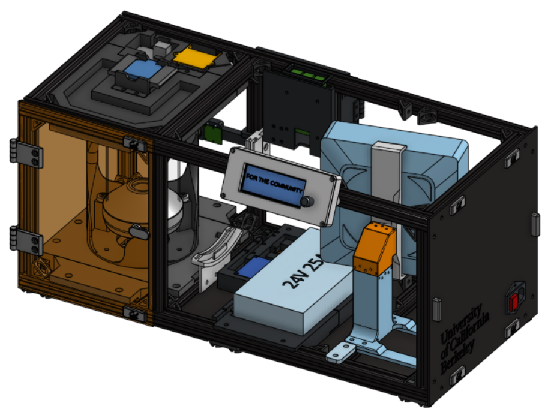
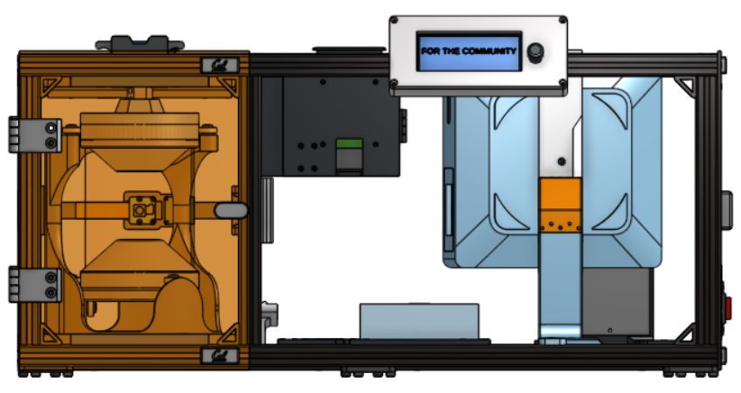
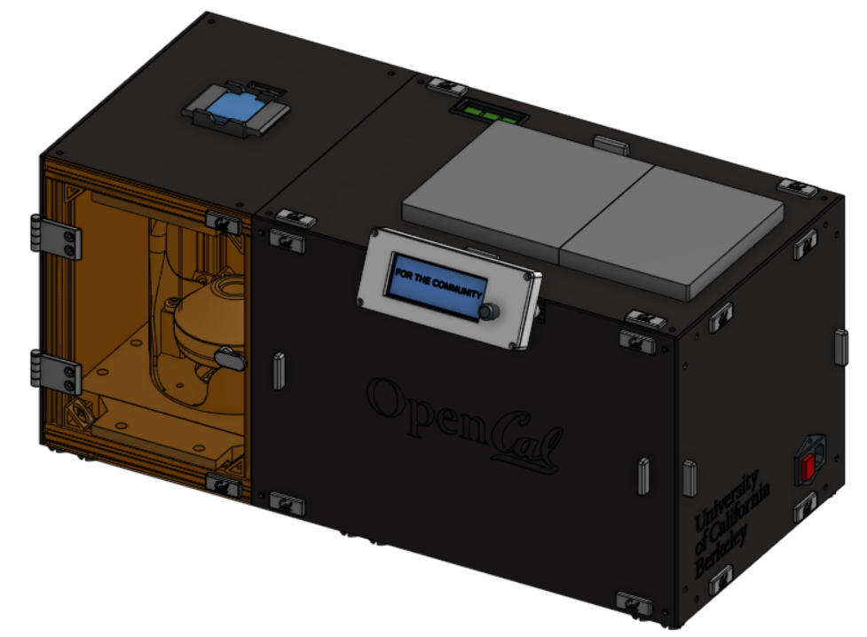
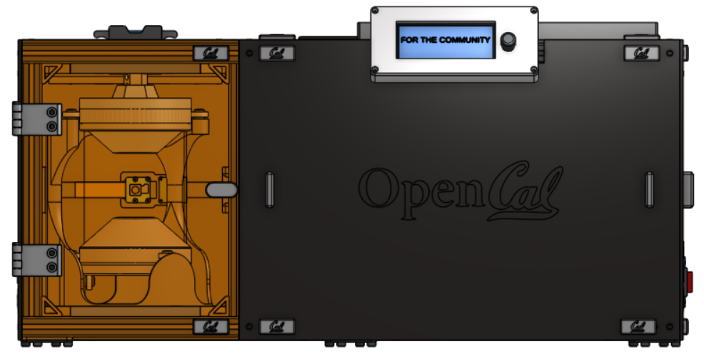

Main Assembly
++++++++++++++
    
**NOTE: ALL SUBASSEMBLIES MUST BE COMPLETED PRIOR TO BEGGINNING THIS PROCESS**

**NOTE: WIRING WILL TAKE PLACE AFTER THIS IS COMPLETED.**

Components List
===============

Frame Subassemblies:

* Aluminum Extrusion Frame
* LCD Panel
* Back Projector Panel
* Side Projector Panel
* Top Projector Panel
* Door
* Top Vial Panel 
* Back Vial Panel
* Side Vial Panel
* Bottom Panels
* Magnet Frame Inserts

Optics Subassemblies:

* Collimating Lens Mounts
* Projector Mount

Rotational Element Subassemblies:

* Rotation Stage
* Large Vial
* Small Vial
* Front & Back Base Plates
* Front Top Plate
* Back Top Plate
* Stepper Motor

Electronics Subassemblies:

* Bottom Plate
* Top Plate
* LCD Housing
* 19V Converter Assembly
* Raspberry Pi Housing
* Camera Mount

Non-Subassemblies:
* (QTY 1) Projector Shroud
* (QTY 1) X Locator
* (QTY 1) 200mm Fresnel Lens

----

Main Assembly Process - Part 1
===============================

----

|

Required Tools:
^^^^^^^^^^^^^^^
* M3 Hex/Allen Key
* Metric Measuring Tape
* Digital/Metric Calipers

Step-by-Step Instructions
^^^^^^^^^^^^^^^^^^^^^^^^^
**NOTE 1: All fasteners will be "hand tight". Ensure all TNuts are in the correct orientation (screw goes into flanged end). Ensure all Hammer TNuts are in the rail before tightening.** 

**NOTE 2: The "front" of the printer is the face where the vial section (smaller section) is on the left and optics section is on the right.**

**NOTE 3: Positioning will be not be referred to in text. See images for positioning**

#. Flip the frame so that it is laying on the top. Loosen the TPU feet. Install the two **Bottom Panels** from the Frames Subassemblies. Each of the bottom panels have cutouts in each corner, with one cutout being larger than the other. The larger cutout should be on the ends and small cutouts should be towards the center. You may need to move the feet to fit in these cutouts. Align all of the nuts with their respective railings, place down, and tighten the M5 fasteners. Also tighten the TPU Feet.

   .. image:: ../static/Step_by_Step/Main_Assembly/part_1/main-1.jpg
        :align: center

#. Flip the frame so that it is sitting on the TPU feet. Install the **Front Base Plate** in the position below. Tighten the M5 fasteners. Repeat with the **Back Base Plate** in the position below. Ensure the Back Base Plate (the one with the slotted holes) is all the way in the back.

   .. image:: ../static/Step_by_Step/Main_Assembly/part_1/main-2.jpg
        :align: center

#. Install the **Camera Mount** in the position below. Position it arounnd ~113.6 mm from the flat bottom of the 3D print directly under the camera to the top of the bottom rail. Tighten the M5 Fasteners.

   .. image:: ../static/Step_by_Step/Main_Assembly/part_1/main-3.jpg
        :align: center

#. Install the **Rotation Stage** in the position below. The cut-out in the mid base plate should be on the rail in between the vial and projector sections. Ensure the mid base plate is pulled to be flush with the front base plate. Tighten the M5 fasteners. Loosen the screws on the **Back Base Plate** and bring it as forward as possible. Tighten the M5 fasteners again.

   .. image:: ../static/Step_by_Step/Main_Assembly/part_1/main-4a.jpg
        :align: center

   .. image:: ../static/Step_by_Step/Main_Assembly/part_1/main-4b.jpg
        :align: center

#. Install the **Col Lens Bottom Mount** from the **Collimating Lens Mounts** subassembly in the position below. Position it so the left side of the mount is 105 mm from the front rail. Tighten the M5 fasteners.

   .. image:: ../static/Step_by_Step/Main_Assembly/part_1/main-5.jpg
        :align: center

#. Install ONE of the **Col Lens Side Mount** to the back rail in the position below. Position it so the bottom is 95 mm from the top face of bottom rail of the frame. Tighten the M5 fasteners.

   .. image:: ../static/Step_by_Step/Main_Assembly/part_1/main-6.jpg
        :align: center

#. Loosen the M5 fasteners that connect the projector rail (25 cm rail that has 90deg gussets on opposite sides) to the 65 cm rails and move the projector rail closer to the right. Install the electronics **Bottom Plate** in the position below. Position it as close to the vial section as possible. Tighten the M5 fasteners.

   .. image:: ../static/Step_by_Step/Main_Assembly/part_1/main-7a.jpg
        :align: center

   .. image:: ../static/Step_by_Step/Main_Assembly/part_1/main-7b.jpg
        :align: center

#. Install the **Back Top Plate** from the bottom up in the position below. Ensure it is pulled as back as possible. Tighten the M5 fasteners.

   .. image:: ../static/Step_by_Step/Main_Assembly/part_1/main-8.jpg
        :align: center

#. Install the **Front Top Plate** from the bottom up in the position below. Ensure it is pulled as forward as possible (there should be minimal movement). Tighten the M5 fasteners.

   .. image:: ../static/Step_by_Step/Main_Assembly/part_1/main-9.jpg
        :align: center

#. Install the **RP5 Housing** from the back. You will need to make sure to bring it from the bottom up since this assembly "sandwiches" the rail. Once the RP5 Housing is pulled up and nuts are in the rails, pull it all the way to the left as much as possible. Tighten the M5 fasteners.

   .. image:: ../static/Step_by_Step/Main_Assembly/part_1/main-10a.jpg
        :align: center

   .. image:: ../static/Step_by_Step/Main_Assembly/part_1/main-10b.jpg
        :align: center

#. Install the **19V Converter Mount** in the position shown below. Tighten the M5 fasteners.

   .. image:: ../static/Step_by_Step/Main_Assembly/part_1/main-11.jpg
        :align: center

#. Install the **LCD Housing** by carefully removing the screws on each corner of the LCD Top and lifting it. Ensure the LCD Screen does not fall out. Align the nuts on the connector near the position shown below and tighten the M5 fasteners. Place the LCD Top back on and tighten the four forner screws. The position of this housing will slightly change once the LCD Panel is installed in the next phase. 
  
   .. image:: ../static/Step_by_Step/Main_Assembly/part_1/main-12a.jpg
        :align: center

   .. image:: ../static/Step_by_Step/Main_Assembly/part_1/main-12b.jpg
        :align: center

#. Move the projector rail close to the Bottom Plate from the previous step. Install the **Projector Mount**, move the projector rail as needed based on the Y locator pieces. Tighten all M5 fasteners.

   .. image:: ../static/Step_by_Step/Main_Assembly/part_1/main-13.jpg
        :align: center

#. Install **QTY (1) X Locator** on the front facing side of the projector mount using **QTY (2) M5x8 Button Head Screw** and **QTY (2) M5 Hammer TNut** on the opposite end. Loosen the M5 fasteners that interface the rails on the projector mount (2 on the Y Locators on back rail and 2 on the Projector Stand) and move it so it is flush with the X Locator. Tighten all M5 fasteners.

   .. image:: ../static/Step_by_Step/Main_Assembly/part_1/main-14a.jpg
        :align: center

   .. image:: ../static/Step_by_Step/Main_Assembly/part_1/main-14b.jpg
        :align: center

   .. image:: ../static/Step_by_Step/Main_Assembly/part_1/main-14c.jpg
        :align: center

#. Install the **Switch** subassembly in the position shown below by aligning the Magnet Frame Inserts in the railing with those on the panel. The top of the panel should touch the top of the frame railing. The exact position will later change once the other panels are on.

   .. image:: ../static/Step_by_Step/Main_Assembly/part_1/main-15.jpg
        :align: center

#. Install the **Door** subassembly in the position shown below via the short hinges. The bottom of the door panel should be flush with the bottom panel. This position may slightly change when the Side Vial Panel is installed.

   .. image:: ../static/Step_by_Step/Main_Assembly/part_1/main-16.jpg
        :align: center

#. Part 1 of the Main Assembly Process is complete. 
   **IMPORTANT:** Complete :ref:`Wiring Instructions <wiring-instructions>` before moving on to Part 2.

----

Main Assembly Process - Part 2
===============================

----

|

Required Tools:
^^^^^^^^^^^^^^^
* M3 Hex/Allen Key
* Metric Measuring Tape
* Digital/Metric Calipers

#. Carefully place in the **200mm Fresnel Lens** into the front slots on the collimating lens bottom and side mounts. The flat, non-grooved side of the lens should be facing the projector. See images below.

   .. image:: ../static/Step_by_Step/Main_Assembly/part_2/main2-1.jpg
        :align: center

#. Now place the **Projector Shroud** into the other grooves/extrusions of the collimating side mount and the extrusion on the colliating lens bottom mount. The projector shroud can only fit in one way (one bottom slot, two side slots).

   .. image:: ../static/Step_by_Step/Main_Assembly/part_2/main2-2a.jpg
        :align: center

   .. image:: ../static/Step_by_Step/Main_Assembly/part_2/main2-2b.jpg
        :align: center

#. After the projector shroud is in, install the second **QTY (1) Col Lens Side Mount** on the front face, ensuring that the **200mm Fresnel Lens** is in the first (left) slot, and the **Projector Shroud** is in the right slot. The **Col Lens Side Mount** should be 95mm from the top of the bottom rail. Tighten all M5 fasteners. See images below.

   .. image:: ../static/Step_by_Step/Main_Assembly/part_2/main2-3.jpg
        :align: center

#. This step is installing the **Top Vial Panel Subassembly** If the motor and encoder wires are plugged in, disconnect the Dupont connectors. Take off the **Stepper Motor Subassembly** and run the wires through the cut out in the panel. Place this on top and run the encoder wires through the wire routing cutout in the Top Housing Plate. Reconnect the Dupont connectors for the motor and encoder. Use the zip-tie cutouts to secure the motor and encoder wires. Leave enough slack in the wires for the motor to reach both the "down" and "up" positions. After the wires have been routed, place the panel flat, align the corner M5 Hammer TNuts with the railing and tighten. Ensure the side of the **Top Vial Panel** is flush with the side face of the rail.

   .. image:: ../static/Step_by_Step/Main_Assembly/part_2/main2-4a.jpg
        :align: center

   .. image:: ../static/Step_by_Step/Main_Assembly/part_2/main2-4b.jpg
        :align: center

   .. image:: ../static/Step_by_Step/Main_Assembly/part_2/main2-4c.jpg
        :align: center

   .. image:: ../static/Step_by_Step/Main_Assembly/part_2/main2-4d.jpg
        :align: center

   .. image:: ../static/Step_by_Step/Main_Assembly/part_2/main2-4e.jpg
        :align: center

   .. image:: ../static/Step_by_Step/Main_Assembly/part_2/main2-4f.jpg
        :align: center

#. Install the **Back Vial Panel Subassembly** in the position located below. Ensure that it is flush with the face of the back railing. You may need to loosen the M5 fasteners of the **RP5 Housing** to push it to the left a little in order to have the Back Vial Panel be flush. After screwing down the Back Vial Panel, bring the RP5 Housing to the right as possible (so it is against the back vial panel) and tigheten down.

   .. image:: ../static/Step_by_Step/Main_Assembly/part_2/main2-5.jpg
        :align: center

#. Install the **Back Projector Panel Subassembly** by aligning all the M5 Hammer TNuts with their respective rails in the position located below. Tighten all M5 fasteners.

   .. image:: ../static/Step_by_Step/Main_Assembly/part_2/main2-6a.jpg
        :align: center

   .. image:: ../static/Step_by_Step/Main_Assembly/part_2/main2-6b.jpg
        :align: center

#. Carefully detach the **Switch Subassembly** from the magnets and pop it out slightly, ensuring that no wiring gets detached. Slide in **QTY (4) Magnet Frame Insert** on the top face of the top two 65cm rails (2 each). Place them approximately where you believe it would align with the Top Projector Panel. Then place **QTY (1) Magnet Frame Insert** on the front top rail (see image below).

   .. image:: ../static/Step_by_Step/Main_Assembly/part_2/main2-7a.jpg
        :align: center

   .. image:: ../static/Step_by_Step/Main_Assembly/part_2/main2-7b.jpg
        :align: center

   .. image:: ../static/Step_by_Step/Main_Assembly/part_2/main2-7c.jpg
        :align: center

#. (Recommended, not required) Tighten the 4 corner M5 fasteners on the Side Projector Panel, to ensure no wiring comes loose.

#. Pop on the **Top Projector Panel Subassembly**, ensuring the top Magnet Frame Inserts are aligned and it is in the position shown below. Ensure the wiring from the LCD Enclosure does not get caught. It should be orientated so that the CAL logos on the magnet holders are facing the front and the hole for the Pi is aligned.

   .. image:: ../static/Step_by_Step/Main_Assembly/part_2/main2-9a.jpg
        :align: center

   .. image:: ../static/Step_by_Step/Main_Assembly/part_2/main2-9b.jpg
        :align: center

#. Open the Door and install **QTY (5) Magnet Frame Insert** on the front top and bottom rails (3 on each). Place them around the door magnets and around the LCD Panel magnets (see images below).

   .. image:: ../static/Step_by_Step/Main_Assembly/part_2/main2-10.jpg
        :align: center

#. Install the **Side Vial Panel Subassembly** in the position below. Loosen the M5 fasteners on the Door Hinges that interface with the rail slightly (loose enought that you can move it but it does not fall). Align the Side Vial Panel such that the top of the panel is flush with the top surface of the Top Vial Panel. The back should be flush with the front surface of the Back Vial Panel. Tighten all M5 fasteners, including the ones on the Door Hinges.

   .. image:: ../static/Step_by_Step/Main_Assembly/part_2/main2-11a.jpg
        :align: center

   .. image:: ../static/Step_by_Step/Main_Assembly/part_2/main2-11b.jpg
        :align: center

#. Remove the corner screws on the **LCD Top** and carefully pull it open and slightly loosen (so that it can move but does not come off) the '2' M5 fasteners that connect the LCD Enclosure to the rail. Pop on the **LCD Panel Subassembly** by aligning it with the magnet frame inserts from the previous step and move the LCD Enclosure as needed. Go from the bottom up.The right side of the LCD Panel should be flush with the BACK surface of the Side Projector Panel.

   .. image:: ../static/Step_by_Step/Main_Assembly/part_2/main2-12a.jpg
        :align: center

   .. image:: ../static/Step_by_Step/Main_Assembly/part_2/main2-12b.jpg
        :align: center

#. OpenCAL is complete.

   .. image:: ../static/Step_by_Step/Main_Assembly/part_2/main2-13a.jpg
        :align: center

   .. image:: ../static/Step_by_Step/Main_Assembly/part_2/main2-13b.jpg
        :align: center

   .. image:: ../static/Step_by_Step/Main_Assembly/part_2/main2-13c.jpg
        :align: center
        
   .. image:: ../static/Step_by_Step/Main_Assembly/part_2/main2-13d.jpg
        :align: center

   .. image:: ../static/Step_by_Step/Main_Assembly/part_2/main2-13e.jpg
        :align: center

   .. image:: ../static/Step_by_Step/Main_Assembly/part_2/main2-13f.jpg
        :align: center
        
