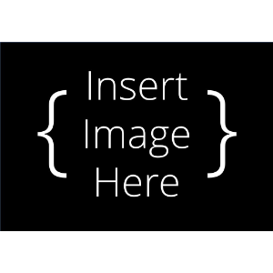

Main Assembly
++++++++++++++

    
**NOTE: ALL SUBASSEMBLIES MUST BE COMPLETED PRIOR TO BEGGINNING THIS PROCESS**

**NOTE: WIRING WILL TAKE PLACE AFTER THIS IS COMPLETED.**

Components List
===============

Frame Subassemblies:

* Aluminum Extrusion Frame
* LCD Panel
* Back Projector Panel
* Side Projector Panel
* Top Projector Panel
* Door
* Top Vial Panel 
* Back Vial Panel
* Side Vial Panel
* Bottom Panels
* Magnet Frame Inserts

Optics Subassemblies:

* Collimating Lens Mounts
* Projector Mount

Rotational Element Subassemblies:

* Rotation Stage
* Large Vial
* Small Vial
* Front & Back Base Plates
* Front Top Plate
* Back Top Plate
* Stepper Motor

Electronics Subassemblies:

* Bottom Plate
* Top Plate
* LCD Housing
* 19V Converter Assembly
* Raspberry Pi Housing
* Camera Mount

Non-Subassemblies:
* (QTY 1) Projector Shroud
* 

----

Main Assembly Process - Part 1
===============================

----

Required Tools:
^^^^^^^^^^^^^^^
* M3 Hex/Allen Key
* Metric Measuring Tape

Step-by-Step Instructions
^^^^^^^^^^^^^^^^^^^^^^^^^
**NOTE 1: All fasteners will be "hand tight". Ensure all TNuts are in the correct orientation (screw goes into flanged end). Ensure all Hammer TNuts are in the rail before tightening.** 

**NOTE 2: The "front" of the printer is the face where the vial section (smaller section) is on the left and optics section is on the right.**

**NOTE 3: Positioning will be not be referred to in text. See images for positioning**

#. Flip the frame so that it is laying on the top. Loosen the TPU feet. Install the two **Bottom Panels** from the Frames Subassemblies. Each of the bottom panels have cutouts in each corner, with one cutout being larger than the other. The larger cutout should be on the ends and small cutouts should be towards the center. You may need to move the feet to fit in these cutouts. Align all of the nuts with their respective railings, place down, and tighten the M5 fasteners. Also tighten the TPU Feet.

    .. image:: ../static/WIP.png
        :align: center

#. Flip the frame so that it is sitting on the TPU feet. Install the **Front Base Plate** in the position below. Tighten the M5 fasteners. Repeat with the **Back Base Plate** in the position below. Ensure the Back Base Plate (the one with the slotted holes) is all the way in the back.

    .. image:: ../static/WIP.png
        :align: center

#. Install the **Camera Mount** in the position below. Position it arounnd ~113.6 mm from the flat bottom of the 3D print directly under the camera to the top of the bottom rail. Tighten the M5 Fasteners.

    .. image:: ../static/WIP.png
        :align: center

#. Install the **Rotation Stage** in the position below. The cut-out in the mid base plate should be on the rail in between the vial and projector sections. Ensure the mid base plate is pulled to be flush with the front base plate. Tighten the M5 fasteners. Loosen the screws on the **Back Base Plate** and bring it as forward as possible. Tighten the M5 fasteners again.

    .. image:: ../static/WIP.png
        :align: center

#. Install the **Col Lens Bottom Mount** from the **Collimating Lens Mounts** subassembly in the position below. Position it so the left side of the mount is 105 mm from the front rail. Tighten the M5 fasteners.

    .. image:: ../static/WIP.png
        :align: center

#. Install ONE of the **Cols Lens Side Mount** to the back rail in the position below. Position it so the bottom is 95 mm from the top face of bottom rail of the frame. Tighten the M5 fasteners.

    .. image:: ../static/WIP.png
        :align: center

#. Loosen the M5 fasteners that connect the projector rail (25 cm rail that has 90deg gussets on opposite sides) to the 65 cm rails and move the projector rail closer to the right. Install the electronics **Bottom Plate** in the position below. Position it as close to the vial section as possible. Tighten the M5 fasteners.

    .. image:: ../static/WIP.png
        :align: center

#. Install the **Back Top Plate** from the bottom up in the position below. Ensure it is pulled as back as possible. Tighten the M5 fasteners.

    .. image:: ../static/WIP.png
        :align: center

#. Install the **Front Top Plate** from the bottom up in the position below. Ensure it is pulled as forward as possible (there should be minimal movement). Tighten the M5 fasteners.

    .. image:: ../static/WIP.png
        :align: center

#. Install the **RP5 Housing** from the back. You will need to make sure to bring it from the bottom up since this assembly "sandwiches" the rail. Once the RP5 Housing is pulled up and nuts are in the rails, pull it all the way to the left as much as possible. Tighten the M5 fasteners.

    .. image:: ../static/WIP.png
        :align: center

#. Install the **19V Converter Mount** in the position shown below. Tighten the M5 fasteners.

    .. image:: ../static/WIP.png
        :align: center

#. Install the **LCD Housing** by carefully removing the screws on each corner of the LCD Top and lifting it. Ensure the LCD Screen does not fall out. Align the nuts on the connector near the position shown below and tighten the M5 fasteners. Place the LCD Top back on and tighten the four forner screws. The position of this housing will slightly change once the LCD Panel is installed in the next phase. 
  
    .. image:: ../static/WIP.png
        :align: center

#. Move the projector rail close to the Bottom Plate from the previous step. Install the **Projector Mount**, move the projector rail as needed based on the locator pieces. Tighten all M5 fasteners.

    .. image:: ../static/WIP.png
        :align: center

#. Install the **Switch** subassembly in the position shown below by aligning the Magnet Frame Inserts in the railing with those on the panel. The top of the panel should touch the top of the frame railing. The exact position will later change once the other panels are on.

    .. image:: ../static/WIP.png
        :align: center 

#. Install the **Door** subassembly in the position shown below via the short hinges. The bottom of the door panel should be flush with the bottom panel. This position may slightly change when the Side Vial Panel is installed.

    .. image:: ../static/WIP.png
        :align: center 

#. Part 1 of the Main Assembly Process is complete. **Complete Wiring Instructions before moving on to Part 2.**

    .. image:: ../static/WIP.png
        :align: center 

----

Main Assembly Process - Part 2
===============================

----
