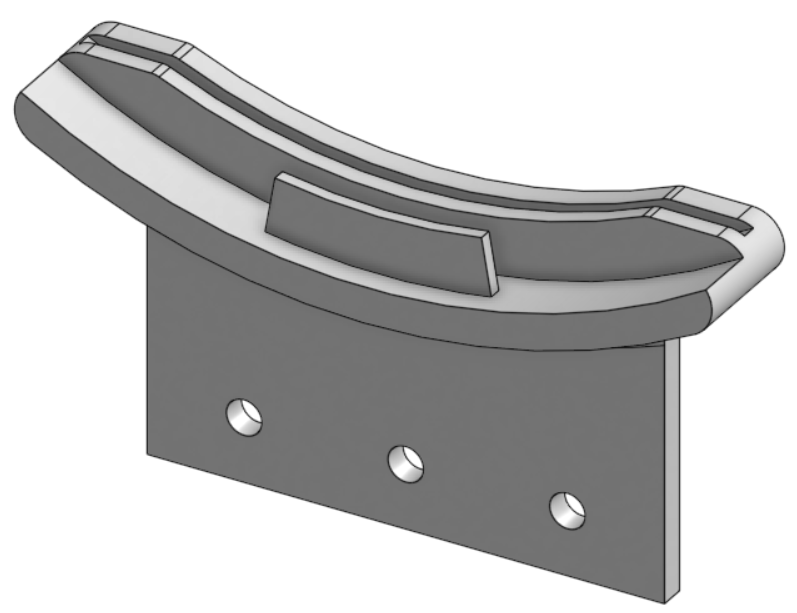
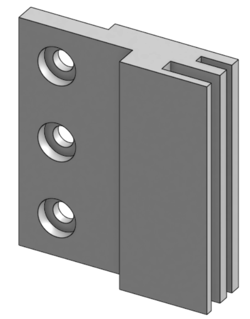
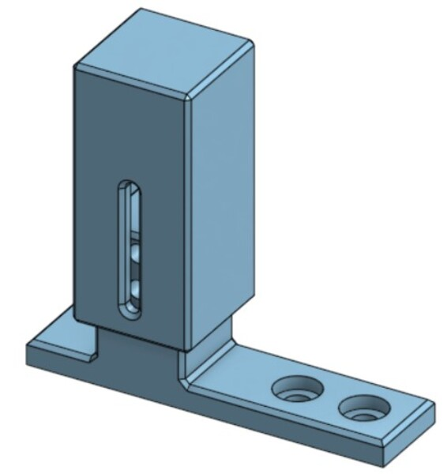
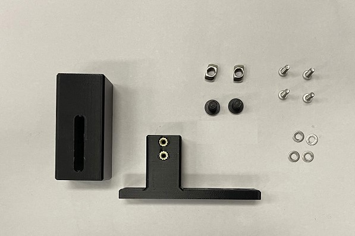
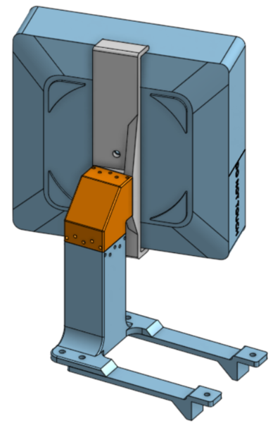
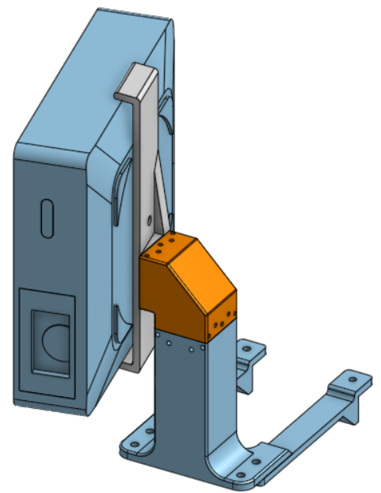

Optics Subassemblies
+++++++++++++++++++++++++
The optics consists of the following subassembly

* Projector Mount

* Collimating Lens Mounts

.. contents:: On this page
   :local:
   :depth: 1

----

Collimating Lens Mounts
=======================

|

Required Materials:
^^^^^^^^^^^^^^^^^^^
* (QTY 1) Col Lens Bottom Mount
* (QTY 2) Col Lens Side Mount
* (QTY 9) M5x8 Button Head Screw
* (QTY 9) M5 Hammer TNut

Required Tools:
^^^^^^^^^^^^^^^
No Tools Required

Step-by-Step Instructions
^^^^^^^^^^^^^^^^^^^^^^^^^

#. Place **QTY (3) M5x8 Button Head Screw** through each of the holes on the **QTY (1) Col Lens Bottom Mount** from the front (see image below). Loosely install **QTY (3) M5 Hammer TNut** on the opposite ends.

   .. image:: ../static/Step_by_Step/Optics_Subassemblies/Collimating_Lens/collens-1a.jpg
       :align: center 
    
   .. image:: ../static/Step_by_Step/Optics_Subassemblies/Collimating_Lens/collens-1b.jpg
       :align: center 

   |

#. Place **QTY (6) M5x8 Button Head Screw** through each of the holes on the **QTY (2) Col Lens Side Mount** from the front (counterbores). Loosely install **QTY (6) M5 Hammer TNut** on the opposite ends.

   .. image:: ../static/Step_by_Step/Optics_Subassemblies/Collimating_Lens/collens-2.jpg
       :align: center 

   |

#. The Collimating Lens Mounts subassembly is now complete.

   .. image:: ../static/Step_by_Step/Optics_Subassemblies/Collimating_Lens/collens-3.jpg
       :align: center 
       
----

Projector Mount Support
=======================

|

Required Materials:
^^^^^^^^^^^^^^^^^^^
**NOTE: Heat Set Inserts have already been installed into Projector Support Base.**

* (QTY 1) Projector Support Mount
* (QTY 1) Projector Support base
* (QTY 4) M3x4x5 Heat Set Insert
* (QTY 4) M3x12 Button Head Screw
* (QTY 4) M3 Washer
* (QTY 2) M5x8 Button Head Screw
* (QTY 2) M5 Hammer Tnut

|

Required Tools:
^^^^^^^^^^^^^^^
M2 Allen/Hex Key
Soldering Iron

Step-by-Step Instructions
^^^^^^^^^^^^^^^^^^^^^^^^^

#. Slide **QTY (1) Projector Support Mount** over the extrusion on **QTY (1) Projector Support Base**. Through the slot on the Projector Support Mount, install **QTY (2) M3x12 Button Head Screw** & **QTY (2) M3 Washer** on BOTH sides. The mount can be slid at an arbitrary point for now.

   .. image:: ../static/Step_by_Step/Optics_Subassemblies/Projector_Support/proj_support_1a.jpg
      :align: center

   .. image:: ../static/Step_by_Step/Optics_Subassemblies/Projector_Support/proj_support_1b.jpg
      :align: center

   |

#. Loosely install **QTY (2) M5x8 Button Head Screw** with **QTY (2) M5 Hammer TNut** in the location below.

   .. image:: ../static/Step_by_Step/Optics_Subassemblies/Projector_Support/proj_support_2a.jpg
      :align: center

   .. image:: ../static/Step_by_Step/Optics_Subassemblies/Projector_Support/proj_support_2b.jpg
      :align: center

   |

#. The Projector Support Subassembly is now complete.

----

Projector Mount
================

**NOTE: These instructions are for the NexiGo Nova Mini Laser Projector.** 

|

Required Materials:
^^^^^^^^^^^^^^^^^^^
* (QTY 1) Projector (NexiGo Nova Mini)
* (QTY 1) Projector Interface
* (QTY 1) XZ Stage
* (QTY 1) Projector Stand
* (QTY 1) XY Core
* (QTY 2) Y Locator
* (QTY 12) M3x40mm Stainless Steel Rod
* (QTY 3) M3x40 Socket Head Screw
* (QTY 3) 6x0.8x25mm Compression Spring
* (QTY 9) M3 Hex Nuts
* (QTY 3) M3 Washer
* (QTY 1) 1/4-20x1/2 Button Head Screw
* (QTY 4) M5x10 Button Head Screw
* (QTY 4) M5 Hammer TNut 

.. image:: ../static/Step_by_Step/Optics_Subassemblies/Projector_Mount/projector-materials.jpg
     :align: center 

Required Tools:
^^^^^^^^^^^^^^^
* Wire Cutter
* M2.5 Hex/Allen Key
* Needle Nose Pliers (recommended)

Step-by-Step Instructions
^^^^^^^^^^^^^^^^^^^^^^^^^
**NOTE: Unless otherwise mentioned, all fasteners will be "hand tight". The "front" of the projector stand is the flat side. To press in the Steel Rods, it is recommended to use Needle Nose Pliers. Always ensure the rods are flush with the 3D print.**

#. Screw on **QTY (2) M3 Hex Nut** on **QTY (1) M3x40 Socket Head Screw** and then place **QTY (1) M3 Washer** over.

   .. image:: ../static/Step_by_Step/Optics_Subassemblies/Projector_Mount/projector-1.jpg
      :align: center 

   |

#. Repeat this 2 more times. You should have **3** of these assemblies total.

   .. image:: ../static/Step_by_Step/Optics_Subassemblies/Projector_Mount/projector-2.jpg
        :align: center 

   |

#. Lay the **QTY (1) Projector Stand** on the flat side. Press in **QTY (2) M3x40mm Stainless Steel Rod** into the bottom center locations (see image below).

   .. image:: ../static/Step_by_Step/Optics_Subassemblies/Projector_Mount/projector-3.jpg
        :align: center 

   |

#. The **QTY (1) XY Core** has two hex holes and two circular holes for M3 Hex Nuts and M3 Screws respectively. On the top hole, screw the assembly from Step 2 through the circular hole until it comes out the hex hole. Screw on **QTY (1) M3 Hex Nut**. Grab the head of the M3 Socket Screw and pull it so that the hex nut goes in the hex hole and is as deep in the hex hole as possible. Remove the screw from the M3 Hex Nut, ensuring that the M3 Hex Nut remains deep in the hex hole.

   .. image:: ../static/Step_by_Step/Optics_Subassemblies/Projector_Mount/projector-4a.jpg
        :align: center 

   .. image:: ../static/Step_by_Step/Optics_Subassemblies/Projector_Mount/projector-4b.jpg
        :align: center 

   .. image:: ../static/Step_by_Step/Optics_Subassemblies/Projector_Mount/projector-4c.jpg
        :align: center 

   .. image:: ../static/Step_by_Step/Optics_Subassemblies/Projector_Mount/projector-4d.jpg
        :align: center 

   |

#. Repeat Step 4 with the bottom hole on the **QTY (1) XY Core**.

   .. image:: ../static/Step_by_Step/Optics_Subassemblies/Projector_Mount/projector-5.jpg
        :align: center 

   |

#. Press in **QTY (2) 6x0.8x25 mm Compression Spring** into each of the circular holes on the **QTY (1) XY Core**.

   .. image:: ../static/Step_by_Step/Optics_Subassemblies/Projector_Mount/projector-6.jpg
        :align: center 

   |

#. Place the assembly from Step 6 within the top hole on the assembly from Step 3. Orient it so that the bottom spring interfaces with the top center hole on the back of the Projector Stand.

   .. image:: ../static/Step_by_Step/Optics_Subassemblies/Projector_Mount/projector-7.jpg
        :align: center 

   |

#. Screw in one of the assemblies from Step 2 through the center hole that is interfacing with the spring mentioned in the previous step. Keep turning until you feel it engage all the way through the nut. For the upcoming steps, it is good to center the XY Core. Do this by tightening the M3x40 Screw assembly.

   .. image:: ../static/Step_by_Step/Optics_Subassemblies/Projector_Mount/projector-8a.jpg
        :align: center 

   .. image:: ../static/Step_by_Step/Optics_Subassemblies/Projector_Mount/projector-8b.jpg
        :align: center 

   |

#. Press in **QTY (2) M3x40 Stainless Steel Rods** through the other through holes at the back of the Projector Stand. Ensure that these rods also go through the slots on the XY Core. This core should be stabilized after the rods are inserted.

   .. image:: ../static/Step_by_Step/Optics_Subassemblies/Projector_Mount/projector-9.jpg
        :align: center 
    
   |

#. Press in **QTY (4) M3x40 Stainless Steel Rod** into the center two holes on each side of the **QTY (1) XZ Stage** (see image below).

   .. image:: ../static/Step_by_Step/Optics_Subassemblies/Projector_Mount/projector-10.jpg
        :align: center 

   |

#. Take the assembly from the previous step and place it over the Projector Stand. Move it so that it is over the spring where the spring is interfacing with the bottom center hole on the XZ Stage. The XZ Stage is symmetrical.

   .. image:: ../static/Step_by_Step/Optics_Subassemblies/Projector_Mount/projector-11a.jpg
        :align: center 

   .. image:: ../static/Step_by_Step/Optics_Subassemblies/Projector_Mount/projector-11b.jpg
        :align: center 

   |

#. Screw in another one of the assemblies from Step 2 through this bottom center hole such that it is interfacing with the spring mentioned in the previous step. Keep turning until you feel it engage all the way through the nut. 

   .. image:: ../static/Step_by_Step/Optics_Subassemblies/Projector_Mount/projector-12.jpg
        :align: center 

   |

#. Press in **QTY (2) M3x40 Stainless Steel Rods** through the other through holes of the **QTY (1) XZ Stage**. Ensure that these rods also go through the slots on the XY Core. 

   .. image:: ../static/Step_by_Step/Optics_Subassemblies/Projector_Mount/projector-13a.jpg
        :align: center 

   .. image:: ../static/Step_by_Step/Optics_Subassemblies/Projector_Mount/projector-13b.jpg
        :align: center 

   |

#. Press on the **QTY (1) Projector Interface** onto the **QTY (1) Projector** such that the flat sides are parallel with the face of the lens. Ensure the larger flat is faces the opposite side of the lens and that the rotation stage is aligned with the lens (see image below). Screw down using **QTY (1) 1/4-20x1/2 Button Head Screw**.

   .. image:: ../static/Step_by_Step/Optics_Subassemblies/Projector_Mount/projector-14a.jpg
        :align: center 

   .. image:: ../static/Step_by_Step/Optics_Subassemblies/Projector_Mount/projector-14b.jpg
        :align: center 

   |

#. The **QTY (1) Projector Interface** has a hex hole and a circular hole for a M3 Hex Nut and M3 Screw respectively. Screw the assembly from Step 2 through the circular hole until it comes out the hex hole. Screw on **QTY (1) M3 Hex Nut** slightly. Grab the head of the M3 Socket Screw and pull it so that the hex nut goes in the hex hole and is as deep in the hex hole as possible. Remove the screw from the M3 Hex Nut, ensuring that the M3 Hex Nut remains deep in the hex hole.

   .. image:: ../static/Step_by_Step/Optics_Subassemblies/Projector_Mount/projector-15.jpg
        :align: center 

   |

#. Press in **QTY (1) 6x0.8x25 mm Compression Spring** into the circular holes on the **QTY (1) Projector Interface**.

   .. image:: ../static/Step_by_Step/Optics_Subassemblies/Projector_Mount/projector-16.jpg
        :align: center 

   |

#. Take the assembly from Step 13 and place it over the **QTY (1) Projector Interface** so that it grabs the spring from the previous step. The spring should interface with the top center hole of the Step 13 assembly. Ensure it is oriented such that the base of the Step 13 assembly is closer to the lens.

   .. image:: ../static/Step_by_Step/Optics_Subassemblies/Projector_Mount/projector-17a.jpg
        :align: center 

   .. image:: ../static/Step_by_Step/Optics_Subassemblies/Projector_Mount/projector-17b.jpg
        :align: center 

   |

#. Screw in the last assembly from Step 2 through the center hole such that it goes through the spring and M3 nut. Keep turning until you feel it engage all the way through the nut. 

   |

#. Insert **QTY (2) M3x40 Stainless Steel Rods** through the two side holes of the Step 13 assembly (from the top). Ensure the rods go through the slots on the **Projector Interface**

   .. image:: ../static/Step_by_Step/Optics_Subassemblies/Projector_Mount/projector-19.jpg
        :align: center 

   |

#. Install **QTY (2) Y Locator** underneath the base of the **Projector Stand** using **QTY (2) M5x10 Button Head Screw** with **QTY (2) Hammer TNut** from the counterbores on the Projector Stand (see image for location).
    **NOTE: The screws in the image are inaccurate, we had to use longer screws due to a misprint. For general case, use M5x10 Button Head Screws.**

   .. image:: ../static/Step_by_Step/Optics_Subassemblies/Projector_Mount/projector-20a.jpg
        :align: center 

   .. image:: ../static/Step_by_Step/Optics_Subassemblies/Projector_Mount/projector-20b.jpg
        :align: center 

   |

#. Install **QTY (2) M5x10 Button Head Screw** with **QTY (2) M5 Hammer TNut** on the opposite end of the **QTY (2) Y Locator**.

   .. image:: ../static/Step_by_Step/Optics_Subassemblies/Projector_Mount/projector-21.jpg
        :align: center 

   |

#. The Projector Mount subassembly is now complete.

   .. image:: ../static/Step_by_Step/Optics_Subassemblies/Projector_Mount/projector-22.jpg
        :align: center 
