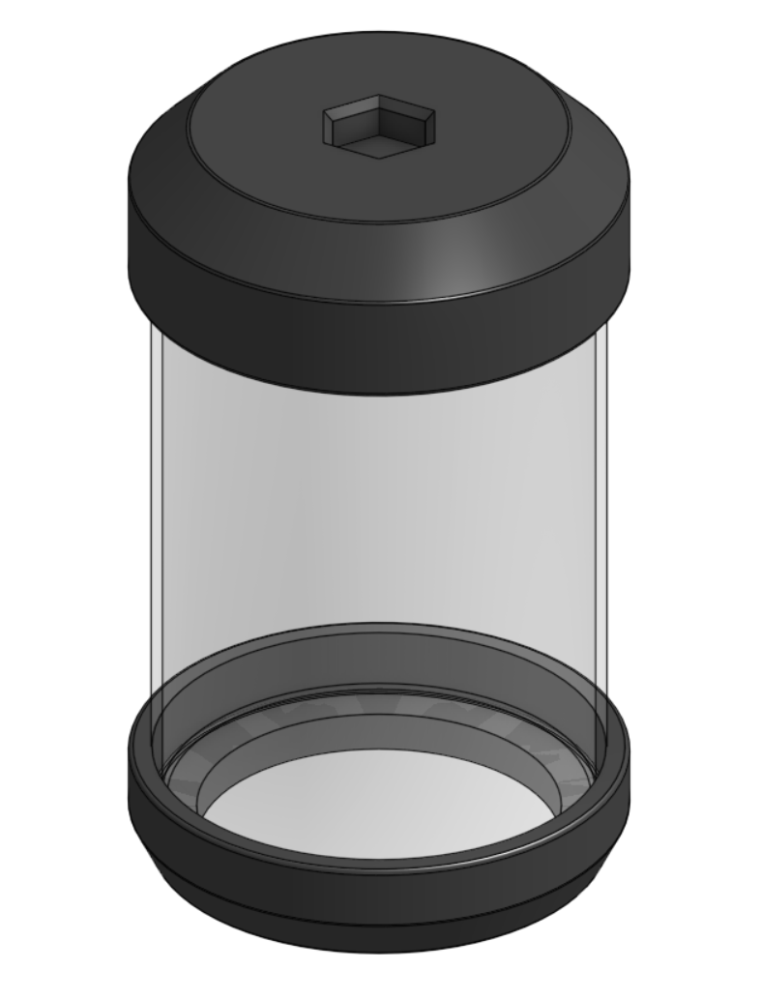
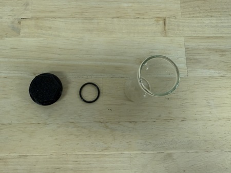

Rotational Element Subassemblies
++++++++++++++++++++++++++++++++
The rotational element consists of the following subassemblies:

* Rotation Stage

* Large Vial

* Small Vial

* Front & Back Base Plates

* Front Top Plate

* Back Top Plate

.. contents:: On this page
   :local:
   :depth: 1

----

Rotation Stage
================

.. image:: ../static/Step_by_Step/Rotational_Element_Subassemblies/Rotation_Stage/rotational_element_1_CAD.png
     :align: center 

.. image:: ../static/Step_by_Step/Rotational_Element_Subassemblies/Rotation_Stage/rotational_element_2_CAD.png
     :align: center 

|

Required Materials:
^^^^^^^^^^^^^^^^^^^

* (QTY 1) Rotation Stage
* (QTY 9) 7x17x5mm Ball Bearing
* (QTY 9) Bearing Post
* (QTY 9) Bearing Top Piece
* (QTY 9) M3x12 Button Head Screw
* (QTY 1) Mid Base Plate
* (QTY 12) M3x4x5 Heat Set Insert
* (QTY 3) M3x5 Button Head Screw
* (QTY 5) M5x10 Button Head Screw
* (QTY 5) M5 Hammer TNut

.. image:: ../static/Step_by_Step/Rotational_Element_Subassemblies/Rotation_Stage/rotational_element_materials.JPG
    :align: center

|

Required Tools:
^^^^^^^^^^^^^^^
* M2.5 Hex/Allen Key
* Soldering Iron

Step-by-Step Instructions:
^^^^^^^^^^^^^^^^^^^^^^^^^^
**NOTE: All fasteners will be "hand tight". Ensure that heat set inserts have ~2 minutes to cool post installation.**

1. Place **QTY (1) 7x17x5mm Ball**  **Bearing** on the shaft of **QTY (1) Bearing Post**. Place **QTY (1) Bearing Top Piece** on the flat end on top of the post and bearing. Take **QTY (1) M3x12 Button Head Screw** and push through the aligned center holes.

   .. image:: ../static/Step_by_Step/Rotational_Element_Subassemblies/Rotation_Stage/rot-stage-1.JPG
       :align: center

   |

2. Repeat for all bearings.

   .. image:: ../static/Step_by_Step/Rotational_Element_Subassemblies/Rotation_Stage/rot-stage-2.JPG
       :align: center

   |

3. Take **QTY (9) M3x4x5mm Heat Set Insert** and, using a soldering iron, place them into the three holes on the top and the six holes on the top and front faces of the bearing posts of the **QTY (1) Rotation Stage**. Ensure that the top of the heat set inserts are flush with the surface.

   .. image:: ../static/Step_by_Step/Rotational_Element_Subassemblies/Rotation_Stage/rot-stage-heat-sets.png
       :align: center

   |

4. On the non-cantilevered top hole of **QTY (1) Rotation Stage**, place a bearing assembly. Use the screw to align the hole and push the bearing down to be flush with the top hole.

   .. image:: ../static/Step_by_Step/Rotational_Element_Subassemblies/Rotation_Stage/rot-stage-3.JPG
       :align: center

   |

5. Using a M2.5 Hex/Allen Key, screw directly into the rotation stage, until flush with the bearing top piece. The bearing should not have any wiggle.

   .. image:: ../static/Step_by_Step/Rotational_Element_Subassemblies/Rotation_Stage/rot-stage-4.JPG
       :align: center

   |

6. Repeat Steps 3 & 4 for the rest of the holes in the rotation stage. The rotation stage is now complete.

   .. image:: ../static/Step_by_Step/Rotational_Element_Subassemblies/Rotation_Stage/rot-stage-5.JPG
       :align: center

   |

7. Take **QTY (3) M3x4x5mm Heat Set Insert** and, using a soldering iron, place them into the following locations on the **QTY (1) Mid Base Plate**. Ensure that the top of the heat set inserts are flush with the surface.

   .. image:: ../static/Step_by_Step/Rotational_Element_Subassemblies/Rotation_Stage/rot-stage-6.JPG
       :align: center

   |

8. Place **QTY (5) M5x10 Button Head Screw** in each of the counterbored holes shown below. Loosely install **QTY (5) M5 Hammer TNut** on the opposite end of each fastener.

   .. image:: ../static/Step_by_Step/Rotational_Element_Subassemblies/Rotation_Stage/rot-stage-7.JPG
       :align: center

   |

9. Take the assembly from Step 5 and place it in the center cutout on the Mid Base Plate, aligning the silhouettes. Using **QTY (3) M3x5 Button Head Screw** to fasten the Rotation Stage and Mid Base Plate together. The Rotation Element Mid Base Plate is now complete.

   .. image:: ../static/Step_by_Step/Rotational_Element_Subassemblies/Rotation_Stage/rot-stage-8.JPG
       :align: center

----

Large Vial
================

|

Required Materials:
^^^^^^^^^^^^^^^^^^^
* (QTY 1) Closed-Bottom Glass Vial
* (QTY 1) Bottom Vial Attachment
* (QTY 1) Lid
* (QTY 1) Lid Plug
* (QTY 1) O-Ring (`McMaster 1173N238 <https://www.mcmaster.com/1173N238/>`__)

|

Required Tools:
^^^^^^^^^^^^^^^
No Tools Required.

Step-by-Step Instructions:
^^^^^^^^^^^^^^^^^^^^^^^^^^
**NOTE: This is the lid-style large vial. It is still a work in progress and is not yet fully reliable. See** :doc:`Help Wanted <../resources/help_wanted>` **if you would like to help finish the design.**

1. Slide **QTY (1) Bottom Vial Attachment** onto the bottom of **QTY (1) Closed-Bottom Glass Vial**. It is a friction fit, so press it on until it seats snugly.

2. Stretch **QTY (1) O-Ring** into the groove on **QTY (1) Lid Plug**, then seat the plug into the center of **QTY (1) Lid**.

   .. image:: ../static/Step_by_Step/Rotational_Element_Subassemblies/Large_Vial/large_vial_lid_plug_CAD.png
       :align: center

3. Fit the Lid onto the top of the vial. The hex feature on the Lid is the adapter that mounts the vial to the rotation stage. The Large Vial is now complete.

   .. image:: ../static/Step_by_Step/Rotational_Element_Subassemblies/Large_Vial/large_vial_cap.jpg
       :align: center

   .. image:: ../static/Step_by_Step/Rotational_Element_Subassemblies/Large_Vial/large_vial_assembled.jpg
       :align: center

   .. image:: ../static/Step_by_Step/Rotational_Element_Subassemblies/Large_Vial/large_vial_printing.jpg
       :align: center

----

Small Vial
================

.. image:: ../static/Step_by_Step/Rotational_Element_Subassemblies/Small_Vial/small_vial_1_CAD.png
     :align: center 

.. image:: ../static/Step_by_Step/Rotational_Element_Subassemblies/Small_Vial/small_vial_2_CAD.png
     :align: center 

|

Required Materials:
^^^^^^^^^^^^^^^^^^^
* (QTY 1) Small glass vial
* (QTY 1) Small vial lid
* (QTY 1) 2x18mm O-ring

|

Required Tools:
^^^^^^^^^^^^^^^^^^^
No Tools Required.

Step-by-Step Instructions:
^^^^^^^^^^^^^^^^^^^^^^^^^^

1. Stretch o-ring over the small vial lid groove.

   .. image:: ../static/Step_by_Step/Rotational_Element_Subassemblies/Small_Vial/small-vial-1.JPG
       :align: center

   |

2. Place the lid in a glass vial to seal.

   .. image:: ../static/Step_by_Step/Rotational_Element_Subassemblies/Small_Vial/small-vial-2.JPG
       :align: center

----

Front & Back Base Plates
========================

.. image:: ../static/Step_by_Step/Rotational_Element_Subassemblies/Front_Back_Base_Plates/bottom_back_plate_CAD.png
     :align: center 

.. image:: ../static/Step_by_Step/Rotational_Element_Subassemblies/Front_Back_Base_Plates/bottom_front_plate_CAD.png
     :align: center 

|

Required Materials:
^^^^^^^^^^^^^^^^^^^
* (QTY 1) Front Base Plate
* (QTY 1) Back Base Plate
* (QTY 4) M5x8 Button Head Screw
* (QTY 4) M5 Hammer TNut

.. image:: ../static/Step_by_Step/Rotational_Element_Subassemblies/Front_Back_Base_Plates/front-back-materials.JPG
    :align: center

|

Required Tools:
^^^^^^^^^^^^^^^
No Tools Required.

Step-by-Step Instructions:
^^^^^^^^^^^^^^^^^^^^^^^^^^

1. Take **QTY (1) Front Base Plate** and place **QTY (2) M5x8 Button Head Screw** from the top in the counterbored holes. Loosely install **QTY (2) M5 Hammer TNut** on the opposite end of each fastener.

   .. image:: ../static/Step_by_Step/Rotational_Element_Subassemblies/Front_Back_Base_Plates/labelled-front-1.jpg
       :align: center

   |

2. Repeat Step 1 one more time with **QTY (1) Back Base Plate**. The Back Base Plate is the one with mounting slots rather than holes. The Front & Back Base Plates subassembly is now complete.

   .. image:: ../static/Step_by_Step/Rotational_Element_Subassemblies/Front_Back_Base_Plates/labelled-front-back-2.jpg
       :align: center

----

Front Top Plate
================

.. image:: ../static/Step_by_Step/Rotational_Element_Subassemblies/Front_Top_Plate_Stepper_Mounting/stepper_mount_CAD.png
     :align: center 

.. image:: ../static/Step_by_Step/Rotational_Element_Subassemblies/Front_Top_Plate_Stepper_Mounting/top_front_plate_CAD.png
     :align: center 

|

Required Materials:
^^^^^^^^^^^^^^^^^^^
* (QTY 1) Front Top Plate
* (QTY 2) Stepper Mount Plate
* (QTY 1) Stepper Motor Holder
* (QTY 1) Stepper Motor
* (QTY 1) Hex Shaft
* (QTY 12) 10x3mm Circular Magnet (Pre-installed below)
* (QTY 6) M3x6mm Button Head Screw
* (QTY 4) M3x15mm Button Head Screw
* (QTY 6) M3x4x5mm Heat Set Insert
* (QTY 6) M5x10mm Button Head Screw
* (QTY 6) M5 Hammer TNut

.. image:: ../static/Step_by_Step/Rotational_Element_Subassemblies/Front_Top_Plate_Stepper_Mounting/front-top-materials.JPG
    :align: center

|

Required Tools:
^^^^^^^^^^^^^^^
* M2.5 Hex/Allen Key
* Soldering Iron

Step-by-Step Instructions:
^^^^^^^^^^^^^^^^^^^^^^^^^^
**NOTE: Unless otherwise mentioned, all fasteners will be "hand tight". Ensure that heat set inserts have ~2 minutes to cool post installation.**

1. Take **QTY (4) M3x4x5mm Heat Set Insert** and, using a soldering iron, place them into the following locations on the **QTY (1) Front Top Plate**. Ensure that the top of the heat set inserts are flush with the surfaces. 

   .. image:: ../static/Step_by_Step/Rotational_Element_Subassemblies/Front_Top_Plate_Stepper_Mounting/front-top-1.JPG
      :align: center

   |

2. Repeat Step 1 with **QTY (2) M3x4x5mm Heat Set Insert**, and place them into **QTY (1) Hex Shaft**. 
   
   .. image:: ../static/Step_by_Step/Rotational_Element_Subassemblies/Front_Top_Plate_Stepper_Mounting/front-top-2.JPG
      :align: center

   |

3. From the “bottom” of the Front Top Plate (where the counterbores are) place **QTY (6) M5x10 Button Head Screw**. Loosely install **QTY (6) M5 Hammer TNut** on the opposite end of each fastener. 

   .. image:: ../static/Step_by_Step/Rotational_Element_Subassemblies/Front_Top_Plate_Stepper_Mounting/front-top-3.JPG
      :align: center

   |
   
4. Apply a small amount of loctite to the holes on the sides of the **QTY (1) Stepper Motor Holder** and place **QTY (4) 10x3mm Circular Magnet**. For each magnet ensure that the same polarity faces outward. 

   .. image:: ../static/Step_by_Step/Rotational_Element_Subassemblies/Front_Top_Plate_Stepper_Mounting/front-top-4.JPG
      :align: center

   |
   
5. Apply a small amount of loctite to the holes on the front of the **QTY (1) Stepper Mount Plate** and place **QTY (4) 10x3mm Circular Magnet** into the holes. For each magnet ensure that the opposite polarity to that of the Stepper Motor Holder magnets faces outward. 

   .. image:: ../static/Step_by_Step/Rotational_Element_Subassemblies/Front_Top_Plate_Stepper_Mounting/front-top-5.JPG
      :align: center

   |
   
6. Repeat Step 5 with the other Stepper Mount Plate. The Stepper Mount Plate magnets should be attracted to the Stepper Motor Holder magnets.  

   .. image:: ../static/Step_by_Step/Rotational_Element_Subassemblies/Front_Top_Plate_Stepper_Mounting/front-top-6.JPG
      :align: center

   |
   
7. Slide **QTY (1) Stepper Motor** into the Stepper Motor Holder. Fasten the holder to the stepper motor using **QTY (4) M3x6mm Button Head Screw**. Ensure that the wiring of the stepper motor is aligned with the opening in the stepper motor holder. 

   .. image:: ../static/Step_by_Step/Rotational_Element_Subassemblies/Front_Top_Plate_Stepper_Mounting/front-top-7.JPG
      :align: center

   |
   
8. Slide **QTY (1) Hex Shaft** onto the Stepper Motor shaft until the hard stop of the Hex Shaft. Fasten the Hex Shaft to the Stepper Motor using **QTY (2) M3x6mm Button Head Screw.** Ensure that the screws are flush with the surface of the hex shaft. 

   .. image:: ../static/Step_by_Step/Rotational_Element_Subassemblies/Front_Top_Plate_Stepper_Mounting/front-top-8.JPG
      :align: center

   |
   
9. Take **QTY (2) Stepper Mount Plate** and slot them into their corresponding areas. Fasten down with **QTY (4) M3x15mm Button Head Screw**. 

   .. image:: ../static/Step_by_Step/Rotational_Element_Subassemblies/Front_Top_Plate_Stepper_Mounting/front-top-9.JPG
      :align: center

   |
   
10. The Front Top Plate is now complete. 

   .. image:: ../static/Step_by_Step/Rotational_Element_Subassemblies/Front_Top_Plate_Stepper_Mounting/front-top-10.JPG
      :align: center

----

Parametric Design: Different Vial Components
============================================

.. note::

   These instructions are for those who use a different sized closed-bottom four-inch vial (different from H 5.9" and W 4").

On Onshape, the currently variable table that would be edited for the Large Vial can be found by going into the 
Rotational Element Folder > Rotational Element > Vial > Large Vial > Parametric Vial Holders (variable table in the right tab). 
It is also shown below:

.. list-table::
   :widths: 10 10 50
   :header-rows: 1

   * - Parameter
     - Fixed/Variable [original value]
     - Description
   * - max_height
     - Fixed [167.6 mm]
     - This is the maximum height that can fit into the rotational stage and represents the entire height of the vial and vial holders.
   * - max_diameter
     - Fixed [109.9 mm]
     - This is the maximum diameter that can fit into the rotational stage and represents the base diameter of the vial holders. 
   * - vial_height
     - Variable [max 153mm]
     - This is the height of the vial you are working with. 
   * - vial_diameter
     - Variable [max 100mm]
     - This is the outer diameter of the vial you are working with.
   * - vial_thickness
     - Variable
     - This is the thickness of the vial you are working with. It should represent the thickness part of the vial i.e if there is a lip in the vial make sure to measure that.
   * - lid_height
     - Fixed [4mm]
     - This is the height of the lid from top of the glass vial. 
   * - lid_diameter
     - Fixed [vial_diameter +5mm]
     - This is the diameter of the lid’s lip and is 5mm larger than the vial diameter to facilitate ease of removing the lid.
   * - plug_height
     - Fixed [8mm]
     - This is the height of the plug that fits into the vial.
   * - hex_key_height
     - Fixed [3mm]
     - This is the height of the hex key that fits into the top vial holder.
   * - oring_cs
     - Fixed [3.531mm]
     - This is the cross section of the o-ring and is 1/8 fractional size (0.139”)
   * - diametrical_clearance
     - Variable 
     - This is the clearance gap between the vial and the plug.
   * - oring_groove_depth
     - Variable 
     - This is the depth of the o-ring groove.
   * - oring_groove_width
     - Fixed [4.953mm]
     - This is the width of the oring groove.

|

**Design Process:**
The CAD file is structured into four key operations, glass vial, vial lid, o-ring and vial holders. 
The `closed-bottom glass vial (H:5.9" OD:4") <https://www.amazon.com/dp/B0FLK9DBXB?ref_=ppx_hzsearch_conn_dt_b_fed_asin_title_3&th=1>`_ 
in the BOM will be referenced as the example in this process and referred to as the large vial. For all vials, 
it is intended that o-rings will be 1/8 Fractional (0.139" Actual) High-Temperature Soft (50A) Silicone O-Rings from 
McMaster or other similar supplier.

#. In the glass vial folder, the vial variables should be modified. Measure your vial’s height, outer diameter 
   and thickness to create a model of it in CAD. For example, the following variables were used were used for the large vial:

   - vial_height: 150mm
   - vial_diameter: 100mm
   - vial_thickness: 2.5mm

   |

#. In the vial lid folder, the diametrical clearance can be modified to ensure that there is a close clearance fit 
   between the lid and the glass vial. For example, the large vial in used:
   diametrical_clearance: 0.254mm

   |

#. In the o-ring folder, place the rollback bar at the end of the folder and use the measuring tools to measure the groove 
   diameter (in inches) in CAD. The ID of the o-ring should be stretched slightly (< 5%) and should be smaller than the 
   groove diameter. Using 2% stretch as the ideal target, divide the groove diameter by 1.02. Use this value to search 
   through `McMaster 1/8 Fractional (0.139" Actual) High-Temperature Soft Silicone O-Rings <https://www.mcmaster.com/products/high-temperature-o-rings/high-temperature-soft-silicone-o-rings/>`_ 
   to find the closest match for ID. For example, for the large vial:

   - Groove diameter (in) / 1.02 = 3.496in / 1.02 = 3.427in
   - Closest match: o-ring dash number 238, Width: 0.139”, ID: 3.484”, OD: 3.762” 

   |

#. Print out the lid and test the fit. 
   - If the plug is too wide → increase the diametrical clearance
   - If the lid and the o-ring is too loose / tight → decrease / increase the groove depth

   |

#. Print the vial holders and test the fit on the vial. 

