Rotational Element Subassemblies
++++++++++++++++++++++++++++++++
The rotational element consists of the following subassemblies:

* Rotation Stage

* Large Vial

* Small Vial

* Front & Back Base Plates

* Front Top Plate

* Back Top Plate

----

Rotation Stage
================

----

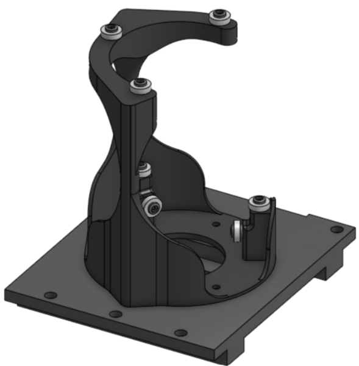

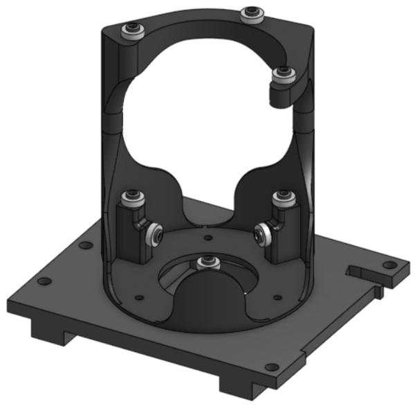

|

Required Materials:
^^^^^^^^^^^^^^^^^^^

* (QTY 1) Rotation Stage
* (QTY 9) 7x17x5mm Ball Bearing
* (QTY 9) Bearing Post
* (QTY 9) Bearing Top Piece
* (QTY 9) M3x12 Button Head Screw
* (QTY 1) Mid Base Plate
* (QTY 3) M3x4x5 Heat Set Insert
* (QTY 3) M3x5 Button Head Screw
* (QTY 5) M5x10 Button Head Screw
* (QTY 5) M5 Hammer TNut

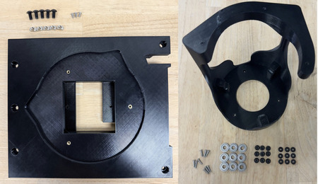

|

Required Tools:
^^^^^^^^^^^^^^^
* M2.5 Hex/Allen Key
* Soldering Iron

Step-by-Step Instructions:
^^^^^^^^^^^^^^^^^^^^^^^^^^
**NOTE: All fasteners will be "hand tight". Ensure that heat set inserts have ~2 minutes to cool post installation.**

1. Place **QTY (1) 7x17x5mm Ball**  **Bearing** on the shaft of **QTY (1) Bearing Post**. Place **QTY (1) Bearing Top Piece** on the flat end on top of the post and bearing. Take **QTY (1) M3x12 Button Head Screw** and push through the aligned center holes.

   .. image:: ../static/Step_by_Step/Rotational_Element_Subassemblies/Rotation_Stage/rot-stage-1.JPG
       :align: center

2. Repeat for all bearings.

   .. image:: ../static/Step_by_Step/Rotational_Element_Subassemblies/Rotation_Stage/rot-stage-2.JPG
       :align: center

3. On the non-cantilevered top hole of **QTY (1) Rotation Stage**, place a bearing assembly. Use the screw to align the hole and push the bearing down to be flush with the top hole.

   .. image:: ../static/Step_by_Step/Rotational_Element_Subassemblies/Rotation_Stage/rot-stage-3.JPG
       :align: center

4. Using a M2.5 Hex/Allen Key, screw directly into the rotation stage, until flush with the bearing top piece. The bearing should not have any wiggle.

   .. image:: ../static/Step_by_Step/Rotational_Element_Subassemblies/Rotation_Stage/rot-stage-4.JPG
       :align: center

5. Repeat Steps 3 & 4 for the rest of the holes in the rotation stage. The rotation stage is now complete.

   .. image:: ../static/Step_by_Step/Rotational_Element_Subassemblies/Rotation_Stage/rot-stage-5.JPG
       :align: center

6. Take **QTY (3) M3x4x5mm Heat Set Insert** and, using a soldering iron, place them into the following locations on the **QTY (1) Mid Base Plate**. Ensure that the top of the heat set inserts are flush with the surface.

   .. image:: ../static/Step_by_Step/Rotational_Element_Subassemblies/Rotation_Stage/rot-stage-6.JPG
       :align: center

7. Place **QTY (5) M5x10 Button Head Screw** in each of the counterbored holes shown below. Loosely install **QTY (5) M5 Hammer TNut** on the opposite end of each fastener.

   .. image:: ../static/Step_by_Step/Rotational_Element_Subassemblies/Rotation_Stage/rot-stage-7.JPG
       :align: center

8. Take the assembly from Step 5 and place it in the center cutout on the Mid Base Plate, aligning the silhouettes. Using **QTY (3) M3x5 Button Head Screw** to fasten the Rotation Stage and Mid Base Plate together. The Rotation Element Mid Base Plate is now complete.

   .. image:: ../static/Step_by_Step/Rotational_Element_Subassemblies/Rotation_Stage/rot-stage-8.JPG
       :align: center

----

Large Vial
================

----

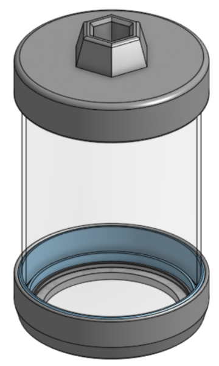

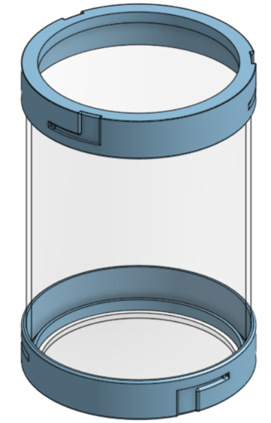

|

Required Materials:
^^^^^^^^^^^^^^^^^^^
* (QTY 1) Large Glass Vial
* (QTY 1) Bottom Glass Vial Attachment
* (QTY 1) Bottom Vial Lock
* (QTY 1) Top Glass Vial Attachment
* (QTY 1) Top Vial Lock
* (QTY 1) Bottom Glass Disk
* (QTY 2) 1/8'' Soft Silicone O-Ring
* (QTY 1) Silicone Caulk

.. image:: ../static/WIP.png
    :align: center

|

Required Tools:
^^^^^^^^^^^^^^^
* Tape

Step-by-Step Instructions:
^^^^^^^^^^^^^^^^^^^^^^^^^^

----

Small Vial
================

----

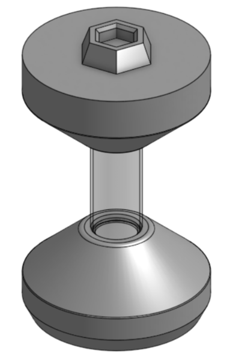

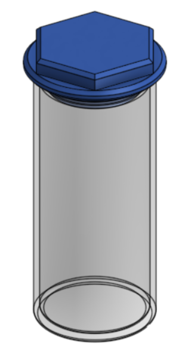

|

Required Materials:
^^^^^^^^^^^^^^^^^^^
* (QTY 1) Small glass vial
* (QTY 1) Small vial lid
* (QTY 1) 2x18mm O-ring

.. image:: ../static/Step_by_Step/Rotational_Element_Subassemblies/Small_Vial/
    :align: center

|

Required Tools:
^^^^^^^^^^^^^^^^^^^
No Tools Required.

Step-by-Step Instructions:
^^^^^^^^^^^^^^^^^^^^^^^^^^

1. Stretch o-ring over the small vial lid groove.

   .. image:: ../static/Step_by_Step/Rotational_Element_Subassemblies/Small_Vial/small-vial-1.JPG
       :align: center

2. Place the lid in a glass vial to seal.

   .. image:: ../static/Step_by_Step/Rotational_Element_Subassemblies/Small_Vial/small-vial-2.JPG
       :align: center

----

Front & Back Base Plates
========================

----

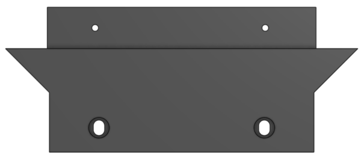

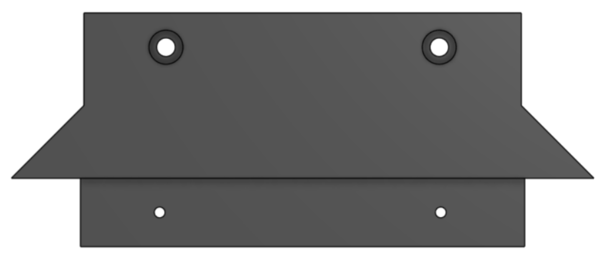

|

Required Materials:
^^^^^^^^^^^^^^^^^^^
* (QTY 1) Front Base Plate
* (QTY 1) Back Base Plate
* (QTY 4) M5x10 Button Head Screw
* (QTY 4) M5 Hammer TNut

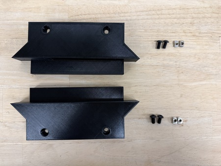

|

Required Tools:
^^^^^^^^^^^^^^^
No Tools Required.

Step-by-Step Instructions:
^^^^^^^^^^^^^^^^^^^^^^^^^^

1. Take **QTY (1) Front Base Plate** and place **QTY (2) M5x8 Button Head Screw** from the top in the counterbored holes. Loosely install **QTY (2) M5 Hammer TNut** on the opposite end of each fastener.

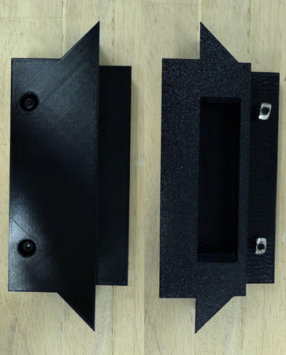

2. Repeat Step 1 one more time with **QTY (1) Back Base Plate**. The Back Base Plate is the one with mounting slots rather than holes. The Front & Back Base Plates subassembly is now complete.

.. image:: ../static/WIP.png
    :align: center

----

Front Top Plate
================

----

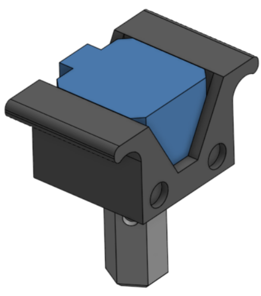

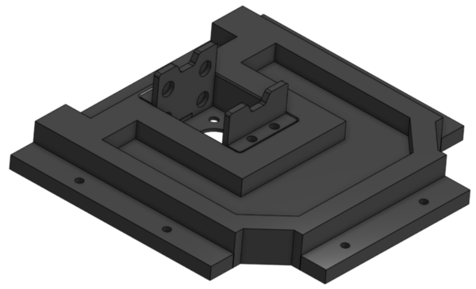

|

Required Materials:
^^^^^^^^^^^^^^^^^^^
* (QTY 1) Front Top Plate
* (QTY 2) Stepper Mount Plate
* (QTY 1) Stepper Motor Holder
* (QTY 1) Stepper Motor
* (QTY 1) Hex Shaft
* (QTY 12) 10x3mm Circular Magnet (Pre-installed below)
* (QTY 6) M3x6mm Button Head Screw
* (QTY 4) M3x8mm Button Head Screw
* (QTY 6) M3x4x5mm Heat Set Insert
* (QTY 6) M5x10mm Button Head Screw
* (QTY 6) M5 Hammer TNut

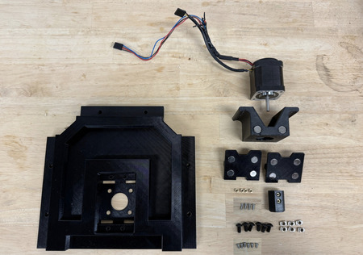

|

Required Tools:
^^^^^^^^^^^^^^^
* M2.5 Hex/Allen Key
* Soldering Iron

Step-by-Step Instructions:
^^^^^^^^^^^^^^^^^^^^^^^^^^
**NOTE: Unless otherwised mentioned, all fasteners will be "hand tight". Ensure that heat set inserts have ~2 minutes to cool post installation.**

1. Take **QTY (4) M3x4x5mm Heat Set Insert** and, using a soldering iron, place them into the following locations on the **QTY (1) Front Top Plate**. Ensure that the top of the heat set inserts are flush with the surfaces. 

   .. image:: ../static/Step_by_Step/Rotational_Element_Subassemblies/Front_Top_Plate_Stepper_Mounting/front-top-1.JPG

2. Repeat Step 1 with **QTY (2) M3x4x5mm Heat Set Insert**, and place them into **QTY (1) Hex Shaft**. 
   
   .. image:: ../static/Step_by_Step/Rotational_Element_Subassemblies/Front_Top_Plate_Stepper_Mounting/front-top-2.JPG

3. From the “bottom” of the Front Top Plate (where the counterbores are) place **QTY (6) M5x10 Button Head Screw**. Loosely install **QTY (6) M5 Hammer TNut** on the opposite end of each fastener. 

   .. image:: ../static/Step_by_Step/Rotational_Element_Subassemblies/Front_Top_Plate_Stepper_Mounting/front-top-3.JPG

4. Apply a small amount of loctite to the holes on the sides of the **QTY (1) Stepper Motor Holder** and place **QTY (4) 10x3mm Circular Magnet**. For each magnet ensure that the same polarity faces outward. 

   .. image:: ../static/Step_by_Step/Rotational_Element_Subassemblies/Front_Top_Plate_Stepper_Mounting/front-top-4.JPG

5. Apply a small amount of loctite to the holes on the front of the **QTY (1) Stepper Mount Plate** and place **QTY (4) 10x3mm Circular Magnet** into the holes. For each magnet ensure that the opposite polarity to that of the Stepper Motor Holder magnets faces outward. 

   .. image:: ../static/Step_by_Step/Rotational_Element_Subassemblies/Front_Top_Plate_Stepper_Mounting/front-top-5.JPG

6. Repeat Step 5 with the other Stepper Mount Plate. The Stepper Mount Plate magnets should be attracted to the Stepper Motor Holder magnets.  

   .. image:: ../static/Step_by_Step/Rotational_Element_Subassemblies/Front_Top_Plate_Stepper_Mounting/front-top-6.JPG

7. Slide **QTY (1) Stepper Motor** into the Stepper Motor Holder. Fasten the holder to the stepper motor using **QTY (4) M3x6mm Button Head Screw**. Ensure that the wiring of the stepper motor is aligned with the opening in the stepper motor holder. 

   .. image:: ../static/Step_by_Step/Rotational_Element_Subassemblies/Front_Top_Plate_Stepper_Mounting/front-top-7.JPG

8. Slide **QTY (1) Hex Shaft** onto the Stepper Motor shaft until the hard stop of the Hex Shaft. Fasten the Hex Shaft to the Stepper Motor using **QTY (2) M3x6mm Button Head Screw.** Ensure that the screws are flush with the surface of the hex shaft. 

   .. image:: ../static/Step_by_Step/Rotational_Element_Subassemblies/Front_Top_Plate_Stepper_Mounting/front-top-8.JPG

9. Take **QTY (2) Stepper Mount Plate** and slot them into their corresponding areas. Fasten down with **QTY (4) M3x15mm Button Head Screw**. 

   .. image:: ../static/Step_by_Step/Rotational_Element_Subassemblies/Front_Top_Plate_Stepper_Mounting/front-top-9.JPG

10. The Front Top Plate is now complete. 

   .. image:: ../static/Step_by_Step/Rotational_Element_Subassemblies/Front_Top_Plate_Stepper_Mounting/front-top-10.JPG

----

Back Top Plate
================

----

.. image:: ../static/WIP.png
    :align: center

Required Materials:
^^^^^^^^^^^^^^^^^^^
* (QTY 1) Back Top Plate
* (QTY 4) M5x10mm Button Head Screw
* (QTY 4) M5 Hammer TNut

.. image:: ../static/WIP.png
    :align: center

Required Tools:
^^^^^^^^^^^^^^^
No Tools Required.

Step-by-Step Instructions:
^^^^^^^^^^^^^^^^^^^^^^^^^^
**NOTE: This assembly will be used in the electronics subassembly section.**

1. From the "bottom" of the Back Top Plate (where the counterbores are) place **QTY (4) M5x10 Button Head Screw**. Loosely install **QTY (4) M5 Hammer TNut** on the opposite end of each fastener.

.. image:: ../static/WIP.png
    :align: center

2. The Back Top Plate is now complete.

