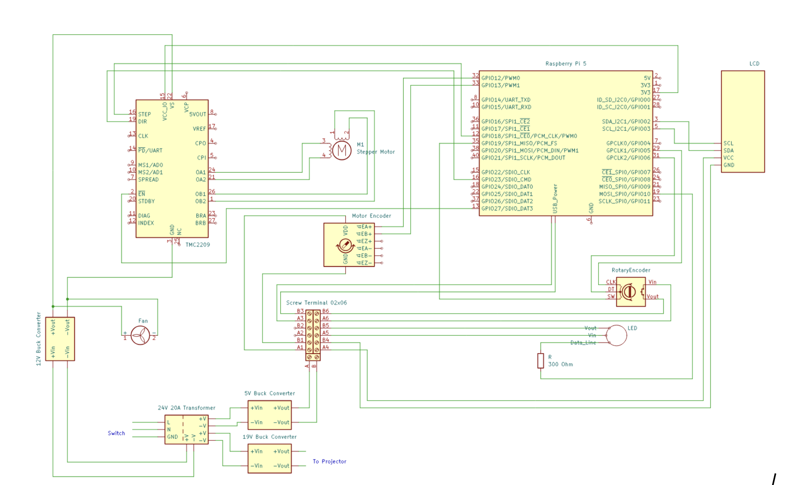

.. _wiring-instructions:

Wiring
++++++++++++++++++++++++++++++

   
   General wiring diagram

Required Materials:
^^^^^^^^^^^^^^^^^^^

* 26 AWG, 22AWG, 18AWG wire
* Heat shrink
* Quick disconnect plugs
* JST connectors
* 2.54mm pitch Dupont Connector Kit
* 4.8mm quick disconnect plugs
* Ring Connectors 5.3mm ID
* Perf board
* 8x1 Header Pins x2
* HDMI 0.5ft
* Zip Ties

Electronics Component Pocket Labeling
^^^^^^^^^^^^^^^^^^^^^^^^^^^^^^^^^^^^^
.. table::
   :align: center

   +----------------------+--------------------+-------+
   | Electronic Component | Part               | Label |
   +======================+====================+=======+
   | 5V Converter         | Inner Housing Plate| 1     |
   +----------------------+--------------------+-------+
   | Terminal Board       | Inner Housing Plate| 2     |
   +----------------------+--------------------+-------+
   | 24V Adapter          | Inner Housing Plate| 3     |
   +----------------------+--------------------+-------+
   | Perf Board           | Top Housing Plate  | 4     |
   +----------------------+--------------------+-------+
   | 12V Converter        | Top Housing Plate  | 5     |
   +----------------------+--------------------+-------+

Required Tools:
^^^^^^^^^^^^^^^

* Soldering iron & solder
* Dupont crimping tool
* Heat gun

References for wiring techniques:
^^^^^^^^^^^^^^^^^^^^^^^^^^^^^^^^^

.. TODO: Add links here

* Dupont connectors tutorial
* Ring connector tutorial

**NOTE: The provided wire lengths are an approximation. For cleaner routing and to account for any differences in your OpenCAL build, measuring wire based on the distances between components in your system.**

This guide assumes all components have been mounted to the printer system.

Stepper Driver Perf Board
=========================

1. Collect JST connector pack, perf board, 8 Position Header Pins, TMC2209
2. Solder header pins to board, using the TMC2209 pins as a reference for distance. (Row 5, Columns K-R; Row 10, Columns K-R)

   .. image:: ../static/Step_by_Step/Wiring_Images/Stepper_Driver/driver_step2_vis.png
      :align: center

3. Solder a 4 pin JST plug one column past the lower header pin. (Row 3, Columns J-M)

   .. image:: ../static/Step_by_Step/Wiring_Images/Stepper_Driver/driver_step3_vis.png
      :align: center

4. Solder a 4 pin JST plug centered with the upper header pin. (Row 12, Columns M-P)

   .. image:: ../static/Step_by_Step/Wiring_Images/Stepper_Driver/driver_step4_vis.png
      :align: center

5. Solder a 2 pin JST plug to the lest size of the perf board. (Row 12, Columns E-F)

   .. image:: ../static/Step_by_Step/Wiring_Images/Stepper_Driver/driver_step5_vis.png
      :align: center

6. Connect the four center pins of the updder header pin to the JST connector. Connect the three pins at the end of the lower header pin to the JST connector. (M10 to M12, N10 to N12, O10 to O12, P10 to P12, K3 to K5, L3 to L5, M3 to M5)

   .. image:: ../static/Step_by_Step/Wiring_Images/Stepper_Driver/driver_step6_vis.png
      :align: center

7. Using 26 AWG wire, connect the pins corresponding to GND and VS, the two leftmost pins on header 1, to the 2 pin JST connector. (Q10 to F12, R10 to E12)

   .. image:: ../static/Step_by_Step/Wiring_Images/Stepper_Driver/driver_step7_vis.png
      :align: center

8. Using 26 AWG wire, connet the leftmost pin of header pin 2, corresponding to EN, to the leftmost pin of the JST connector 2. (R5 to M3)

   .. image:: ../static/Step_by_Step/Wiring_Images/Stepper_Driver/driver_step8_vis.png
      :align: center

9. Using 26 AWG wire, connect the rightmost pin of the header pin 1 to the rightmost pin of JST connector 2. (L10 to J3)

   .. image:: ../static/Step_by_Step/Wiring_Images/Stepper_Driver/driver_step9_vis.png
      :align: center

10. Place the TMC2209 on the perf board wit hthe A1, A2, B1, B2, pins on top.

   .. image:: ../static/Step_by_Step/Wiring_Images/Stepper_Driver/driver_step10_vis.png
      :align: center

Power Distribution
==================

1. Connect the Power Switch to the 24V Adapter.

   .. image:: ../static/Step_by_Step/Wiring_Images/Power_Distribution/power_dist_step1_cad_diagram.png
      :align: center

   .. table::
      :align: center

      +--------------+---------+--------------------+-------+-------------+
      | Component    | Name    | Connector          | Gauge | Length (cm) |
      +==============+=========+====================+=======+=============+
      | Power Switch | Live    | Quick Release Plug |       |             |
      +--------------+---------+--------------------+ 18    | 41          |
      | 24V Adapter  | Live    | Ring Connector &   |       |             |
      |              |         | Screw Terminal     |       |             |
      +--------------+---------+--------------------+-------+-------------+
      | Power Switch | Neutral | Quick Release Plug |       |             |
      +--------------+---------+--------------------+ 18    | 41          |
      | 24V Adapter  | Neutral | Ring Connector &   |       |             |
      |              |         | Screw Terminal     |       |             |
      +--------------+---------+--------------------+-------+-------------+
      | Power Switch | Ground  | Quick Release Plug |       |             |
      +--------------+---------+--------------------+ 18    | 41          |
      | 24V Adapter  | Ground  | Ring Connector &   |       |             |
      |              |         | Screw Terminal     |       |             |
      +--------------+---------+--------------------+-------+-------------+

   .. image:: ../static/Step_by_Step/Wiring_Images/Power_Distribution/power_dist_step1_assem.jpg
      :align: center

2. Connect the 5V Converter to the 24V Adapter. The 5V Converter will need to be removed from the plate to connect wires to the soldering through holes, then reattached.

   .. image:: ../static/Step_by_Step/Wiring_Images/Power_Distribution/power_dist_step2_cad_diagram.png
      :align: center

   .. table::
      :align: center

      +--------------+------+--------------------+-------+-------------+
      | Component    | Name | Connector          | Gauge | Length (cm) |
      +==============+======+====================+=======+=============+
      | 5V Converter | Vin  | Through-hole solder|       |             |
      +--------------+------+--------------------+ 26    | 19          |
      | 24V Adapter  | V+   | Ring Connector &   |       |             |
      |              |      | Screw Terminal     |       |             |
      +--------------+------+--------------------+-------+-------------+
      | 5V Converter | GND  | Through-hole solder|       |             |
      +--------------+------+--------------------+ 26    | 16          |
      | 24V Adapter  | V-   | Ring Connector &   |       |             |
      |              |      | Screw Terminal     |       |             |
      +--------------+------+--------------------+-------+-------------+

   .. image:: ../static/Step_by_Step/Wiring_Images/Power_Distribution/power_dist_step2_assem.jpg
      :align: center

3. Connect 12V Converter to the 24V Adapter

   .. image:: ../static/Step_by_Step/Wiring_Images/Power_Distribution/power_dist_step3_cad_diagram.png
      :align: center

   .. table::
      :align: center
   
      +---------------+---------+--------------------+-------+-------------+
      | Component     | Name    | Connector          | Gauge | Length (cm) |
      +===============+=========+====================+=======+=============+
      | 12V Converter | Input + | Screw Terminal     |       |             |
      +---------------+---------+--------------------+ 22    | 45          |
      | 24V Adapter   | V+      | Ring Connector &   |       |             |
      |               |         | Screw Terminal     |       |             |
      +---------------+---------+--------------------+-------+-------------+
      | 12V Converter | Input - | Screw Terminal     |       |             |
      +---------------+---------+--------------------+ 22    | 55          |
      | 24V Adapter   | V-      | Ring Connector &   |       |             |
      |               |         | Screw Terminal     |       |             |
      +---------------+---------+--------------------+-------+-------------+

   .. image:: ../static/Step_by_Step/Wiring_Images/Power_Distribution/power_dist_step3_assem.jpg
      :align: center

4. Connect 19V Converter to the 24V Adapter

   .. image:: ../static/Step_by_Step/Wiring_Images/Power_Distribution/power_dist_step4_vis1.png
      :align: center

   .. image:: ../static/Step_by_Step/Wiring_Images/Power_Distribution/power_dist_step4_cad_diagram.png
      :align: center

   .. table::
      :align: center
   
      +---------------+---------+--------------------+-------+-------------+
      | Component     | Name    | Connector          | Gauge | Length (cm) |
      +===============+=========+====================+=======+=============+
      | 19V Converter | In+     | Pre-attached       |       |             |
      +---------------+---------+--------------------+ 18    | 15          |
      | 24V Adapter   | V+      | Ring Connector &   |       |             |
      |               |         | Screw Terminal     |       |             |
      +---------------+---------+--------------------+-------+-------------+
      | 19V Converter | In-     | Pre-attached       |       |             |
      +---------------+---------+--------------------+ 18    | 15          |
      | 24V Adapter   | V-      | Ring Connector &   |       |             |
      |               |         | Screw Terminal     |       |             |
      +---------------+---------+--------------------+-------+-------------+

   .. image:: ../static/Step_by_Step/Wiring_Images/Power_Distribution/power_dist_step4_assem.jpg
      :align: center

5. Connect 5V Converter to the Screw Terminal Block, with Vout connected to A and Ground connected to B. This is where all 5V powered components will be connected.

   .. table::
      :align: center
   
      +-----------------+---------+---------------------+-------+-------------+
      | Component       | Name    | Connector           | Gauge | Length (cm) |
      +=================+=========+=====================+=======+=============+
      | 5V Converter    | Vout    | Through-hole solder |       |             |
      +-----------------+---------+---------------------+ 26    | 4           |
      | Terminal Block  | A       | Screw Terminal      |       |             |
      +-----------------+---------+---------------------+-------+-------------+
      | 5V Converter    | GND     | Through-hole solder |       |             |
      +-----------------+---------+---------------------+ 26    | 4           |
      | Terminal Block  | B       | Screw Terminal      |       |             |
      +-----------------+---------+---------------------+-------+-------------+

   .. image:: ../static/Step_by_Step/Wiring_Images/Power_Distribution/power_dist_step5_assem.jpg
      :align: center

Top Plate Housing Connections
=============================

1. Remove the motor from the top plate. Gather wire motors and trim to end a few centimeters past the opening of the printer. Attach A+, A-, B+, and B- motor wires to a 4 pin Dupont Socket. Connect wires from a 4 pin Dupont Plug to a 4 pin JST connector. Plug this into the Perf Board.

   .. table::
      :align: center

      +--------------------+-------+----------------+-------+-------------+
      | Component          | Name  | Connector      | Gauge | Length (cm) |
      +====================+=======+================+=======+=============+
      | Motor              | A-    | Pre-attached   |       |             |
      +--------------------+-------+----------------+ 26    | 15          |
      | 4 Pin Dupont Socket| Slot 1| Dupont Socket  |       |             |
      +--------------------+-------+----------------+-------+-------------+
      | Motor              | A+    | Pre-attached   |       |             |
      +--------------------+-------+----------------+ 26    | 15          |
      | 4 Pin Dupont Socket| Slot 2| Dupont Socket  |       |             |
      +--------------------+-------+----------------+-------+-------------+
      | Motor              | B+    | Pre-attached   |       |             |
      +--------------------+-------+----------------+ 26    | 15          |
      | 4 Pin Dupont Socket| Slot 3| Dupont Socket  |       |             |
      +--------------------+-------+----------------+-------+-------------+
      | Motor              | B-    | Pre-attached   |       |             |
      +--------------------+-------+----------------+ 26    | 15          |
      | 4 Pin Dupont Socket| Slot 4| Dupont Socket  |       |             |
      +--------------------+-------+----------------+-------+-------------+
      | Perf Board         | A2    | 4 Pin JST Plug |       |             |
      +--------------------+-------+----------------+ 26    | 6           |
      | 4 Pin Dupont Socket| Slot 1| Dupont Socket  |       |             |
      +--------------------+-------+----------------+-------+-------------+
      | Perf Board         | A1    | 4 Pin JST Plug |       |             |
      +--------------------+-------+----------------+ 26    | 6           |
      | 4 Pin Dupont Socket| Slot 2| Dupont Socket  |       |             |
      +--------------------+-------+----------------+-------+-------------+
      | Perf Board         | B1    | 4 Pin JST Plug |       |             |
      +--------------------+-------+----------------+ 26    | 6           |
      | 4 Pin Dupont Socket| Slot 3| Dupont Socket  |       |             |
      +--------------------+-------+----------------+-------+-------------+
      | Perf Board         | B2    | 4 Pin JST Plug |       |             |
      +--------------------+-------+----------------+ 26    | 6           |
      | 4 Pin Dupont Socket| Slot 4| Dupont Socket  |       |             |
      +--------------------+-------+----------------+-------+-------------+

   .. image:: ../static/Step_by_Step/Wiring_Images/Top_Plate/top_plate_step1_assem.jpg
      :align: center

2. Connect encoder EA+, EB+, VCC, and GND wires to a receptacle Dupont connector. Connect wires from a plug Dupont connector to Terminal Block and RP5 pins. Trim extraneous wires (EA-, EB-, EZ+, EZ-) to 10 cm and use heat shrink to cover wire ends.

   .. image:: ../static/Step_by_Step/Wiring_Images/Top_Plate/top_plate_step2_vis1.png
      :align: center

   .. image:: ../static/Step_by_Step/Wiring_Images/Top_Plate/top_plate_step2_cad_diagram.png
      :align: center

   .. table::
      :align: center

      +------------------+---------+----------------+-------+-------------+
      | Component        | Name    | Connector      | Gauge | Length (cm) |
      +==================+=========+================+=======+=============+
      | Encoder          | EA+     | Pre-attached   |       |             |
      +------------------+---------+----------------+ 26    | 28          |
      | 4 Pin Dupont Plug| Slot 1  | Dupont Plug Pin|       |             |
      +------------------+---------+----------------+-------+-------------+
      | Encoder          | EB+     | Pre-attached   |       |             |
      +------------------+---------+----------------+ 26    | 28          |
      | 4 Pin Dupont Plug| Slot 2  | Dupont Plug Pin|       |             |
      +------------------+---------+----------------+-------+-------------+
      | Encoder          | VCC     | Pre-attached   |       |             |
      +------------------+---------+----------------+ 26    | 28          |
      | 4 Pin Dupont Plug| Slot 3  | Dupont Plug Pin|       |             |
      +------------------+---------+----------------+-------+-------------+
      | Encoder          | GND     | Pre-attached   |       |             |
      +------------------+---------+----------------+ 26    | 28          |
      | 4 Pin Dupont Plug| Slot 4  | Dupont Plug Pin|       |             |
      +------------------+---------+----------------+-------+-------------+
      | RP5              | GPIO 12 | Pre-attached   |       |             |
      +------------------+---------+----------------+ 26    | 33          |
      | 4 Pin Dupont Plug| Slot 1  | Dupont Plug Pin|       |             |
      +------------------+---------+----------------+-------+-------------+
      | RP5              | GPIO 13 | Pre-attached   |       |             |
      +------------------+---------+----------------+ 26    | 33          |
      | 4 Pin Dupont Plug| Slot 2  | Dupont Plug Pin|       |             |
      +------------------+---------+----------------+-------+-------------+
      | Terminal Block   | A4      | Pre-attached   |       |             |
      +------------------+---------+----------------+ 26    | 33          |
      | 4 Pin Dupont Plug| Slot 3  | Dupont Plug Pin|       |             |
      +------------------+---------+----------------+-------+-------------+
      | Terminal Block   | B4      | Pre-attached   |       |             |
      +------------------+---------+----------------+ 26    | 33          |
      | 4 Pin Dupont Plug| Slot 4  | Dupont Plug Pin|       |             |
      +------------------+---------+----------------+-------+-------------+

   .. image:: ../static/Step_by_Step/Wiring_Images/Top_Plate/top_plate_step2_assem.jpg
      :align: center

3. Connect wires from a 4 pin JST plug to the corresponding pins on the RP5. Plug the JST connector into the stepper driver Perf Board.

   .. image:: ../static/Step_by_Step/Wiring_Images/Top_Plate/top_plate_step3_cad_diagram.png
      :align: center

   .. table::
      :align: center
   
      +------------------+---------+----------------+-------+-------------+
      | Component        | Name    | Connector      | Gauge | Length (cm) |
      +==================+=========+================+=======+=============+
      | RP5              | 3v3     | 4 Pin JST Plug |       |             |
      +------------------+---------+----------------+ 26    | 40          |
      | 4 Pin JST Plug   | VIO     | Dupont Socket  |       |             |
      +------------------+---------+----------------+-------+-------------+
      | RP5              | DIR     | 4 Pin JST Plug |       |             |
      +------------------+---------+----------------+ 26    | 40          |
      | 4 Pin JST Plug   | GPIO 23 | Dupont Socket  |       |             |
      +------------------+---------+----------------+-------+-------------+
      | RP5              | STEP    | 4 Pin JST Plug |       |             |
      +------------------+---------+----------------+ 26    | 40          |
      | 4 Pin JST Plug   | GPIO 18 | Dupont Socket  |       |             |
      +------------------+---------+----------------+-------+-------------+
      | RP5              | EN      | 4 Pin JST Plug |       |             |
      +------------------+---------+----------------+ 26    | 40          |
      | 4 Pin JST Plug   | GPIO 27 | Dupont Socket  |       |             |
      +------------------+---------+----------------+-------+-------------+

   .. image:: ../static/Step_by_Step/Wiring_Images/Top_Plate/top_plate_step3_assem.jpg
      :align: center

4. Connect wires from a 2 pin JST plug to the 12V Converter output screw terminals

   .. image:: ../static/Step_by_Step/Wiring_Images/Top_Plate/top_plate_step4_vis1.png
      :align: center

   .. table::
      :align: center
   
      +-----------------+----------+----------------+-------+-------------+
      | Component       | Name     | Connector      | Gauge | Length (cm) |
      +=================+==========+================+=======+=============+
      | Perf Board      | VS       | 2 Pin JST Plug |       |             |
      +-----------------+----------+----------------+ 26    | 13          |
      | 12V Converter   | Output + | Screw Terminal |       |             |
      +-----------------+----------+----------------+-------+-------------+
      | Perf Board      | GND      | 2 Pin JST Plug |       |             |
      +-----------------+----------+----------------+ 26    | 13          |
      | 12V Converter   | Output - | Screw Terminal |       |             |
      +-----------------+----------+----------------+-------+-------------+

5. Connect the 12V converter to the fan. Use a set of 2 pin Dupont connectors in-between for easy fan removal. Run the wires through the corresponding opening in the Top Plate Housing.

   .. image:: ../static/Step_by_Step/Wiring_Images/Top_Plate/top_plate_step5_vis1.png
      :align: center

   .. image:: ../static/Step_by_Step/Wiring_Images/Top_Plate/top_plate_step5_cad_diagram.png
      :align: center

   .. table::
      :align: center
   
      +------------------+---------+----------------+-------+-------------+
      | Component        | Name    | Connector      | Gauge | Length (cm) |
      +==================+=========+================+=======+=============+
      | Fan              | Power   | Pre-attached   |       |             |
      +------------------+---------+----------------+ 26    | 8           |
      | 2 Pin Dupont Plug| Slot 1  | Dupont Plug Pin|       |             |
      +------------------+---------+----------------+-------+-------------+
      | Fan              | Ground  | Pre-attached   |       |             |
      +------------------+---------+----------------+ 26    | 8           |
      | 2 Pin Dupont Plug| Slot 2  | Dupont Plug Pin|       |             |
      +------------------+---------+----------------+-------+-------------+
      | 12V Converter    | Output +| Screw Terminal |       |             |
      +------------------+---------+----------------+ 26    | 28          |
      | 2 Pin Dupont     | Slot 1  | Dupont Socket  |       |             |
      | Socket           |         | Pin            |       |             |
      +------------------+---------+----------------+-------+-------------+
      | 12V Converter    | Output -| Screw Terminal |       |             |
      +------------------+---------+----------------+ 26    | 28          |
      | 2 Pin Dupont     |         | Dupont Socket  |       |             |
      | Socket           | Slot 2  | Pin            |       |             |
      +------------------+---------+----------------+-------+-------------+

LCD Housing
===========

1. Connect the LCD to the Terminal Block and RP5. Run wires through the cutout in the LCD Housing Mount.

   .. image:: ../static/Step_by_Step/Wiring_Images/LCD/LCD_step1_cad_diagram.png
      :align: center

   .. table::
      :align: center
   
      +-----------------+---------+----------------+-------+-------------+
      | Component       | Name    | Connector      | Gauge | Length (cm) |
      +=================+=========+================+=======+=============+
      | LCD             | SDA     | Dupont Socket  |       |             |
      +-----------------+---------+----------------+ 26    | 92          |
      | RP5             | SDA     | Dupont Socket  |       |             |
      +-----------------+---------+----------------+-------+-------------+
      | LCD             | SCL     | Dupont Socket  |       |             |
      +-----------------+---------+----------------+ 26    | 92          |
      | RP5             | SCL     | Dupont Socket  |       |             |
      +-----------------+---------+----------------+-------+-------------+
      | LCD             | VCC     | Dupont Socket  |       |             |
      +-----------------+---------+----------------+ 26    | 99          |
      | Terminal Block  | A3      | Screw Terminal |       |             |
      +-----------------+---------+----------------+-------+-------------+
      | LCD             | GND     | Dupont Socket  |       |             |
      +-----------------+---------+----------------+ 26    | 99          |
      | Terminal Block  | B3      | Screw Terminal |       |             |
      +-----------------+---------+----------------+-------+-------------+

   .. image:: ../static/Step_by_Step/Wiring_Images/LCD/LCD_step1_assem.jpg
      :align: center

2. Connect the Encoder to the Terminal Block and RP5. Run wires through the cutout in the LCD Housing Mount.

   .. image:: ../static/Step_by_Step/Wiring_Images/LCD/LCD_step2_cad_diagram.png
      :align: center

   .. table::
      :align: center

      +-----------------+---------+----------------+-------+-------------+
      | Component       | Name    | Connector      | Gauge | Length (cm) |
      +=================+=========+================+=======+=============+
      | Encoder Knob    | \+      | Dupont Socket  |       |             |
      +-----------------+---------+----------------+ 26    | 104         |
      | Terminal Block  | A2      | Screw Terminal |       |             |
      +-----------------+---------+----------------+-------+-------------+
      | Encoder Knob    | GND     | Dupont Socket  |       |             |
      +-----------------+---------+----------------+ 26    | 104         |
      | Terminal Block  | B2      | Screw Terminal |       |             |
      +-----------------+---------+----------------+-------+-------------+
      | Encoder Knob    | CLK     | Dupont Socket  |       |             |
      +-----------------+---------+----------------+ 26    | 103         |
      | RP5             | GPIO 5  | Dupont Socket  |       |             |
      +-----------------+---------+----------------+-------+-------------+
      | Encoder Knob    | DT      | Dupont Socket  |       |             |
      +-----------------+---------+----------------+ 26    | 103         |
      | RP5             | GPIO 6  | Dupont Socket  |       |             |
      +-----------------+---------+----------------+-------+-------------+
      | Encoder Knob    | SW      | Dupont Socket  |       |             |
      +-----------------+---------+----------------+ 26    | 103         |
      | RP5             | GPIO 19 | Dupont Socket  |       |             |
      +-----------------+---------+----------------+-------+-------------+

   .. image:: ../static/Step_by_Step/Wiring_Images/LCD/LCD_step2_assem.jpg
      :align: center

LED
===

1. Remove the Bottom Plate  of the rotation element from the assembly.

   .. image:: ../static/Step_by_Step/Wiring_Images/LED/LED_step1_vis1.png
      :align: center

2. Solder wires from the LED to a 3 pin Dupont plug. Zip tie the wire in place to keep the Dupont connector exposed.

   .. image:: ../static/Step_by_Step/Wiring_Images/LED/LED_step2_vis1.png
      :align: center

   .. image:: ../static/Step_by_Step/Wiring_Images/LED/LED_step2_vis2.png
      :align: center

   .. table::
      :align: center

      +--------------------+--------+--------------------+-------+-------------+
      | Component          | Name   | Connector          | Gauge | Length (cm) |
      +====================+========+====================+=======+=============+
      | LED                | 5V     | Through-hole solder|       |             |
      +--------------------+--------+--------------------+ 26    | 20          |
      | 3 Pin Dupont Socket| Slot 1 | Dupont Socket      |       |             |
      +--------------------+--------+--------------------+-------+-------------+
      | LED                | GND    | Through-hole solder|       |             |
      +--------------------+--------+--------------------+ 26    | 20          |
      | 3 Pin Dupont Socket| Slot 2 | Dupont Socket      |       |             |
      +--------------------+--------+--------------------+-------+-------------+
      | LED                | Din    | Through-hole solder|       |             |
      +--------------------+--------+--------------------+ 26    | 20          |
      | 3 Pin Dupont Socket| Slot 3 | Dupont Socket      |       |             |
      +--------------------+--------+--------------------+-------+-------------+

3. Connect a 3 pin Dupont receptacle to three wires, running power and ground to the Terminal Block and the data line to the RP5. Add a 300 Ohm resistor to the data line to prevent noise and power leeching. Reconnect the Bottom Plate to the assembly and plug the LED Dupont connectors.

   .. image:: ../static/Step_by_Step/Wiring_Images/LED/LED_step3_cad_diagram.png
      :align: center

   .. table::
      :align: center
   
      +--------------------+------------+----------------+-------+-------------+
      | Component          | Name       | Connector      | Gauge | Length (cm) |
      +====================+============+================+=======+=============+
      | Terminal Block     | A5         | Dupont Socket  |       |             |
      +--------------------+------------+----------------+ 26    | 20          |
      | 3 Pin Dupont Plug  | Slot 1     | Dupont Plug    |       |             |
      +--------------------+------------+----------------+-------+-------------|
      | Terminal Block     | B5         | Screw Terminal |       |             |
      +--------------------+------------+----------------+ 26    | 20          |
      | 3 Pin Dupont Plug  | Slot 2     | Dupont Plug    |       |             |
      +--------------------+------------+----------------+-------+-------------+
      | Resistor           | Wire End 1 | Wire Solder    |       |             |
      +--------------------+------------+----------------+ 26    | 30          |
      | 3 Pin Dupont Plug  | Slot 3     | Dupont Plug    |       |             |
      +--------------------+------------+----------------+-------+-------------+
      | RP5                | GPIO 10    | Screw Terminal |       |             |
      +--------------------+------------+----------------+ 26    | 30          |
      | Resistor           | Wire End 2 | Wire Solder    |       |             |
      +--------------------+------------+----------------+-------+-------------+

   .. image:: ../static/Step_by_Step/Wiring_Images/LED/LED_step3_assem.jpg
      :align: center
      
Camera
======

*Note about camera assembly: if CSI to HDMI adapters are not available, a long CSI cable can be used as a substitute.*

1. Remove the camera and CSI to HDMI adapter from the Camera Mount.

   .. image:: ../static/Step_by_Step/Wiring_Images/camera/camera_step1_vis1.png
      :align: center

2. Run the CSI cable from the left side of the camera, behind the camera, and connect it to the adapter. This 22 pin to 22 pin CSI cable comes with the adapter set.

   .. image:: ../static/Step_by_Step/Wiring_Images/camera/camera_step2_vis1.png
      :align: center

3. In the RP5 Housing assembly, connect the CSI to HDMI adapter to the RP5 using a CSI cable. This CSI cable is 22 pin to 15 pin.

   .. image:: ../static/Step_by_Step/Wiring_Images/camera/camera_step3_vis1.png
      :align: center

   .. image:: ../static/Step_by_Step/Wiring_Images/camera/camera_step3_assem.jpg
      :align: center

4. Connect the adapters using the 0.5 ft HDMI cable.

   .. image:: ../static/Step_by_Step/Wiring_Images/camera/camera_step4_vis1.png
      :align: center

   .. image:: ../static/Step_by_Step/Wiring_Images/camera/camera_step4_assem.jpg
      :align: center

Remaining Connections
=====================

1. Connect the RP5 to 5V power by running a USB cable from the RP5 to the Terminal Block.

   .. image:: ../static/Step_by_Step/Wiring_Images/Remaining_Connections/remaining_step1_vis1.png
      :align: center

   .. image:: ../static/Step_by_Step/Wiring_Images/Remaining_Connections/remaining_step1_cad_diagram.png
      :align: center

   .. table::
      :align: center
   
      +----------------+-------+----------------+-------+-------------+
      | Component      | Name  | Connector      | Gauge | Length (cm) |
      +================+=======+================+=======+=============+
      | RP5            | Power | Dupont Socket  |       |             |
      +----------------+-------+----------------+ 26    | 35          |
      | Terminal Block | A6    | Screw Terminal |       |             |
      +----------------+-------+----------------+-------+-------------+
      | RP5            | Power | Dupont Socket  |       |             |
      +----------------+-------+----------------+ 26    | 35          |
      | Terminal Block | B6    | Screw Terminal |       |             |
      +----------------+-------+----------------+-------+-------------+

   .. image:: ../static/Step_by_Step/Wiring_Images/Remaining_Connections/remaining_step1_assem.jpg
      :align: center

2. Connect the projector to 19V power by connecting wires from the 19V power output to the corresponding plug for projector power. For the NexiGo Nova Mini, this is a USB-C.

   .. image:: ../static/Step_by_Step/Wiring_Images/Remaining_Connections/remaining_step2_vis1.png
      :align: center

   .. table::
      :align: center

      +---------------+-------+----------------+-------+-------------+
      | Component     | Name  | Connector      | Gauge | Length (cm) |
      +===============+=======+================+=======+=============+
      | Projector     | Power | USB-C          |       |             |
      +---------------+-------+----------------+ 22    | 40          |
      | 19V Converter | Out+  | Screw Terminal |       |             |
      +---------------+-------+----------------+-------+-------------+
      | Projector     | Power | Dupont Socket  |       |             |
      +---------------+-------+----------------+ 22    | 40          |
      | 19V Converter | Out-  | USB-C          |       |             |
      +---------------+-------+----------------+-------+-------------+

   .. image:: ../static/Step_by_Step/Wiring_Images/Remaining_Connections/remaining_step2_assem.jpg
      :align: center

3. Connect the projector to the RP5 using a micro-HDMI to HDMI cable. If using an alternative projector with a different video input method, use a cable for connection from micro-HDMI to the corresponding input plug type.

   .. image:: ../static/Step_by_Step/Wiring_Images/Remaining_Connections/remaining_step3_cad_diagram.png
      :align: center

   .. image:: ../static/Step_by_Step/Wiring_Images/Remaining_Connections/remaining_step3_assem.jpg
      :align: center

4. To secure wires on the Inner Housing Plate, use the press-fit clips along the wire routing cutouts.

   .. image:: ../static/Step_by_Step/Wiring_Images/Remaining_Connections/remaining_step4_vis1.png
      :align: center

   .. image:: ../static/Step_by_Step/Wiring_Images/Remaining_Connections/remaining_step4_assem.jpg
      :align: center

