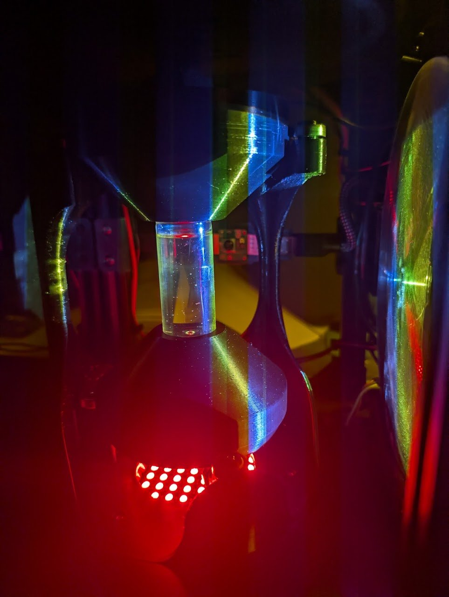
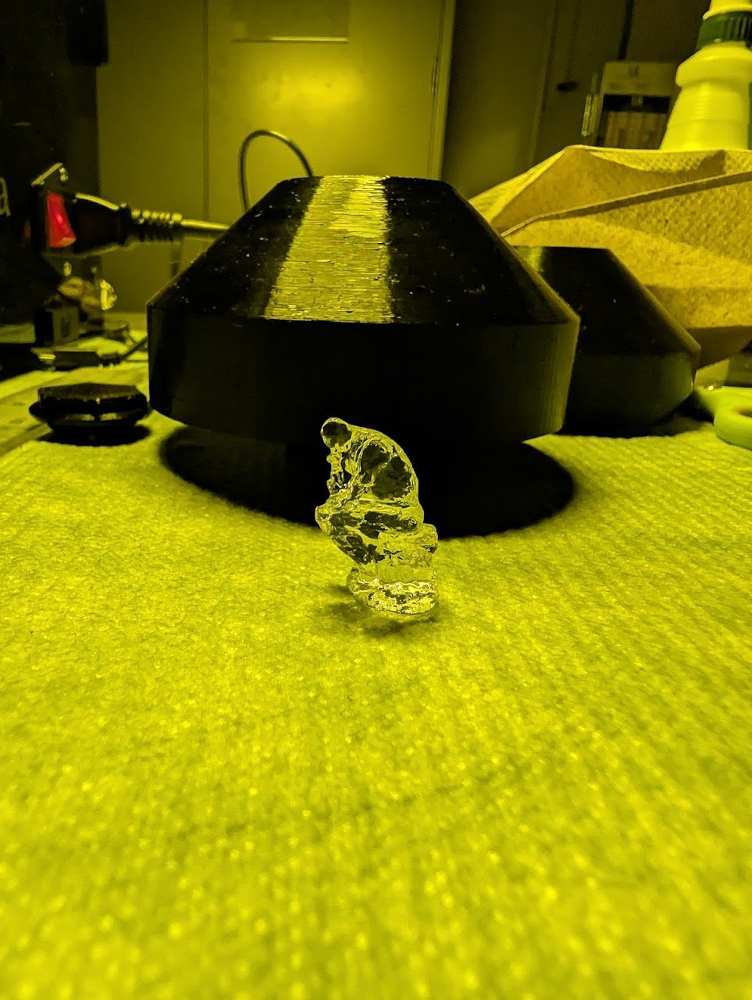
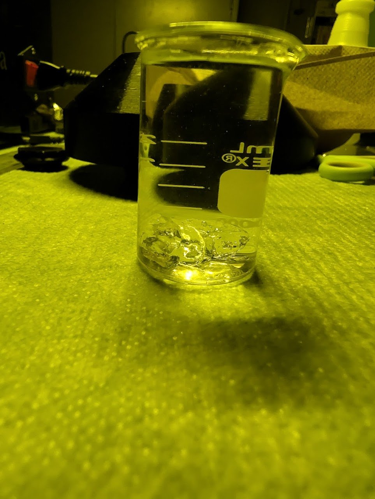
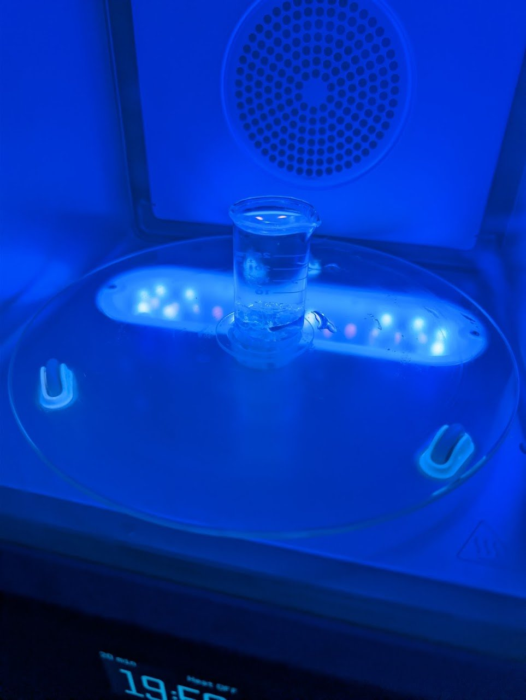

Printing Workflow
=================

This page walks through a complete OpenCAL print from start to finish: preparing the print
file, loading resin, running the print, and post-processing the finished part.

.. warning::

   **Resin safety — read before you begin.**

   * Always wear **nitrile gloves** when handling resin or uncured (wet) parts.
   * **Never expose the resin to natural sunlight.** Sunlight (and other strong UV / blue light)
     causes **rapid, uncontrolled curing** that will ruin the resin and can solidify it in its
     container. Keep resin away from windows, work under subdued ambient room light, and keep
     vials **capped** whenever they are not in use.
   * Work in a well-ventilated area and follow the resin's Safety Data Sheet (SDS). See
     :doc:`../materials/overview` for full handling guidance.

Calibration
-----------

Before your first print (and any time you move the projector or optics), calibrate the machine so
the projected image is focused, centered on the vial, and sized correctly. Calibration uses the
tools under **Settings** on the LCD menu (see :doc:`Controls & Operation <../software/controls>`).

#. **Display the calibration image.** The calibration image ships on the Raspberry Pi. Open it from
   **Settings → Calibration Images** on the LCD menu.

   .. figure:: ../static/Workflow/alignment_image.png
      :align: center
      :width: 200px

      The projector alignment image.

#. **Focus and align the projector.** Place the **cross-strut alignment tool** in the machine
   (in place of the vial). Adjust the projector so the calibration image is sharp and centered on
   the tool. Use **Settings → Show Alignment** to project the cross-strut alignment image, and
   adjust the projector's XY stage until the projected cross lines up with the tool's cross-struts.
   Rotate the encoder to shift the image up or down for transverse alignment.

   .. figure:: ../static/Workflow/alignment_tool_render.jpg
      :align: center
      :width: 300px

      The cross-strut alignment tool.

   All the files needed to build the alignment tool are on the
   `OpenCAL Printables page <https://www.printables.com/model/1641693-opencal>`__.

   .. figure:: ../static/Workflow/cal_alignment.jpg
      :align: center
      :width: 360px

      The alignment image projected onto the alignment tool.

#. **Print a calibration piece.** Print the provided calibration part and check it against the
   expected geometry. If it is off, repeat the alignment steps above and re-print.

   .. The calibration-piece print files (download link) go here.

.. note::

   Calibration only needs to be repeated when the projector or optics are moved.

Step 1 — Prepare the Print File
-------------------------------

Generate the projection video for your part using :doc:`Tomo <../software/tomo>` (or
:doc:`VAMToolbox <../software/vamtoolbox>` directly). Export it as an ``.mp4`` and name it with
the OpenCAL convention so the printer reads the rotation speed automatically:

.. code-block:: text

   <part_name>_<rpm>rpm.mp4

Then copy the ``.mp4`` onto a USB drive. (See :ref:`naming-convention` for details.)

Step 2 — Load the File onto the Machine
---------------------------------------

#. Insert the USB drive into the Raspberry Pi.
#. On the LCD menu, select **Print from USB** and choose your file
   (see :doc:`Controls & Operation <../software/controls>`).
#. Confirm the **RPM** when prompted.

Step 3 — Prepare and Load the Vial
----------------------------------

.. warning::

   Put on **nitrile gloves** and keep the resin away from sunlight before opening any container.

#. Fill a clean glass vial with the photopolymer resin. **Pour the resin gently down the side of
   the vial** so it does not fold in on itself and trap bubbles.

   .. figure:: ../static/Workflow/wf_fill_vial.jpg
      :align: center
      :width: 360px

      Filling the vial. Pour against the side to avoid bubbles.

#. **Cap the vial** securely to prevent spills and to limit light and oxygen exposure.

   .. figure:: ../static/Workflow/wf_cap_vial.jpg
      :align: center
      :width: 360px

      The capped vial.

#. Place the capped vial into the machine's rotation stage: seat it on the **bottom rotation
   piece**, attach the **top piece**, and make sure it is centered and secure.

   .. figure:: ../static/Workflow/wf_load_bottom.jpg
      :align: center
      :width: 360px

      The vial seated on the bottom rotation piece.

   .. figure:: ../static/Workflow/wf_load_top.jpg
      :align: center
      :width: 360px

      The top piece attached.

Step 4 — Run the Print
----------------------

Start the print from the **Print from USB** menu. The vial rotates while the projector plays the
video, and the part forms volumetrically over the rotation(s). You can monitor progress on the
camera view, and click to stop when the print finishes.

   A print in progress: the projector plays the video into the spinning vial.

Step 5 — Remove the Part
------------------------

#. When the print is complete, remove the vial from the machine.
#. Wearing gloves, uncap the vial and use **tweezers** to gently lift the cured part out of the
   surrounding uncured resin.

   .. figure:: ../static/Workflow/wf_tweezers.jpg
      :align: center
      :width: 360px

      Lifting the cured part out with tweezers.

#. Let excess resin drip back into the vial; the remaining uncured resin can be reused (see
   Step 8). **Let gravity do the work**: holding the part and letting the resin drip off is the
   best way to clean off the excess.

Step 6 — Wash (Post-Process)
----------------------------

Wash the uncured resin off the part using a **Formlabs Form Wash** (or an equivalent solvent
wash). Use the solvent appropriate to your resin, commonly isopropyl alcohol (IPA), and follow
the wash time recommended for your resin.

   The part after washing in IPA.

Step 7 — Post-Cure
------------------

Post-cure the washed part in a **Formlabs Form Cure**, with the part **submerged in water** (or
under **vacuum**). Curing in water or under vacuum excludes oxygen, which would otherwise inhibit
surface curing and leave the part tacky.

   The washed part submerged in water, ready to post-cure.

   Post-curing in the Form Cure.

Step 8 — Rest Before Reuse
--------------------------

Let any resin you plan to reuse **sit for about 24 hours before the next print**. Curing in CAL
depends on **oxygen inhibition** (dissolved oxygen suppresses curing until enough light dose
overcomes it), and a print consumes the resin's dissolved oxygen and stirs it up. Resting the
resin lets it **resettle and re-equilibrate its oxygen** so the next print behaves consistently.
For how resin reuse was characterized in practice, see the **Automatic Exposure** paper in
:doc:`../resources/research_papers`.
